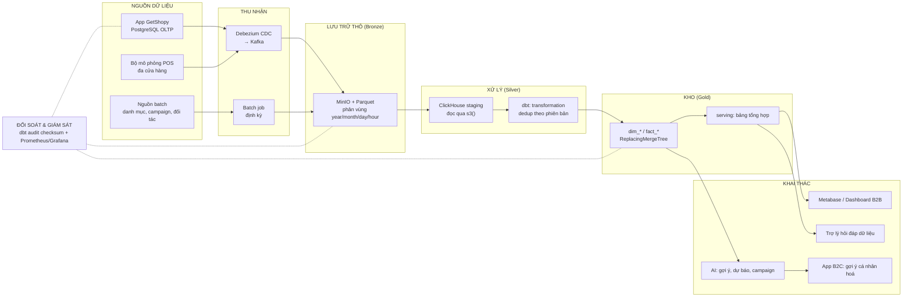

# ĐỀ CƯƠNG KHOÁ LUẬN TỐT NGHIỆP

**Tên đề tài (VI):** Xây dựng nền tảng dữ liệu (Data Platform) hiện đại theo kiến trúc Lakehouse phục vụ phân tích thời gian gần thực và ứng dụng AI cho hệ thống bán lẻ / thương mại điện tử

**Tên đề tài (EN):** Building a Modern Lakehouse Data Platform for Near Real-time Analytics and AI Applications in Retail / E-commerce

| | |
|---|---|
| Sinh viên thực hiện |  |
| GVHD | VÕ VĂN THÀNH |
| Thời gian thực hiện | 08/2026 – 12/2026, bảo vệ dự kiến 01/2027 |
| Mốc nghiệm thu lõi platform | Tuần 4 (cuối 08/2026) — pipeline E2E chạy được, đo được |
| Sản phẩm | Data Platform (3 tầng) + Ứng dụng GetShopy + 3 module AI + bộ tài liệu & thực nghiệm |

Tài liệu liên quan:
- **Bản hợp nhất đề cương + kiến trúc (dùng để trình bày):** [docs/00-DE-CUONG-VA-KIEN-TRUC.md](docs/00-DE-CUONG-VA-KIEN-TRUC.md)
- Kiến trúc nền tảng dữ liệu: [docs/01-ARCH-DATA-PLATFORM.md](docs/01-ARCH-DATA-PLATFORM.md)
- Kiến trúc ứng dụng GetShopy: [docs/02-ARCH-APP-GETSHOPY.md](docs/02-ARCH-APP-GETSHOPY.md)
- Thiết kế các module AI: [docs/03-AI-INTEGRATION.md](docs/03-AI-INTEGRATION.md)
- Đề xuất ứng dụng mở rộng: [docs/04-DE-XUAT-UNG-DUNG.md](docs/04-DE-XUAT-UNG-DUNG.md)
- Kế hoạch thực hiện chi tiết: [KE-HOACH-THUC-HIEN.md](KE-HOACH-THUC-HIEN.md)
- Các điểm cần chốt với GVHD: [docs/05-CAN-CHOT-VOI-GVHD.md](docs/05-CAN-CHOT-VOI-GVHD.md)

---

## 0. Trạng thái hiện tại của công việc

Đề tài **không bắt đầu từ số không**. Nền tảng đã được hiện thực và vận hành ở các mức sau:

| Mức | Trạng thái | Ghi chú |
|---|---|---|
| **Sandbox một máy** (`local-infra-sandbox`) | Đã thông luồng đầu-cuối | PostgreSQL → Debezium/Kafka Connect → Kafka → MinIO (Parquet) → ClickHouse staging → dbt (staging → transformation → warehouse → serving → audit) → Metabase; dữ liệu mô phỏng, mô hình dbt thể hiện logic cơ bản trên các bảng đơn giản (orders, order_details, outputvoucher_detail); đã có lớp `audit` đối soát checksum xuyên tầng |
| **Máy ảo đơn (single-node VM)** | **Đã thông luồng** | Đã triển khai và chạy được toàn bộ stack trên một VM — file `PROGRESS.MD` chưa được cập nhật nên còn ghi "Not Started"; cần cập nhật lại |
| **Cụm nhiều máy (production)** | Đã cấu hình và go-live tại doanh nghiệp | Phần lớn công việc là cấu hình trực tiếp trên cụm; nằm ngoài phạm vi nghiệm thu của khoá luận, chỉ dùng làm cơ sở đối chiếu thiết kế |
| **Cụm VM beta được doanh nghiệp cấp** | Sẵn có, toàn quyền sử dụng | Là môi trường để **tái lập và tài liệu hoá** kiến trúc cụm phục vụ khoá luận, độc lập hoàn toàn với production |
| **Ứng dụng GetShopy** | Có mã nguồn chạy được | React + Vite / Node.js Express / ClickHouse / Redis; hiện dùng tệp `db.json` làm dữ liệu, chưa có CSDL tác nghiệp để phát sinh CDC |
| **Bộ mô phỏng POS** (`data-platform-poc`) | Có các script Python dùng được | Sinh đơn hàng số lượng lớn; cần nâng cấp để sinh dữ liệu **có chủ đích** phục vụ phần AI |

Do đó khoá luận tập trung vào bốn khối công việc còn lại: (1) hoàn thiện và **đo đạc – kiểm chứng** nền tảng theo SLA dữ liệu, (2) đưa ứng dụng vào đúng vai trò nguồn – tiêu thụ, (3) xây dựng các module AI trên kho dữ liệu, (4) tái lập kiến trúc cụm trên VM beta kèm tài liệu vận hành.

*Việc cập nhật lại `PROGRESS.MD` cho khớp thực tế là một hạng mục của Tuần 1.*

---

## 1. Lý do chọn đề tài & phát biểu bài toán

### 1.1. Bối cảnh
Trong các doanh nghiệp bán lẻ có chuỗi cửa hàng và kênh thương mại điện tử, dữ liệu nghiệp vụ sinh ra liên tục và phân tán trên nhiều nguồn: hệ thống POS tại cửa hàng, website/app bán hàng, hệ thống khuyến mãi – voucher, kho, và các hệ thống hỗ trợ khác. Nhu cầu của ban điều hành là **theo dõi báo cáo hằng ngày và ở mức thời gian gần thực (near real-time)**, thay vì chờ tổng hợp thủ công theo tuần/tháng.

Cách làm phổ biến — cắm báo cáo trực tiếp vào cơ sở dữ liệu tác nghiệp (OLTP) — bộc lộ ba hạn chế:

1. **Hiệu năng truy vấn:** truy vấn tổng hợp trên hàng chục triệu dòng của CSDL quan hệ dạng dòng (row-oriented) rất chậm, và còn tranh chấp tài nguyên với luồng ghi của nghiệp vụ, gây rủi ro cho chính hệ thống bán hàng.
2. **Phân mảnh nguồn dữ liệu:** một báo cáo hợp nhất phải ghép dữ liệu từ nhiều nguồn với lược đồ (schema) khác nhau; việc ghép thủ công vừa tốn công, vừa không có khả năng tái lập và kiểm chứng.
3. **Không có nền dữ liệu sạch cho phân tích nâng cao:** dữ liệu tác nghiệp không được lưu vết lịch sử theo dạng phân tích, nên không đủ chất lượng để phân tích xu hướng, huấn luyện mô hình dự báo, hệ gợi ý hay trợ lý hỏi–đáp dữ liệu.

### 1.2. Phát biểu bài toán
Đề tài giải quyết bài toán: **thiết kế và hiện thực một nền tảng dữ liệu tập trung, có khả năng thu nhận dữ liệu từ nhiều nguồn với tải lớn, xử lý được lượng cập nhật/xoá cao, đảm bảo tính đúng – đủ – kịp thời của dữ liệu, phục vụ đồng thời (a) báo cáo phân tích near real-time và (b) các ứng dụng AI trên dữ liệu đã chuẩn hoá.**

Ba câu hỏi nghiên cứu – kỹ thuật cốt lõi:

- **RQ1 – Ingestion:** làm sao thu nhận đồng thời luồng thay đổi liên tục (CDC) và luồng batch định kỳ từ nhiều nguồn mà không tạo áp lực lên hệ thống tác nghiệp, không mất dữ liệu khi có sự cố?
- **RQ2 – Xử lý cập nhật/xoá trên OLAP:** kho phân tích dạng cột (columnar) vốn tối ưu cho ghi thêm (append). Với khối lượng cập nhật trạng thái lớn (đơn hàng đổi trạng thái nhiều lần trong ngày), làm sao vẫn cho ra kết quả đúng ở trạng thái mới nhất mà không phải ghi lại (rewrite) toàn bộ bảng?
- **RQ3 – Bảo đảm chất lượng & SLA:** làm sao chứng minh được dữ liệu ở kho phân tích **đúng, đủ, kịp thời** so với nguồn, một cách tự động và có thể quan sát (observable)?

### 1.3. Tính mới / điểm nhấn của đề tài
- Không dừng ở việc "dựng được pipeline", đề tài đặt trọng tâm vào **cơ chế đối soát (reconciliation/checksum) xuyên tầng** — so khớp số bản ghi và tổng giá trị nghiệp vụ giữa Nguồn → Data Lake → Warehouse — như một hợp đồng SLA dữ liệu, được hiện thực bằng dbt và giám sát bằng Prometheus/Grafana.
- Chứng minh giá trị của nền tảng bằng **hai đầu ra thực tế**: một ứng dụng thương mại điện tử vừa là nguồn sinh dữ liệu vừa là nơi tiêu thụ kết quả phân tích, và ba module AI dùng trực tiếp dữ liệu từ kho.
- Kiến trúc được thiết kế theo hai cấp độ: **cấp sandbox** (một máy, phục vụ nghiên cứu, đo đạc, thực nghiệm) và **cấp cụm nhiều máy** (triển khai trên các máy ảo được cấp, có tính sẵn sàng cao), cho thấy con đường từ nghiên cứu tới vận hành.

---

## 2. Mục tiêu đề tài

### 2.1. Mục tiêu tổng quát
Hiện thực hoá một nền tảng dữ liệu hoàn chỉnh theo kiến trúc 3 tầng (Thô → Tinh → Phục vụ), chạy được đầu-cuối, đo đạc được hiệu năng và chất lượng dữ liệu, kèm ứng dụng minh hoạ và các module AI khai thác dữ liệu từ nền tảng đó.

### 2.2. Mục tiêu cụ thể (theo thứ tự ưu tiên)

| # | Mục tiêu | Tiêu chí hoàn thành (Definition of Done) |
|---|---|---|
| **MT1** | Pipeline dữ liệu đầu-cuối từ **nhiều nguồn** (CDC near real-time + batch định kỳ) tới kho phân tích, chịu được tải lớn | Chạy liên tục ≥ 8 giờ với tải mô phỏng ≥ 1.000 giao dịch/phút, không mất bản ghi (checksum khớp), có khả năng phát lại (replay) sau sự cố |
| **MT2** | Xử lý **cập nhật/xoá** hiệu quả trên kho OLAP | Mô hình bảng dùng `ReplacingMergeTree` + khoá nghiệp vụ + phiên bản; truy vấn trạng thái mới nhất đúng 100% so với nguồn trên bộ dữ liệu kiểm thử; so sánh chi phí với phương án ghi lại toàn bảng |
| **MT3** | **Truy vấn nhanh** phục vụ báo cáo | Bộ 8–10 truy vấn báo cáo tiêu biểu: p95 < 1s trên ≥ 10 triệu dòng; đối chứng thời gian thực thi cùng truy vấn trên PostgreSQL |
| **MT4** | **Giám sát & SLA dữ liệu**: đúng, đủ, kịp thời, sẵn sàng cao | Bộ chỉ số Prometheus + dashboard Grafana: độ trễ đầu-cuối, độ trễ tiêu thụ Kafka (lag), trạng thái checksum theo tầng, tỉ lệ job thất bại; có cảnh báo khi lệch |
| **MT5** | **Tích hợp AI** trên dữ liệu kho: gợi ý sản phẩm, dự báo nhu cầu/xu hướng, tối ưu khuyến mãi–voucher, trợ lý hỏi đáp dữ liệu | Mỗi module: có tập dữ liệu huấn luyện lấy từ warehouse, có chỉ số đánh giá offline, có đường phục vụ (serving) mà ứng dụng gọi được |
| **MT6** | **Ứng dụng minh hoạ GetShopy** đóng vai trò kép: sinh dữ liệu và tiêu thụ kết quả | Đơn hàng phát sinh trên app chảy qua pipeline và xuất hiện ở dashboard/AI trong ngưỡng SLA; app hiển thị gợi ý sản phẩm, dashboard quản trị, cảnh báo, chatbot dữ liệu |
| **MT7** | **Triển khai cấp cụm** trên nhiều máy ảo với tính sẵn sàng cao | Triển khai được stack lên cụm VM, có tài liệu vận hành (runbook), kịch bản sao lưu – phục hồi và một bài diễn tập hỏng node |

---

## 3. Đối tượng, phạm vi và giới hạn

### 3.1. Đối tượng nghiên cứu
Kiến trúc và công nghệ nền tảng dữ liệu hiện đại: thu nhận thay đổi dữ liệu (Change Data Capture), hàng đợi thông điệp phân tán, lưu trữ đối tượng dạng data lake, định dạng cột Parquet, kho dữ liệu OLAP, biến đổi dữ liệu theo mô hình ELT với dbt, mô hình dữ liệu chiều (dimensional modeling), giám sát hệ thống, và các mô hình học máy trên dữ liệu bán lẻ.

### 3.2. Đối tượng người dùng của sản phẩm
- **Ban điều hành / quản lý chuỗi:** xem báo cáo doanh thu, xu hướng, cảnh báo bất thường.
- **Bộ phận marketing:** thiết kế campaign/voucher dựa trên số liệu hiệu quả các đợt trước.
- **Bộ phận vận hành – kho:** dự báo nhu cầu, đối soát đơn hàng, tồn kho.
- **Khách hàng cuối:** nhận gợi ý sản phẩm cá nhân hoá trên ứng dụng.
- **Kỹ sư dữ liệu:** vận hành, giám sát, mở rộng nền tảng.

### 3.3. Phạm vi thực hiện

**Trong phạm vi (làm thật, có kiểm chứng):**
1. Môi trường sandbox một máy (`local-infra-sandbox`) — nơi phát triển và đo đạc: PostgreSQL (nguồn) → Debezium/Kafka Connect → Kafka → MinIO (Parquet) → ClickHouse (staging) → dbt (transformation → warehouse → serving → audit) → Metabase/Grafana.
2. Luồng batch định kỳ cho các nguồn không phù hợp CDC (danh mục sản phẩm, dữ liệu campaign/voucher lịch sử, tệp đối tác).
3. Bộ sinh dữ liệu mô phỏng POS đa cửa hàng và hành vi mua hàng **có chủ đích** (có mùa vụ, có tác động của khuyến mãi, có phân khúc khách hàng) — kế thừa và mở rộng các script Python trong `data-platform-poc`.
4. Ứng dụng GetShopy (React + Node/Express + ClickHouse + Redis) với vai trò kép nguồn – tiêu thụ.
5. Ba module AI + trợ lý hỏi đáp dữ liệu.
6. Cơ chế đối soát checksum xuyên tầng và bộ giám sát.
7. Bộ thực nghiệm định lượng (Mục 6).
8. Triển khai lên cụm máy ảo được cấp, ở mức có tính sẵn sàng cho các thành phần trọng yếu.

**Ngoài phạm vi (chỉ thiết kế / định hướng, nêu rõ trong báo cáo):**
- Vận hành hệ thống thật của doanh nghiệp; mọi số liệu trong luận văn là **dữ liệu mô phỏng**.
- Lược đồ dữ liệu **tham khảo có tinh giản** từ mô hình nghiệp vụ thực tế, không sao chép nguyên trạng và không chứa dữ liệu thật.
- Các thành phần hạ tầng nâng cao (Keycloak SSO, Consul, PostgreSQL/Patroni HA, Kubernetes + MetalLB/Ingress, Apache Iceberg) được trình bày ở chương thiết kế triển khai quy mô lớn; mức độ hiện thực phụ thuộc tiến độ và sẽ ghi rõ trạng thái.
- Không xây dựng hệ khuyến nghị/dự báo ở mức nghiên cứu thuật toán mới; sử dụng các phương pháp đã công bố và tập trung vào việc tích hợp end-to-end với nền tảng dữ liệu.

### 3.4. Giới hạn & giả định
- Khối lượng tải mục tiêu trong thiết kế (chục triệu bản ghi ghi mới và hàng triệu bản ghi cập nhật mỗi ngày) là **yêu cầu thiết kế**; thực nghiệm sẽ chạy ở quy mô nhỏ hơn tương ứng tài nguyên phòng lab, kèm phép ngoại suy có lập luận.
- Dữ liệu mô phỏng, nên các chỉ số độ chính xác của mô hình AI mang tính minh chứng luồng và khả năng học pattern, không phải kết luận về thị trường thực.

---

## 4. Phương pháp và công nghệ

### 4.1. Phương pháp thực hiện
1. **Nghiên cứu tài liệu:** kiến trúc Lakehouse, Medallion (bronze/silver/gold), mô hình chiều Kimball, CDC theo log, kỹ thuật hợp nhất bản ghi trên OLAP (`ReplacingMergeTree` / merge-on-read), kiểm thử chất lượng dữ liệu.
2. **Phát triển tăng dần theo lát cắt dọc:** mỗi vòng lặp hoàn thành một lát cắt xuyên suốt nguồn → kho → hiển thị cho một chủ đề nghiệp vụ (đơn hàng → voucher/campaign → sản phẩm/tồn kho → khách hàng), thay vì làm xong từng tầng.
3. **Thực nghiệm và đo đạc:** thiết kế bộ kịch bản tải, thu số liệu bằng Prometheus, phân tích và so sánh có đối chứng.
4. **Kiểm chứng chất lượng dữ liệu:** dbt tests (unique, not null, quan hệ khoá) + các model đối soát checksum theo cửa sổ giờ / theo ngày / toàn thời gian, cùng cơ chế leo thang (escalation) khi phát hiện lệch.

### 4.2. Ngăn xếp công nghệ

| Tầng | Công nghệ | Vai trò |
|---|---|---|
| Nguồn | PostgreSQL 15, bộ sinh dữ liệu Python (Faker) | CSDL tác nghiệp của ứng dụng và mô phỏng POS |
| Thu nhận (streaming) | Debezium, Kafka Connect, Apache Kafka | Bắt thay đổi theo WAL, truyền tải bền vững, cho phép phát lại |
| Thu nhận (batch) | Kafka Connect / job Python (định hướng: Airbyte) | Đồng bộ định kỳ nguồn không realtime |
| Lưu trữ thô | MinIO (S3 API) + Apache Parquet | Data lake bất biến, phân vùng theo thời gian |
| Xử lý – biến đổi | dbt-core (adapter ClickHouse) | ELT theo tầng, tăng trưởng (incremental), có test & tài liệu |
| Kho phân tích | ClickHouse (`ReplacingMergeTree`) | OLAP: hợp nhất cập nhật bất đồng bộ, truy vấn tổng hợp nhanh |
| Phục vụ & BI | Metabase, API Node.js, Redis | Dashboard, API cho ứng dụng, cache |
| Giám sát | Prometheus, Grafana (định hướng: Alertmanager, Loki) | Chỉ số hệ thống, độ trễ, lag, trạng thái checksum, cảnh báo |
| AI/ML | Python (pandas, scikit-learn, LightGBM/Prophet, implicit/ALS), FastAPI, LLM API | Huấn luyện offline, phục vụ suy luận |
| Ứng dụng | React + Vite, Node.js/Express, Ant Design | Ứng dụng thương mại điện tử B2C + quản trị B2B |
| Triển khai | Docker Compose (sandbox) → cụm VM / Kubernetes (định hướng) | Đóng gói và triển khai |

---

## 5. Kiến trúc hệ thống (tóm lược)

Chi tiết đầy đủ (mô hình dữ liệu, chiến lược phân vùng, cơ chế dedup, thiết kế checksum, sơ đồ triển khai cụm) xem [docs/01-ARCH-DATA-PLATFORM.md](docs/01-ARCH-DATA-PLATFORM.md).

---

## 6. Thực nghiệm và tiêu chí đánh giá

| # | Thực nghiệm | Cách đo | Kết quả mong đợi |
|---|---|---|---|
| **TN1** | Độ trễ đầu-cuối theo mức tải | Đóng dấu thời gian tại nguồn và tại warehouse; đo phân vị p50/p95/p99 ở các mức 100 / 500 / 1.000 / 5.000 giao dịch/phút | Xác định được ngưỡng tải mà hệ vẫn giữ SLA độ trễ; chỉ ra điểm nghẽn |
| **TN2** | Thông lượng thu nhận tối đa | Tăng tải tới khi Kafka lag tăng đơn điệu không hồi phục | Con số thông lượng bão hoà và thành phần nghẽn |
| **TN3** | Hiệu năng truy vấn OLAP có đối chứng | 8–10 truy vấn báo cáo, chạy trên ClickHouse và PostgreSQL cùng dữ liệu, nhiều mức 1M / 10M / 50M dòng | Tỉ lệ tăng tốc và cách nó biến thiên theo quy mô dữ liệu |
| **TN4** | Chi phí xử lý cập nhật | So sánh dbt incremental + `ReplacingMergeTree` với ghi lại toàn bảng: thời gian chạy, I/O, tài nguyên | Chứng minh lựa chọn kiến trúc ở MT2 |
| **TN5** | **Đối soát & SLA: đúng – đủ – kịp thời – sẵn sàng cao** | Checksum xuyên tầng (số bản ghi, tổng tiền, watermark) chạy theo giờ/ngày/toàn thời gian; đồng thời tiêm lỗi: hạ Kafka, hạ ClickHouse, ngắt mạng, kill giữa lúc đang ghi | Sau khi phục hồi, checksum trở về trạng thái OK; không mất và không nhân bản dữ liệu; đo thời gian phát hiện lệch và thời gian phục hồi |
| **TN6** | Đánh giá các module AI | Gợi ý: Precision@K / Recall@K / MAP@K; dự báo: MAPE / RMSE so với đường cơ sở (naive, trung bình trượt); campaign: uplift mô phỏng; trợ lý: tỉ lệ sinh SQL chạy được và đúng ngữ nghĩa trên bộ 30–50 câu hỏi mẫu | Vượt đường cơ sở ở gợi ý và dự báo; nêu rõ giới hạn do dữ liệu mô phỏng |

---

## 7. Dàn ý dự kiến của quyển báo cáo

1. **Mở đầu** — lý do, bài toán, mục tiêu, phạm vi, đóng góp, cấu trúc báo cáo.
2. **Tổng quan và cơ sở lý thuyết** — kho dữ liệu và OLAP; kiến trúc Data Lake, Lakehouse, Medallion; CDC theo log; hàng đợi phân tán và ngữ nghĩa phân phối; định dạng cột Parquet; mô hình chiều Kimball; ELT với dbt; engine hợp nhất trên ClickHouse; chất lượng dữ liệu và đối soát; khảo sát các giải pháp liên quan (kho đám mây, ELT thuần trên CSDL quan hệ) và lập luận lựa chọn.
3. **Phân tích yêu cầu** — nghiệp vụ bán lẻ/thương mại điện tử; yêu cầu chức năng và phi chức năng; đặc tả SLA dữ liệu; ước lượng quy mô và tài nguyên (capacity planning).
4. **Thiết kế nền tảng dữ liệu** — kiến trúc tổng thể; thiết kế từng tầng; mô hình dữ liệu warehouse; chiến lược phân vùng, khoá sắp xếp, dedup; thiết kế đối soát; thiết kế giám sát; thiết kế triển khai cụm và tính sẵn sàng cao.
5. **Thiết kế ứng dụng GetShopy** — kiến trúc, luồng nghiệp vụ, vai trò kép nguồn – tiêu thụ, các màn hình khai thác dữ liệu.
6. **Thiết kế các module AI** — dữ liệu đặc trưng (feature) lấy từ warehouse, mô hình, huấn luyện, phục vụ, tích hợp vào ứng dụng.
7. **Hiện thực hệ thống** — môi trường, cấu hình, các quyết định kỹ thuật đáng chú ý, những vấn đề gặp phải và cách giải quyết.
8. **Thực nghiệm và đánh giá** — theo Mục 6, kèm bảng số liệu và biểu đồ.
9. **Kết luận và hướng phát triển** — kết quả đạt được đối chiếu mục tiêu, hạn chế, hướng mở rộng (Iceberg, điều phối bằng Airflow/Dagster, quản trị dữ liệu và lineage, feature store, học tăng cường cho định giá khuyến mãi).
10. **Tài liệu tham khảo & Phụ lục** — sơ đồ, mã nguồn tiêu biểu, sổ tay vận hành (runbook).

---

## 8. Sản phẩm giao (Deliverables)

1. Quyển báo cáo khoá luận + slide bảo vệ.
2. Mã nguồn: nền tảng dữ liệu (`local-infra-sandbox`), bộ sinh dữ liệu mô phỏng, dự án dbt, ứng dụng GetShopy, các module AI.
3. Bộ tài liệu kỹ thuật: kiến trúc nền tảng, kiến trúc ứng dụng, thiết kế AI, sổ tay vận hành, hướng dẫn dựng lại môi trường bằng một câu lệnh.
4. Dashboard: Metabase (báo cáo nghiệp vụ) + Grafana (sức khoẻ hệ thống và SLA dữ liệu).
5. Bộ dữ liệu mô phỏng và script tái tạo, kèm kết quả thực nghiệm dạng bảng/biểu đồ.
6. Video demo đầu-cuối (đặt đơn trên app → dữ liệu xuất hiện ở dashboard và AI).

---

## 9. Rủi ro và phương án dự phòng

| Rủi ro | Mức độ | Phương án |
|---|---|---|
| Quỹ thời gian hạn chế do vừa đi làm vừa làm khoá luận | Cao | Kế hoạch chia lát cắt dọc, mỗi tuần có sản phẩm chạy được; ưu tiên MT1–MT4, các mục nâng cao đặt ở phần mở rộng có thể cắt |
| Tài nguyên phòng lab không đủ để mô phỏng đúng quy mô thiết kế | Trung bình | Thu nhỏ theo tỉ lệ, đo ở nhiều mức quy mô rồi ngoại suy có lập luận; nêu rõ giới hạn |
| Dữ liệu mô phỏng làm phần AI mất ý nghĩa | Trung bình | Bộ sinh dữ liệu có chủ đích: mùa vụ, độ co giãn theo giá, phân khúc khách hàng, hiệu ứng voucher — pattern được cài đặt trước nên có "đáp án" để đối chiếu với kết quả mô hình |
| Ranh giới thông tin doanh nghiệp | Trung bình | Chỉ tham khảo và tinh giản lược đồ; không dùng dữ liệu thật; toàn bộ số liệu trong luận văn sinh từ bộ mô phỏng |
| Phạm vi phình to (nhiều thành phần hạ tầng nâng cao) | Cao | Tách rõ "làm thật" và "thiết kế/định hướng" từ đề cương; chốt với GVHD ngay từ đầu |
| Phụ thuộc dịch vụ LLM bên ngoài cho trợ lý dữ liệu | Thấp | Thiết kế lớp trừu tượng cho nhà cung cấp; có phương án dự phòng bằng bộ mẫu truy vấn (template) |

---

## 10. Kế hoạch thực hiện (tóm lược)

| Giai đoạn | Thời gian | Kết quả chính |
|---|---|---|
| GĐ0 – Chốt phạm vi & đề cương | Tuần 1 (03–09/08/2026) | Đề cương được GVHD phê duyệt, môi trường sandbox chạy ổn định |
| GĐ1 – Hoàn thiện lõi platform | Tuần 2–4 (10–30/08) | **Mốc M1:** pipeline E2E chạy được, có batch, có checksum, có giám sát |
| GĐ2 – Ứng dụng GetShopy | Tuần 5–7 (31/08–20/09) | **Mốc M2:** app là nguồn CDC thật và tiêu thụ dữ liệu từ warehouse |
| GĐ3 – Ba module AI + trợ lý | Tuần 8–10 (21/09–11/10) | **Mốc M3:** ba module có đánh giá offline và đã tích hợp vào app |
| GĐ4 – Thực nghiệm & đánh giá | Tuần 11–12 (12–25/10) | **Mốc M4:** bộ số liệu TN1–TN6 hoàn chỉnh |
| GĐ5 – Triển khai cụm VM | Tuần 13–14 (26/10–08/11) | **Mốc M5:** stack chạy trên cụm, có runbook và diễn tập sự cố |
| GĐ6 – Viết quyển & bảo vệ | Tuần 15 → 12/2026 | **Mốc M6:** quyển hoàn chỉnh, slide, video demo; dự phòng tới 01/2027 |

Chi tiết theo tuần, biểu đồ Gantt, đầu ra từng tuần và tiêu chí kiểm tra: [KE-HOACH-THUC-HIEN.md](KE-HOACH-THUC-HIEN.md).

---

## 11. Tài liệu tham khảo (dự kiến)

1. Kimball, R., Ross, M. *The Data Warehouse Toolkit*, 3rd ed., Wiley.
2. Kleppmann, M. *Designing Data-Intensive Applications*, O'Reilly.
3. Armbrust, M. et al. *Lakehouse: A New Generation of Open Platforms that Unify Data Warehousing and Advanced Analytics*, CIDR 2021.
4. Tài liệu chính thức: Apache Kafka, Debezium, Apache Parquet, Apache Iceberg, MinIO, ClickHouse, dbt-core, Prometheus, Grafana.
5. Hu, Y., Koren, Y., Volinsky, C. *Collaborative Filtering for Implicit Feedback Datasets*, ICDM 2008.
6. Taylor, S., Letham, B. *Forecasting at Scale* (Prophet), 2017.
7. Ke, G. et al. *LightGBM: A Highly Efficient Gradient Boosting Decision Tree*, NIPS 2017.
8. Các nghiên cứu về ước lượng uplift trong marketing và phân khúc khách hàng theo RFM.

*(Danh mục sẽ được bổ sung và chuẩn hoá theo định dạng trích dẫn của trường trong quá trình viết quyển.)*
