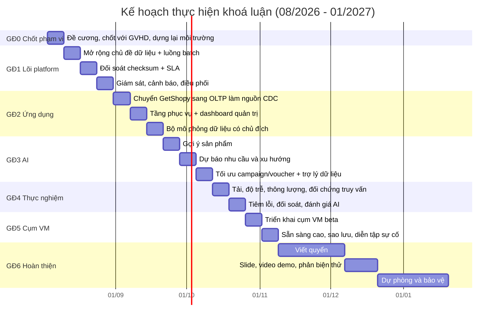

# KẾ HOẠCH THỰC HIỆN KHOÁ LUẬN

Mốc tính từ **Tuần 1 = 03/08/2026**. Bảo vệ dự kiến **01/2027**, kế hoạch dồn khối lượng chính vào 08–11/2026 để có vùng dự phòng rộng.

**Nguyên tắc lập kế hoạch**
1. **Lát cắt dọc, không lát cắt ngang.** Mỗi tuần hoàn thành một mạch xuyên suốt nguồn → kho → hiển thị cho một chủ đề nghiệp vụ, thay vì làm xong tầng này mới sang tầng khác. Nhờ đó tại bất kỳ thời điểm nào cũng có thứ demo được.
2. **Mỗi tuần có một đầu ra kiểm chứng được**, không phải "đang làm".
3. **Tách rõ bắt buộc và mở rộng.** Hạng mục đánh dấu 🔹 là mở rộng, cắt được nếu thiếu thời gian mà không ảnh hưởng mục tiêu chính.
4. Nền tảng đã thông luồng tới mức máy ảo đơn, nên trọng tâm còn lại là **mở rộng chủ đề dữ liệu, kiểm chứng SLA, ứng dụng và AI**.

---

## 1. Tổng quan giai đoạn

---

## 2. Kế hoạch chi tiết theo tuần

### GĐ0 — Chốt phạm vi và nền móng

**Tuần 1 (03–09/08)**
- Báo cáo đề cương với GVHD, chốt các điểm trong [docs/05-CAN-CHOT-VOI-GVHD.md](docs/05-CAN-CHOT-VOI-GVHD.md).
- Cập nhật lại `PROGRESS.MD` cho khớp thực tế (đã thông luồng tới máy ảo đơn).
- Dựng lại sandbox từ đầu bằng một câu lệnh để xác nhận tính tái lập; ghi lại các bước còn thủ công.
- Chuẩn hoá cấu hình: đưa toàn bộ thông tin bí mật ra `.env`, sinh cấu hình connector tự động (hiện `config/vars.yml` còn ghi mật khẩu trực tiếp — cần xử lý).
- Chốt lược đồ dữ liệu tinh giản cho 4 chủ đề: đơn hàng, sản phẩm/tồn kho, khách hàng, campaign/voucher.

**Đầu ra:** đề cương đã phê duyệt; sandbox dựng lại được từ máy trắng; sơ đồ quan hệ thực thể (ERD) của lược đồ nguồn.
**Tiêu chí kiểm tra:** `docker compose up` trên máy sạch → chạy được luồng đơn hàng đầu-cuối, không sửa tay.

---

### GĐ1 — Hoàn thiện lõi nền tảng → **Mốc M1**

**Tuần 2 (10–16/08) — Mở rộng chủ đề dữ liệu + luồng batch**
- Mở rộng nguồn PostgreSQL và connector CDC cho các bảng còn thiếu (sản phẩm, khách hàng, tồn kho, campaign, voucher).
- Xây luồng **batch định kỳ** cho nguồn không phù hợp CDC (danh mục sản phẩm, dữ liệu campaign lịch sử, tệp đối tác dạng CSV/JSON) → MinIO.
- Bổ sung mô hình dbt: staging → transformation (dedup) → warehouse cho các chủ đề mới; hoàn thiện mô hình chiều: `dim_product`, `dim_customer`, `dim_store`, `dim_date`, `dim_campaign`, `fact_order_line`, `fact_voucher_redemption`, `fact_inventory_snapshot`.
- Bổ sung dbt tests (unique, not null, quan hệ khoá, giá trị hợp lệ) cho toàn bộ mô hình.

**Đầu ra:** biểu đồ phụ thuộc (DAG) dbt hoàn chỉnh 4 chủ đề, cả hai luồng streaming và batch chạy được.
**Tiêu chí kiểm tra:** `dbt build` xanh toàn bộ; số dòng ở warehouse khớp nguồn cho từng chủ đề.

**Tuần 3 (17–23/08) — Đối soát và SLA dữ liệu**
- Mở rộng lớp `audit` hiện có (đang có cho orders) sang toàn bộ chủ đề: checksum theo cửa sổ giờ, theo ngày, toàn thời gian, cùng model tiền kiểm (preflight) theo watermark.
- Định nghĩa **hợp đồng SLA dữ liệu**: đúng (khớp số bản ghi và tổng giá trị), đủ (không thiếu phân vùng, không thiếu watermark), kịp thời (độ trễ trong ngưỡng cam kết), sẵn sàng (tỉ lệ chạy thành công của pipeline).
- Cơ chế leo thang: khi checksum lệch → ghi bảng sự cố, phát chỉ số cảnh báo, và thủ tục phát lại (replay) từ Kafka hoặc từ MinIO.
- Kiểm thử tính bất biến khi chạy lại (idempotency): chạy lại pipeline nhiều lần trên cùng dữ liệu, kết quả không đổi.

**Đầu ra:** bảng đối soát cho 4 chủ đề + tài liệu đặc tả SLA + thủ tục phát lại.
**Tiêu chí kiểm tra:** cố tình bỏ một phân vùng ở lake → hệ phát hiện và báo `STORAGE_MISMATCH`; sau khi phát lại → trở về `OK`.

**Tuần 4 (24–30/08) — Giám sát, cảnh báo, điều phối**
- Hoàn thiện Prometheus + Grafana: chỉ số Kafka (lag theo consumer group), Kafka Connect, ClickHouse (truy vấn, merge, phần chờ merge), MinIO, tài nguyên container, thời gian chạy dbt.
- Dashboard **SLA dữ liệu**: độ trễ đầu-cuối, trạng thái checksum theo tầng và theo chủ đề, độ tươi của dữ liệu (freshness), tỉ lệ job lỗi.
- Cảnh báo (Alertmanager): lag vượt ngưỡng, checksum lệch, dữ liệu quá cũ, job thất bại.
- Điều phối pipeline: thay việc chạy tay bằng bộ lịch (cron trong container, hoặc 🔹Airflow/Dagster nếu đủ thời gian) — trả lời được câu "ai lên lịch cho pipeline".

**Đầu ra:** 🎯 **Mốc M1** — nền tảng chạy tự động, tự giám sát, tự đối soát.
**Tiêu chí kiểm tra:** chạy liên tục 8 giờ không can thiệp ở tải ≥ 1.000 giao dịch/phút; checksum giữ trạng thái OK; dashboard phản ánh đúng thực tế.

---

### GĐ2 — Ứng dụng GetShopy → **Mốc M2**

**Tuần 5 (31/08–06/09) — Đưa ứng dụng vào vai trò nguồn dữ liệu**
- Thay `db.json` bằng PostgreSQL làm CSDL tác nghiệp của ứng dụng (lược đồ khớp lược đồ nguồn đã chốt ở Tuần 1).
- Bật CDC trên CSDL của ứng dụng; mọi hành vi đặt hàng, đổi trạng thái, dùng voucher đều chảy vào pipeline.
- Bổ sung thu nhận sự kiện hành vi (xem sản phẩm, thêm giỏ, tìm kiếm) — nguồn dữ liệu quan trọng cho module gợi ý.

**Đầu ra:** đặt một đơn trên giao diện → thấy đơn đó ở warehouse trong ngưỡng SLA.
**Tiêu chí kiểm tra:** đo được độ trễ từ lúc bấm "đặt hàng" tới lúc bản ghi xuất hiện ở `fact_order_line`.

**Tuần 6 (07–13/09) — Tầng phục vụ và dashboard quản trị**
- Tầng `serving` trong dbt: các bảng tổng hợp phục vụ đúng nhu cầu từng màn hình (doanh thu theo ngày/cửa hàng/danh mục, top sản phẩm, hiệu quả campaign, phễu chuyển đổi, đối soát tài chính).
- API Node.js đọc `serving` (cache Redis), gắn vào các màn hình quản trị B2B sẵn có: Dashboard, Financial, Fulfillment, Reconciliation, Alerts.
- Dashboard Metabase cho người dùng nghiệp vụ, dùng chung mô hình dữ liệu.

**Đầu ra:** dashboard quản trị chạy trên dữ liệu thật của pipeline (không còn dữ liệu tĩnh).
**Tiêu chí kiểm tra:** mỗi màn hình có nguồn gốc dữ liệu truy được về tới mô hình dbt cụ thể.

**Tuần 7 (14–20/09) — Bộ mô phỏng dữ liệu có chủ đích**
- Nâng cấp script từ `data-platform-poc` thành bộ sinh dữ liệu có cấu trúc pattern **cài đặt trước và ghi lại** (ground truth): mùa vụ theo tuần/tháng, giờ cao điểm, phân khúc khách hàng (giá trị cao / nhạy giá / mua theo dịp), độ co giãn theo giá, hiệu ứng nâng doanh số của voucher theo từng đợt campaign, sản phẩm mua kèm nhau.
- Sinh dữ liệu lịch sử 12–24 tháng để phần dự báo có đủ chuỗi thời gian; đồng thời sinh dòng dữ liệu trực tuyến cho luồng CDC.
- Sinh cả luồng cập nhật trạng thái đơn hàng (tỉ lệ cập nhật/ghi mới mô phỏng đúng đặc thù nghiệp vụ) để kiểm chứng `ReplacingMergeTree`.

**Đầu ra:** 🎯 **Mốc M2** — ứng dụng vừa sinh vừa tiêu thụ dữ liệu; kho dữ liệu đủ lớn và đủ "có ý nghĩa" cho AI.
**Tiêu chí kiểm tra:** truy vấn warehouse tái hiện lại được các pattern đã cài (VD: doanh thu tăng đúng trong khoảng thời gian campaign).

---

### GĐ3 — Ba module AI và trợ lý dữ liệu → **Mốc M3**

**Tuần 8 (21–27/09) — Gợi ý sản phẩm**
- Đặc trưng từ warehouse: ma trận tương tác khách–sản phẩm từ `fact_order_line` và sự kiện hành vi.
- Mô hình: đường cơ sở phổ biến nhất → luật kết hợp (co-purchase) → lọc cộng tác trên phản hồi ẩn (ALS/implicit); chia tập theo mốc thời gian.
- Đánh giá: Precision@K, Recall@K, MAP@K so với đường cơ sở.
- Phục vụ: tính theo lô, ghi bảng kết quả vào ClickHouse; API đọc và trả về; gắn vào trang chi tiết sản phẩm và giỏ hàng.

**Tuần 9 (28/09–04/10) — Dự báo nhu cầu và xu hướng**
- Đặc trưng: chuỗi doanh số theo sản phẩm–ngày, ngày lễ, cờ khuyến mãi, giá, tồn kho.
- Mô hình: naive/trung bình trượt (cơ sở) → Prophet → LightGBM có đặc trưng trễ (lag); đánh giá MAPE/RMSE theo kiểm định tiến dần theo thời gian (walk-forward).
- Ứng dụng: cảnh báo nguy cơ hết hàng, đề xuất nhóm hàng nên đưa vào khuyến mãi, biểu đồ xu hướng cho ban điều hành.

**Tuần 10 (05–11/10) — Tối ưu campaign/voucher + trợ lý dữ liệu**
- Phân khúc khách hàng RFM + phân cụm; đo hiệu quả các đợt voucher đã phát (tỉ lệ dùng, giá trị đơn trung bình, uplift so nhóm đối chứng).
- Bộ đề xuất cấu hình campaign: chọn phân khúc mục tiêu, loại/ mức giảm giá, danh mục áp dụng, ước lượng hiệu quả và chi phí.
- 🔹 Trợ lý dữ liệu bằng LLM: hỏi bằng tiếng Việt → sinh SQL trên ClickHouse (có giới hạn quyền chỉ đọc, giới hạn phạm vi bảng, kiểm tra cú pháp trước khi chạy) → trả bảng/biểu đồ; đánh giá trên bộ 30–50 câu hỏi mẫu.

**Đầu ra:** 🎯 **Mốc M3** — ba module có chỉ số đánh giá và đã tích hợp vào ứng dụng.
**Tiêu chí kiểm tra:** mỗi module vượt đường cơ sở tương ứng; mỗi module có ít nhất một điểm hiển thị trong ứng dụng.

---

### GĐ4 — Thực nghiệm và đánh giá → **Mốc M4**

**Tuần 11 (12–18/10) — Tải, độ trễ, hiệu năng truy vấn**
- TN1 độ trễ đầu-cuối theo bốn mức tải; TN2 thông lượng bão hoà và điểm nghẽn.
- TN3 đối chứng truy vấn ClickHouse vs PostgreSQL trên 1M / 10M / 50M dòng.
- TN4 chi phí xử lý cập nhật: incremental + `ReplacingMergeTree` so với ghi lại toàn bảng.

**Tuần 12 (19–25/10) — Tiêm lỗi, đối soát, đánh giá AI**
- TN5: hạ Kafka / hạ ClickHouse / ngắt mạng / kill giữa lúc ghi → đo thời gian phát hiện, thời gian phục hồi, tính toàn vẹn dữ liệu sau phục hồi.
- TN6: tổng hợp chỉ số ba module AI.
- Vẽ toàn bộ biểu đồ, lập bảng số liệu cuối cùng.

**Đầu ra:** 🎯 **Mốc M4** — chương thực nghiệm đủ dữ liệu để viết.

---

### GĐ5 — Tái lập kiến trúc cụm trên VM beta → **Mốc M5**

**Tuần 13 (26/10–01/11)**
- Triển khai stack lên cụm VM beta được cấp (đã có kinh nghiệm từ máy ảo đơn và từ cấu hình production, nên trọng tâm là **chuẩn hoá và tài liệu hoá**, không phải thử nghiệm).
- Hạ tầng dưới dạng mã (infrastructure as code): script/Ansible/Compose có tham số, để việc dựng lại tái lập được và trình bày được trong luận văn.

**Tuần 14 (02–08/11)**
- Cấu hình sẵn sàng cao cho thành phần trọng yếu: nhiều bản sao ClickHouse + Keeper, Kafka nhiều broker, MinIO phân tán; 🔹Keycloak SSO, 🔹PostgreSQL Patroni, 🔹Kubernetes.
- Sao lưu – phục hồi và một bài **diễn tập sự cố**: hỏng một node → dịch vụ vẫn phục vụ → phục hồi node → dữ liệu nhất quán.
- Viết sổ tay vận hành (runbook).

**Đầu ra:** 🎯 **Mốc M5** — cụm chạy được, có tài liệu, có kết quả diễn tập sự cố.

---

### GĐ6 — Viết quyển và bảo vệ → **Mốc M6**

**Tuần 15–18 (09/11–06/12) — Viết quyển**
- Tuần 15: Chương 1–2 (mở đầu, cơ sở lý thuyết, khảo sát giải pháp liên quan).
- Tuần 16: Chương 3–4 (phân tích yêu cầu, thiết kế nền tảng) — tận dụng trực tiếp bộ tài liệu kiến trúc trong `docs/`.
- Tuần 17: Chương 5–6–7 (ứng dụng, AI, hiện thực).
- Tuần 18: Chương 8–9 (thực nghiệm, kết luận), tài liệu tham khảo, phụ lục.

**Tuần 19–20 (07–20/12)**
- Slide bảo vệ, video demo đầu-cuối, tổng duyệt.
- Buổi phản biện thử: tự lập danh sách 20 câu hỏi khó nhất và chuẩn bị câu trả lời.

**21/12/2026 – 01/2027 — Dự phòng**
- Sửa theo góp ý của GVHD, hoàn thiện, in quyển, bảo vệ.

---

## 3. Ma trận mục tiêu ↔ giai đoạn

| Mục tiêu | GĐ0 | GĐ1 | GĐ2 | GĐ3 | GĐ4 | GĐ5 | GĐ6 |
|---|---|---|---|---|---|---|---|
| MT1 Pipeline đa nguồn chịu tải | ● | ●●● | ● | | ●● | ● | |
| MT2 Xử lý cập nhật/xoá | | ●● | ● | | ●●● | | |
| MT3 Truy vấn nhanh | | ●● | ●● | | ●●● | | |
| MT4 Giám sát & SLA dữ liệu | | ●●● | | | ●●● | ●● | |
| MT5 Tích hợp AI | | | ●● | ●●● | ●● | | |
| MT6 Ứng dụng minh hoạ | | | ●●● | ●● | | | |
| MT7 Triển khai cụm, sẵn sàng cao | | | | | | ●●● | |
| Báo cáo & bảo vệ | ●● | | | | | | ●●● |

---

## 4. Bảng kiểm mốc nghiệm thu

| Mốc | Hạn | Điều kiện đạt |
|---|---|---|
| **M0** Đề cương duyệt | 09/08 | GVHD chốt tên đề tài, phạm vi, ranh giới "làm thật / thiết kế" |
| **M1** Lõi platform | 30/08 | Chạy tự động 8 giờ ở tải mục tiêu, checksum OK, dashboard SLA hoạt động |
| **M2** Ứng dụng vai trò kép | 20/09 | Đặt đơn trên app → xuất hiện ở dashboard trong ngưỡng SLA; dữ liệu mô phỏng có pattern kiểm chứng được |
| **M3** Ba module AI | 11/10 | Mỗi module vượt đường cơ sở và có điểm tích hợp trong app |
| **M4** Thực nghiệm | 25/10 | Đủ số liệu TN1–TN6, có biểu đồ |
| **M5** Cụm VM | 08/11 | Cụm chạy, có IaC, runbook, kết quả diễn tập hỏng node |
| **M6** Hoàn thiện | 20/12 | Quyển + slide + video demo hoàn chỉnh |

---

## 5. Danh sách hạng mục có thể cắt (theo thứ tự cắt trước)

1. 🔹 Kubernetes + MetalLB/Ingress trên cụm beta → giữ ở chương thiết kế.
2. 🔹 Apache Iceberg cho tầng thô → giữ Parquet, phân tích so sánh bằng lý thuyết và nêu là hướng phát triển.
3. 🔹 Keycloak SSO và PostgreSQL Patroni → mô tả thiết kế.
4. 🔹 Airflow/Dagster → dùng bộ lịch đơn giản, nêu định hướng.
5. 🔹 Trợ lý dữ liệu bằng LLM → nếu cắt thì thay bằng bộ truy vấn mẫu tham số hoá.
6. 🔹 Loki cho log tập trung.

**Không cắt trong mọi trường hợp:** pipeline đa nguồn, mô hình dbt nhiều tầng, đối soát checksum, giám sát SLA, ứng dụng vai trò kép, ít nhất hai module AI, bộ thực nghiệm TN1–TN5.

---

## 6. Nhịp làm việc và theo dõi

- **Hằng ngày:** một khối tập trung; ghi lại quyết định kỹ thuật ngay khi phát sinh (viết quyển sau sẽ đỡ được rất nhiều công).
- **Cuối tuần:** cập nhật `PROGRESS.MD`, đối chiếu đầu ra tuần với tiêu chí kiểm tra, điều chỉnh tuần sau.
- **Hai tuần một lần:** báo cáo GVHD kèm bản demo chạy được, không chỉ báo cáo bằng lời.
- Số liệu thực nghiệm ghi ngay vào bảng ở dạng có thể dán trực tiếp vào quyển; không đo lại lần hai vào cuối kỳ.
