# ĐỀ CƯƠNG & KIẾN TRÚC HỆ THỐNG
### Nền tảng dữ liệu (Data Platform) theo kiến trúc Lakehouse phục vụ phân tích near real-time và ứng dụng AI cho hệ thống bán lẻ / thương mại điện tử

| | |
|---|---|
| **Tên đề tài (EN)** | Building a Modern Lakehouse Data Platform for Near Real-time Analytics and AI Applications in Retail / E-commerce |
| **GVHD** | Võ Văn Thành |
| **Thời gian** | 08/2026 – 12/2026 · bảo vệ dự kiến 01/2027 |
| **Sản phẩm** | Data Platform 3 tầng · Ứng dụng GetShopy · 3 module AI · bộ thực nghiệm định lượng |

> Đây là tài liệu **hợp nhất** dùng để trình bày: Phần I là đề cương, Phần II là kiến trúc theo bốn góc nhìn (Conceptual → Logical → Data → Physical). Các tài liệu chi tiết hơn: [01-ARCH-DATA-PLATFORM.md](01-ARCH-DATA-PLATFORM.md) · [02-ARCH-APP-GETSHOPY.md](02-ARCH-APP-GETSHOPY.md) · [03-AI-INTEGRATION.md](03-AI-INTEGRATION.md) · [04-DE-XUAT-UNG-DUNG.md](04-DE-XUAT-UNG-DUNG.md) · [05-CAN-CHOT-VOI-GVHD.md](05-CAN-CHOT-VOI-GVHD.md) · [KE-HOACH-THUC-HIEN.md](../KE-HOACH-THUC-HIEN.md)

---
---

# PHẦN I — ĐỀ CƯƠNG

## 1. Bài toán

### 1.1. Bối cảnh
Doanh nghiệp bán lẻ có chuỗi cửa hàng và kênh thương mại điện tử sinh dữ liệu liên tục trên nhiều nguồn phân tán: POS tại cửa hàng, website/app bán hàng, hệ thống khuyến mãi – voucher, kho, thanh toán. Ban điều hành cần theo dõi báo cáo **hằng ngày và ở mức near real-time**, thay vì chờ tổng hợp thủ công.

Cách làm phổ biến — cắm báo cáo trực tiếp vào CSDL tác nghiệp (OLTP) — bộc lộ ba hạn chế:

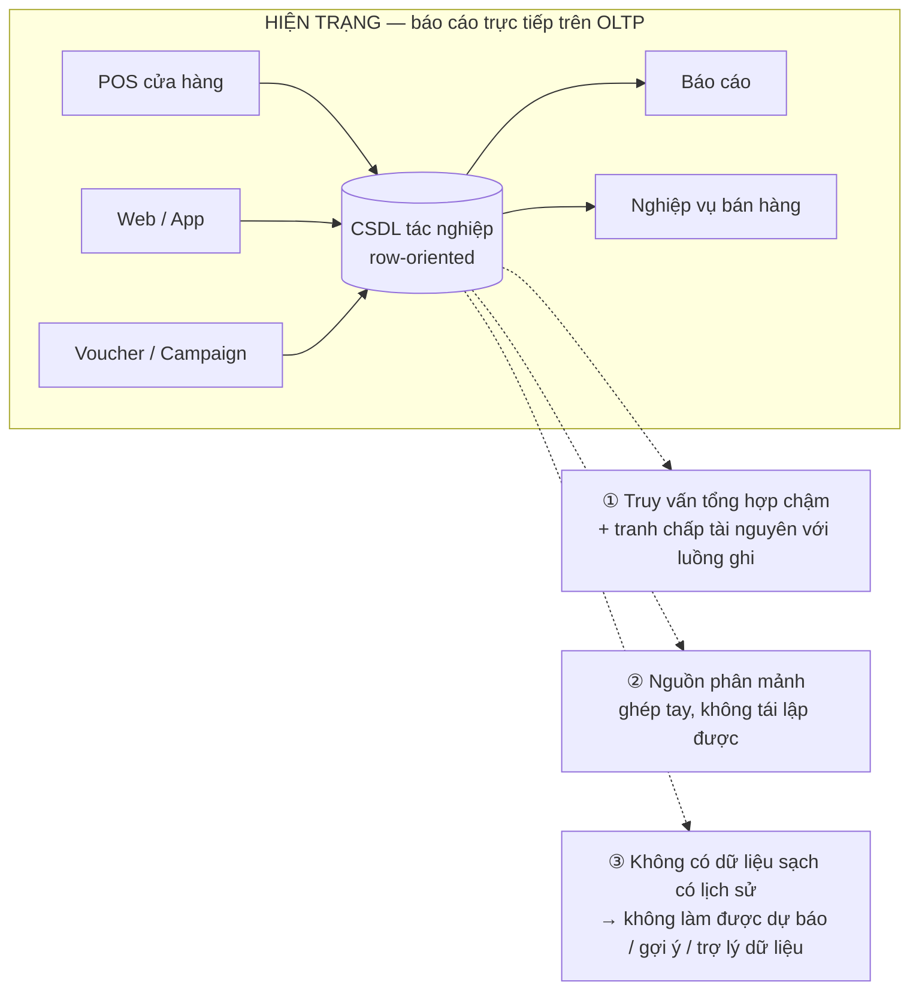

### 1.2. Phát biểu bài toán
Thiết kế và hiện thực một **nền tảng dữ liệu tập trung** có khả năng: thu nhận dữ liệu từ nhiều nguồn ở tải lớn, xử lý được khối lượng cập nhật/xoá cao, đảm bảo tính **đúng – đủ – kịp thời**, phục vụ đồng thời (a) báo cáo phân tích near real-time và (b) các ứng dụng AI trên dữ liệu đã chuẩn hoá.

### 1.3. Ba câu hỏi nghiên cứu – kỹ thuật

| | Câu hỏi | Trả lời bằng |
|---|---|---|
| **RQ1** | Thu nhận đồng thời luồng thay đổi liên tục (CDC) và luồng batch từ nhiều nguồn mà không tạo áp lực lên hệ tác nghiệp, không mất dữ liệu khi có sự cố? | CDC đọc WAL + Kafka làm vùng đệm và nhật ký phát lại + lake bất biến (§7, §8) |
| **RQ2** | Kho OLAP dạng cột tối ưu cho ghi thêm — làm sao vẫn cho kết quả đúng ở trạng thái mới nhất khi có khối lượng cập nhật lớn, mà không ghi lại toàn bảng? | Biểu diễn cập nhật bằng phiên bản + `ReplacingMergeTree` hợp nhất bất đồng bộ (§9) |
| **RQ3** | Làm sao **chứng minh** được dữ liệu ở kho đúng, đủ, kịp thời so với nguồn — tự động và quan sát được? | Đối soát checksum xuyên tầng như một hợp đồng SLA dữ liệu (§11) |

### 1.4. Điểm nhấn của đề tài
1. Không dừng ở "dựng được pipeline": trọng tâm là **cơ chế đối soát xuyên tầng** (số bản ghi + tổng giá trị nghiệp vụ + watermark giữa Nguồn → Lake → Kho), hiện thực hoàn toàn bằng SQL trong dbt, giám sát bằng Prometheus/Grafana.
2. Giá trị nền tảng được chứng minh bằng **hai đầu ra thực tế**: ứng dụng vừa sinh dữ liệu vừa tiêu thụ kết quả phân tích, và ba module AI dùng trực tiếp dữ liệu kho.
3. Kiến trúc trình bày ở **hai cấp**: sandbox một máy (nghiên cứu, đo đạc) và cụm nhiều máy (vận hành, sẵn sàng cao) — cho thấy đường đi từ nghiên cứu tới vận hành.

---

## 2. Trạng thái hiện tại

Đề tài **không bắt đầu từ số không**:

| Mức | Trạng thái |
|---|---|
| Sandbox một máy (`local-infra-sandbox`) | **Đã thông luồng đầu-cuối** — có cả lớp `audit` đối soát checksum |
| Máy ảo đơn (single-node VM) | **Đã thông luồng** (`PROGRESS.MD` trước đây chưa cập nhật) |
| Cụm production tại doanh nghiệp | Đã go-live — ⚪ ngoài phạm vi nghiệm thu, chỉ làm cơ sở đối chiếu thiết kế |
| Cụm VM beta được cấp | Sẵn có, toàn quyền — môi trường **tái lập & tài liệu hoá** kiến trúc cụm cho khoá luận |
| Ứng dụng GetShopy | Chạy được; còn dùng `db.json` → **chưa bắt được CDC**, phải chuyển sang PostgreSQL |
| Bộ mô phỏng POS | Có script dùng được; cần nâng cấp thành bộ sinh dữ liệu **có chủ đích** |

Bốn khối công việc còn lại: **(1)** hoàn thiện + đo đạc–kiểm chứng nền tảng theo SLA, **(2)** đưa ứng dụng vào đúng vai trò nguồn–tiêu thụ, **(3)** xây các module AI, **(4)** tái lập kiến trúc cụm kèm tài liệu vận hành.

---

## 3. Mục tiêu

| # | Mục tiêu | Tiêu chí hoàn thành |
|---|---|---|
| **MT1** | Pipeline đầu-cuối đa nguồn (CDC near real-time + batch), chịu tải lớn | Chạy liên tục ≥ 8h ở ≥ 1.000 giao dịch/phút, checksum khớp, phát lại được sau sự cố |
| **MT2** | Xử lý cập nhật/xoá hiệu quả trên OLAP | Trạng thái mới nhất đúng 100% so nguồn; có so sánh chi phí với phương án ghi lại toàn bảng |
| **MT3** | Truy vấn nhanh phục vụ báo cáo | 8–10 truy vấn tiêu biểu, p95 < 1s trên ≥ 10 triệu dòng, có đối chứng PostgreSQL |
| **MT4** | Giám sát & SLA dữ liệu: đúng, đủ, kịp thời, sẵn sàng | Dashboard SLA + cảnh báo khi lệch |
| **MT5** | Tích hợp AI: gợi ý, dự báo, tối ưu campaign (+ trợ lý dữ liệu) | Mỗi module: đặc trưng từ kho, chỉ số đánh giá offline, đường phục vụ app gọi được |
| **MT6** | Ứng dụng GetShopy vai trò kép | Đặt đơn trên app → xuất hiện ở dashboard/AI trong ngưỡng SLA |
| **MT7** | Triển khai cấp cụm, sẵn sàng cao | Stack chạy trên cụm VM + runbook + diễn tập hỏng node |

---

## 4. Phạm vi

| Trong phạm vi (làm thật, có kiểm chứng) | Ngoài phạm vi (chỉ thiết kế / định hướng) |
|---|---|
| Sandbox một máy: PostgreSQL → Debezium/Kafka → MinIO Parquet → ClickHouse → dbt → Metabase/Grafana | Vận hành hệ thống thật của doanh nghiệp |
| Luồng batch định kỳ cho nguồn không phù hợp CDC | Apache Iceberg cho tầng thô (phân tích so sánh ở mức thiết kế) |
| Bộ sinh dữ liệu mô phỏng POS **có chủ đích** | Keycloak SSO, Consul, PostgreSQL/Patroni, Kubernetes + MetalLB |
| 4 chủ đề dữ liệu: bán hàng, sản phẩm/tồn kho, khách hàng, campaign/voucher | Airflow/Dagster (sandbox dùng bộ lịch đơn giản) |
| Đối soát checksum + hợp đồng SLA + giám sát | Nghiên cứu thuật toán ML mới |
| Ứng dụng GetShopy vai trò kép + 3 module AI | Cổng thanh toán/giao vận thật, app di động |
| Bộ thực nghiệm TN1–TN6 | |
| Tái lập cụm trên VM beta được cấp | |

**Giới hạn & giả định:** khối lượng tải mục tiêu (hàng chục triệu bản ghi ghi mới, hàng triệu bản ghi cập nhật/ngày) là **yêu cầu thiết kế**; thực nghiệm chạy ở quy mô nhỏ hơn theo tài nguyên phòng lab, kèm ngoại suy có lập luận. Lược đồ **tham khảo có tinh giản** từ mô hình nghiệp vụ thực tế, không sao chép nguyên trạng; **toàn bộ dữ liệu trong luận văn là dữ liệu mô phỏng**.

---

## 5. Phương pháp và công nghệ

**Phương pháp:** nghiên cứu tài liệu (Lakehouse, Medallion, Kimball, CDC theo log, merge-on-read) → **phát triển tăng dần theo lát cắt dọc** (mỗi vòng lặp hoàn thành một mạch nguồn → kho → hiển thị cho một chủ đề nghiệp vụ, thay vì làm xong từng tầng) → thực nghiệm và đo đạc có đối chứng → kiểm chứng chất lượng dữ liệu bằng dbt tests + đối soát checksum.

| Tầng | Công nghệ |
|---|---|
| Nguồn | PostgreSQL 15 (`wal_level = logical`), bộ sinh dữ liệu Python/Faker |
| Thu nhận | Debezium, Kafka Connect, Apache Kafka; job batch định kỳ |
| Lưu trữ thô | MinIO (S3 API) + Apache Parquet |
| Xử lý | dbt-core (adapter ClickHouse), incremental |
| Kho | ClickHouse — `ReplacingMergeTree` |
| Phục vụ & BI | Metabase, API Node.js, Redis |
| Giám sát | Prometheus, Grafana |
| AI/ML | pandas, scikit-learn, implicit/ALS, Prophet, LightGBM, FastAPI, LLM API |
| Ứng dụng | React + Vite, Node.js/Express, Ant Design |
| Triển khai | Docker Compose → cụm VM |

---

## 6. Thực nghiệm và tiêu chí đánh giá

| # | Thực nghiệm | Cách đo | Kết quả mong đợi |
|---|---|---|---|
| **TN1** | Độ trễ đầu-cuối theo tải | Dấu thời gian nguồn vs kho; p50/p95/p99 ở 100 / 500 / 1.000 / 5.000 giao dịch/phút | Ngưỡng tải giữ được SLA; chỉ ra điểm nghẽn |
| **TN2** | Thông lượng thu nhận tối đa | Tăng tải tới khi Kafka lag tăng đơn điệu không hồi phục | Thông lượng bão hoà + thành phần nghẽn |
| **TN3** | Hiệu năng truy vấn có đối chứng | 8–10 truy vấn báo cáo, ClickHouse vs PostgreSQL, ở 1M / 10M / 50M dòng | Tỉ lệ tăng tốc và biến thiên theo quy mô |
| **TN4** | Chi phí xử lý cập nhật | incremental + `ReplacingMergeTree` vs ghi lại toàn bảng: thời gian, I/O, tài nguyên | Chứng minh lựa chọn kiến trúc ở MT2 |
| **TN5** | **SLA: đúng – đủ – kịp thời – sẵn sàng** | Checksum theo giờ/ngày/toàn thời gian + tiêm lỗi (hạ Kafka, hạ ClickHouse, ngắt mạng, kill giữa lúc ghi) | Sau phục hồi checksum trở về OK, không mất/không nhân bản; đo thời gian phát hiện và phục hồi |
| **TN6** | Đánh giá module AI | Gợi ý: Precision@K/Recall@K/MAP@K · Dự báo: sMAPE/WAPE/RMSE · Campaign: uplift mô phỏng · Trợ lý: tỉ lệ SQL chạy được/đúng ngữ nghĩa | Vượt đường cơ sở; nêu rõ giới hạn do dữ liệu mô phỏng |

---

## 7. Kế hoạch thực hiện (tóm lược)

| Giai đoạn | Thời gian | Mốc |
|---|---|---|
| GĐ0 Chốt phạm vi & đề cương | Tuần 1 (03–09/08) | **M0** đề cương duyệt |
| GĐ1 Hoàn thiện lõi platform | Tuần 2–4 (10–30/08) | **M1** pipeline tự động, tự giám sát, tự đối soát |
| GĐ2 Ứng dụng GetShopy | Tuần 5–7 (31/08–20/09) | **M2** vai trò kép nguồn–tiêu thụ |
| GĐ3 Ba module AI + trợ lý | Tuần 8–10 (21/09–11/10) | **M3** có đánh giá offline, đã tích hợp |
| GĐ4 Thực nghiệm & đánh giá | Tuần 11–12 (12–25/10) | **M4** đủ số liệu TN1–TN6 |
| GĐ5 Tái lập cụm VM beta | Tuần 13–14 (26/10–08/11) | **M5** IaC + runbook + diễn tập sự cố |
| GĐ6 Viết quyển & bảo vệ | Tuần 15 → 12/2026 | **M6** quyển + slide + video demo |

Chi tiết theo tuần, Gantt, tiêu chí kiểm tra và danh sách hạng mục cắt được: [KE-HOACH-THUC-HIEN.md](../KE-HOACH-THUC-HIEN.md).

---
---

# PHẦN II — KIẾN TRÚC HỆ THỐNG

Kiến trúc được trình bày theo bốn góc nhìn, đi từ trừu tượng tới cụ thể:

| Góc nhìn | Trả lời câu hỏi | Mục |
|---|---|---|
| **Conceptual** | Hệ thống làm gì, gồm những khối chức năng nào (không nhắc công nghệ) | §8 |
| **Logical** | Mỗi khối được hiện thực bằng thành phần nào, dữ liệu chảy ra sao | §9–§12 |
| **Data** | Dữ liệu được mô hình hoá thế nào | §10 |
| **Physical / Deployment** | Chạy ở đâu, trên máy nào, chịu lỗi thế nào | §13 |

---

## 8. Góc nhìn khái niệm (Conceptual View)

Ở mức khái niệm, nền tảng là một chuỗi bốn khối chức năng, cộng hai khối xuyên suốt (quản trị và đảm bảo chất lượng). Sơ đồ này **cố tình không nhắc tên công nghệ** — nó là kiến trúc, không phải danh sách công cụ.

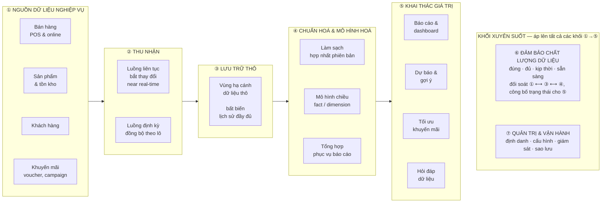

**Bốn quyết định kiến trúc ở mức khái niệm:**

| Quyết định | Lý do |
|---|---|
| Tách hoàn toàn khối tác nghiệp và khối phân tích | Báo cáo không được gây rủi ro cho hệ thống bán hàng |
| Dữ liệu thô là bất biến và giữ lịch sử đầy đủ | Mọi sai sót ở tầng trên đều tính lại được, không phải đọc lại nguồn |
| Cập nhật được biểu diễn bằng phiên bản mới, không sửa tại chỗ | Phù hợp bản chất của kho phân tích dạng cột; hợp nhất được đẩy về nền |
| Chất lượng dữ liệu là **một thành phần của hệ thống**, không phải quy trình thủ công | Chỉ khi tự động và quan sát được thì mới cam kết SLA được |

---

## 9. Góc nhìn logic (Logical View)

Cùng bảy khối ở §8, nhưng đã gán thành phần hiện thực cụ thể. Tách thành hai sơ đồ cho dễ đọc: **(a)** luồng dữ liệu chính (khối ①→④), **(b)** khai thác cùng hai khối xuyên suốt (⑤⑥⑦).

#### (a) Luồng dữ liệu chính — từ nguồn tới kho

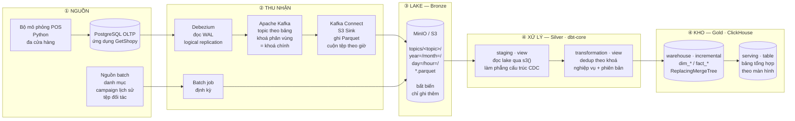

#### (b) Khai thác, đảm bảo chất lượng và vận hành

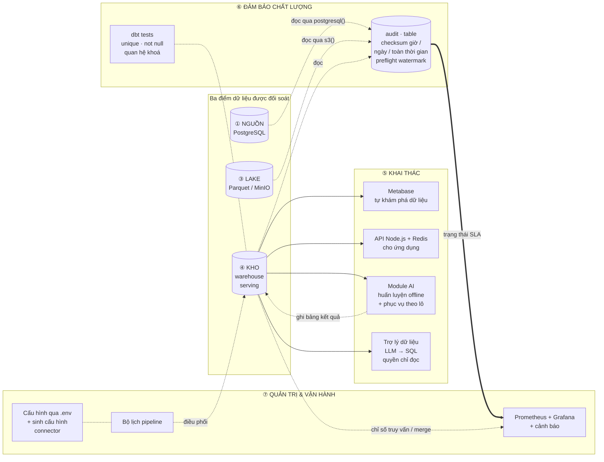

### 9.1. Đặc tả các tầng

| Tầng | Thành phần | Trách nhiệm chính | Ghi chú kỹ thuật |
|---|---|---|---|
| Nguồn | PostgreSQL 15 | CSDL tác nghiệp | Bật `wal_level = logical` + publication cho bảng cần theo dõi |
| Thu nhận streaming | Debezium → Kafka → S3 Sink | Bắt thay đổi, đệm, hạ cánh Parquet | Khoá thông điệp = khoá chính ⇒ mọi thay đổi của một bản ghi vào cùng phân vùng và **giữ đúng thứ tự** — điều kiện tiên quyết để dedup đúng |
| Thu nhận batch | Job định kỳ | Nguồn không phù hợp CDC | Ghi theo **cùng quy ước phân vùng** ⇒ tầng trên xử lý đồng nhất bất kể nguồn gốc |
| Lake | MinIO + Parquet | Nguồn chân lý bất biến | Vấn đề tệp nhỏ: tăng ngưỡng cuộn tệp / job gộp tệp / (định hướng) Apache Iceberg |
| Silver | dbt staging + transformation | Làm phẳng CDC, ép kiểu, hợp nhất phiên bản | Chọn phiên bản mới nhất theo `(ts_ms, lsn)`; loại `op = 'd'` |
| Gold | dbt warehouse + serving trên ClickHouse | Mô hình chiều + bảng tổng hợp | Incremental theo watermark; preflight chặn tính trên phân vùng còn dở |
| Khai thác | Metabase, API, AI | Đưa dữ liệu thành quyết định | Ghi luôn vào PostgreSQL, đọc tổng hợp luôn từ ClickHouse |
| Chất lượng | dbt audit + tests | Đối soát và kiểm thử | ClickHouse đọc được cả PostgreSQL (`postgresql()`) và Parquet (`s3()`) ⇒ đối soát biểu diễn trọn vẹn bằng SQL |
| Vận hành | Prometheus/Grafana, bộ lịch | Quan sát và điều phối | Bốn dashboard: pipeline · SLA dữ liệu · ClickHouse · hạ tầng |

### 9.2. Cơ chế xử lý cập nhật/xoá — trọng tâm kỹ thuật (RQ2)

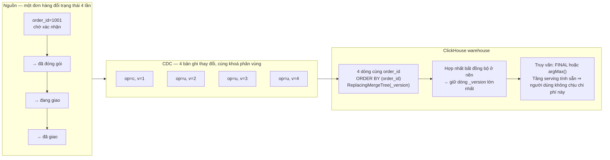

```sql
CREATE TABLE warehouse.dim_orders (
    order_id      UInt64,
    store_id      UInt32,
    customer_id   UInt64,
    status        LowCardinality(String),
    total_amount  Decimal(18, 2),
    updated_at    DateTime64(3),
    _version      UInt64,   -- suy ra từ ts_ms / lsn của CDC
    _is_deleted   UInt8     -- xoá luận lý, tránh xoá vật lý tốn kém
) ENGINE = ReplacingMergeTree(_version)
PARTITION BY toYYYYMM(updated_at)
ORDER BY (order_id);
```

Phương án đối chứng trong TN4: ghi lại toàn bộ bảng mỗi lần chạy, hoặc `ALTER TABLE ... UPDATE` (mutation nặng). Tiêu chí so sánh: thời gian chạy, I/O đĩa, tài nguyên tiêu thụ, độ trễ nhìn thấy dữ liệu mới.

---

## 10. Góc nhìn dữ liệu (Data View)

### 10.1. Dòng chảy qua các tầng mô hình hoá

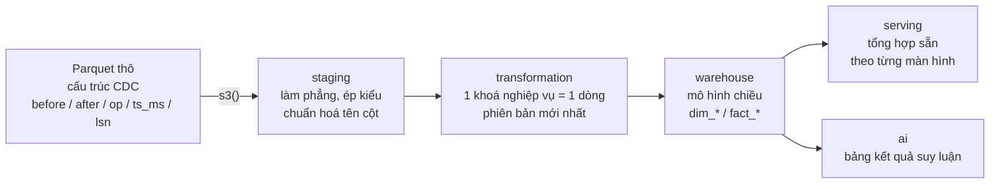

### 10.2. Mô hình chiều (star schema)

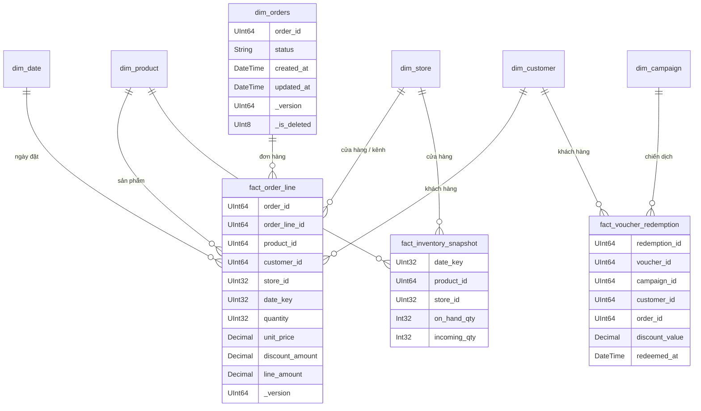

### 10.3. Bốn chủ đề dữ liệu

| Chủ đề | Bảng fact | Câu hỏi nghiệp vụ phục vụ |
|---|---|---|
| Bán hàng | `fact_order_line` | Doanh thu theo thời gian/cửa hàng/danh mục, giá trị đơn trung bình, top sản phẩm |
| Khuyến mãi | `fact_voucher_redemption` | Tỉ lệ sử dụng voucher, chi phí khuyến mãi, uplift theo campaign |
| Tồn kho | `fact_inventory_snapshot` | Nguy cơ hết hàng, vòng quay tồn kho, hàng tồn chậm |
| Khách hàng | dẫn xuất từ fact bán hàng | RFM, giữ chân khách, giá trị vòng đời khách hàng |

`dim_date` được sinh sẵn (không lấy từ CDC), chứa cờ ngày lễ và mùa vụ — cần cho phần dự báo.

---

## 11. Đối soát dữ liệu và hợp đồng SLA (RQ3)

### 11.1. Nguyên lý ba điểm đo

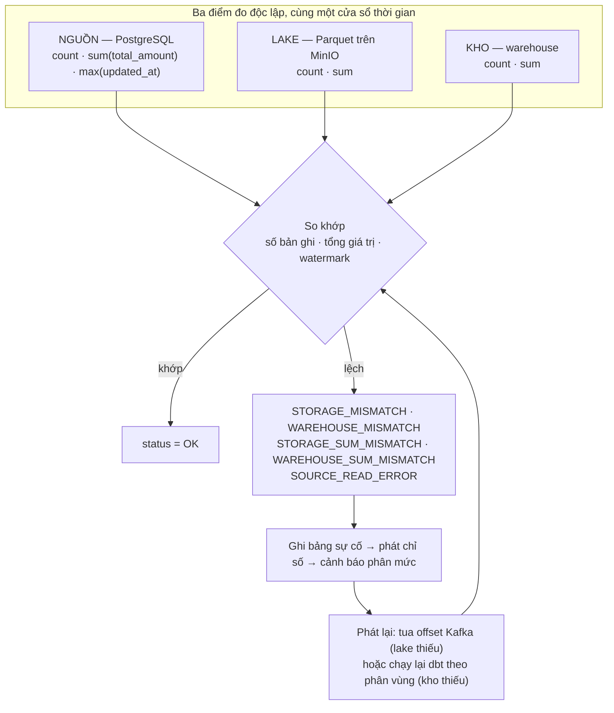

**Vì sao phải so cả tổng giá trị, không chỉ đếm dòng:** số bản ghi đúng mà tổng tiền lệch cho thấy lỗi ở tầng biến đổi — sai kiểu dữ liệu, mất độ chính xác số thập phân, dedup chọn sai phiên bản. Đây là loại lỗi mà việc chỉ đếm dòng **không bao giờ** phát hiện được.

### 11.2. Bốn cấp đối soát

| Model | Phạm vi | Tần suất | Mục đích |
|---|---|---|---|
| `checksum_watermark_preflight` | Kiểm tra dữ liệu đã hạ cánh đủ | Trước mỗi lần biến đổi | Chặn tính toán trên phân vùng còn dở |
| `checksum_hourly_orders` | Cửa sổ 1 giờ gần nhất | Mỗi giờ | Phát hiện lệch sớm, đúng mức chi phí |
| `checksum_all_orders` | Toàn thời gian | Hằng ngày | Chống trôi tích luỹ theo thời gian |
| `checksum_escalation_orders` | Bản ghi lệch quá ngưỡng thời gian | Mỗi giờ | Phân biệt "đang trên đường" và "thực sự mất" |

### 11.3. Hợp đồng SLA dữ liệu

| Chiều | Chỉ số | Ngưỡng cam kết (sandbox) | Nguồn đo |
|---|---|---|---|
| **Đúng** | tỉ lệ checksum trạng thái OK | ≥ 99,9% lần chạy | lớp `audit` |
| **Đủ** | số bản ghi lệch giữa các tầng | = 0 sau khi hoà | lớp `audit` |
| **Kịp thời** | độ trễ đầu-cuối p95 | trong ngưỡng chu kỳ thu nhận | dấu thời gian nguồn vs kho |
| **Sẵn sàng** | tỉ lệ lần chạy pipeline thành công | ≥ 99% | Prometheus |
| **Tươi** | tuổi bản ghi mới nhất ở kho | < 2× chu kỳ thu nhận | truy vấn watermark |

---

## 12. Ứng dụng và AI — hai đầu ra của nền tảng

### 12.1. Ứng dụng GetShopy: vai trò kép

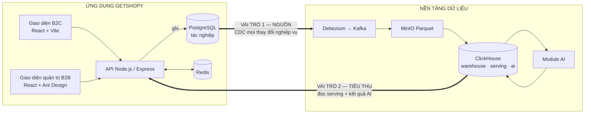

**Nguyên tắc tách trách nhiệm ở mức mã nguồn:** ghi luôn đi vào PostgreSQL, đọc dữ liệu tổng hợp luôn đi vào ClickHouse — hiện thân trực tiếp của luận điểm "tách rời tác nghiệp và phân tích".

Luồng đổi trạng thái đơn hàng trên app chính là **nguồn cập nhật thật** để kiểm chứng `ReplacingMergeTree` (§9.2). Chi tiết bản đồ màn hình ↔ mô hình dbt: [02-ARCH-APP-GETSHOPY.md](02-ARCH-APP-GETSHOPY.md).

### 12.2. Kiến trúc tích hợp AI

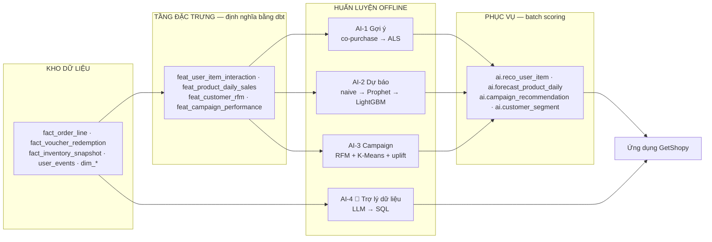

**Hai quyết định thiết kế:**
- **Đặc trưng định nghĩa bằng dbt, không bằng Python** — cùng một định nghĩa dùng cho cả huấn luyện và phục vụ (tránh lệch train/serve), có kiểm thử dữ liệu, có lineage.
- **Phục vụ theo lô, ghi kết quả vào ClickHouse** — độ trễ đọc rất thấp, không phụ thuộc tình trạng dịch vụ mô hình lúc người dùng truy cập, dễ tái lập kết quả để đưa vào báo cáo. FastAPI chỉ dùng cho suy luận tại thời điểm yêu cầu.

**Vấn đề dữ liệu huấn luyện:** dữ liệu sinh ngẫu nhiên đều thì không mô hình nào học được gì. Bộ sinh dữ liệu vì vậy cài đặt sẵn 9 nhóm quy luật (mùa vụ, giờ cao điểm, phân khúc khách, độ co giãn theo giá, hiệu ứng campaign, sản phẩm mua kèm, sở thích cá nhân, xu hướng dài hạn, nhiễu) và **ghi lại tham số** — nhờ đó có "đáp án" để đối chiếu với kết quả mô hình, điều dữ liệu thật không cho phép. Chi tiết: [03-AI-INTEGRATION.md](03-AI-INTEGRATION.md).

---

## 13. Góc nhìn vật lý (Physical / Deployment View)

### 13.1. Cấp sandbox — một máy (môi trường nghiên cứu & đo đạc)

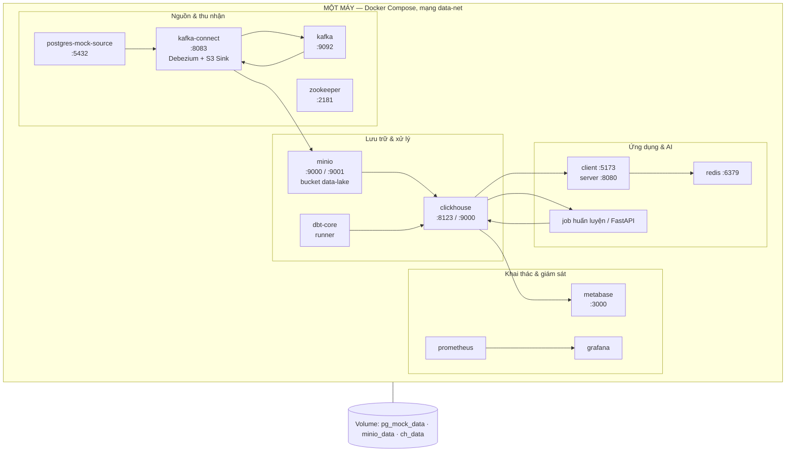

Đây là môi trường được dùng để nghiệm thu và chạy toàn bộ thực nghiệm TN1–TN6, vì nó cho phép kiểm soát biến số và tái lập kết quả.

### 13.2. Cấp cụm — nhiều máy ảo (tính sẵn sàng cao)

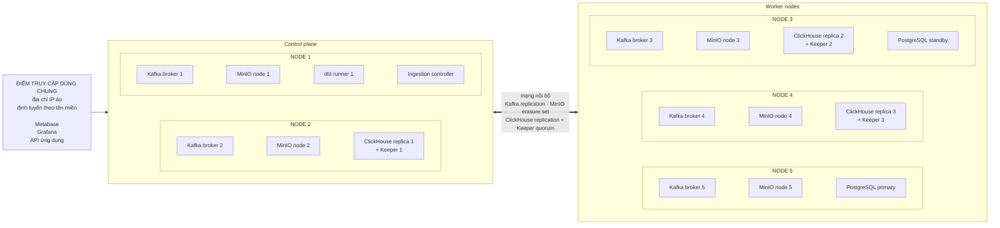

**Chiến lược sẵn sàng cao theo thành phần**

| Thành phần | Cơ chế | Chịu được |
|---|---|---|
| Kafka | nhiều broker, hệ số nhân bản 3, `min.insync.replicas = 2` | hỏng 1 broker: không mất dữ liệu, không ngừng ghi |
| MinIO | chế độ phân tán, mã hoá xoá (erasure coding) | hỏng đĩa/node trong giới hạn erasure set |
| ClickHouse | bảng nhân bản + cụm Keeper 3 node (đồng thuận) | hỏng 1 replica: vẫn đọc/ghi được |
| PostgreSQL | streaming replication, chuyển đổi dự phòng (định hướng: Patroni + Consul) | hỏng primary → chuyển sang standby |
| dbt / batch job | tiến trình không lưu trạng thái, chạy lại được | lỗi giữa lúc chạy → chạy lại an toàn nhờ tính bất biến |
| Điểm truy cập | IP ảo + định tuyến theo tên miền | hỏng node vào: không mất điểm truy cập |

**Diễn tập sự cố (nội dung TN5):** hạ một broker Kafka khi đang có tải · hạ một replica ClickHouse khi đang truy vấn · ngắt mạng giữa lake và kho · kill tiến trình dbt giữa lúc ghi. Mỗi kịch bản đo: hệ còn phục vụ được không, thời gian phát hiện, thời gian phục hồi, trạng thái đối soát sau phục hồi.

### 13.3. Hai cấp triển khai — vai trò khác nhau

| | Sandbox một máy | Cụm nhiều máy VM beta |
|---|---|---|
| Mục đích | Nghiên cứu, phát triển, **đo đạc & nghiệm thu** | Chứng minh khả năng vận hành và chịu lỗi |
| Đóng gói | Docker Compose | IaC có tham số (script/Ansible) |
| Dữ liệu | Mô phỏng, quy mô kiểm soát được | Mô phỏng, quy mô lớn hơn |
| Nội dung thực nghiệm | TN1–TN4, TN6 | TN5 (một phần), diễn tập sự cố |
| Trạng thái | Đã thông luồng | Tái lập & tài liệu hoá ở GĐ5 |

---

## 14. Hướng phát triển của kiến trúc

| Hạng mục | Giá trị mang lại | Trạng thái trong đề tài |
|---|---|---|
| **Apache Iceberg** cho tầng thô | Giải quyết tệp nhỏ, cập nhật mức bản ghi, time travel, tiến hoá lược đồ | Thiết kế + so sánh; hiện thực nếu hoàn thành sớm M1–M4 |
| **Airflow / Dagster** | Điều phối có phụ thuộc, chạy lại theo mốc, lineage khi thực thi | Sandbox dùng bộ lịch đơn giản |
| **Quản trị dữ liệu** (DataHub/OpenMetadata) | Danh mục dữ liệu, lineage, phân loại dữ liệu nhạy cảm | Định hướng |
| **Feature store** | Dùng lại đặc trưng, chống lệch train/serve | Định hướng — hiện tính bằng dbt |
| **Xử lý dòng thực sự** (Flink/ksqlDB) | Tổng hợp theo cửa sổ ở mức giây | Micro-batch đã đủ cho yêu cầu near real-time |
| **Định danh tập trung** (Keycloak) | SSO, phân quyền theo vai trò cho Metabase/API/UI | Định hướng |
| **CI/CD + Terraform/Ansible** | Dựng lại cụm tái lập được, triển khai tự động | Một phần thực hiện ở GĐ5 |

Điều đáng nhấn mạnh: [04-DE-XUAT-UNG-DUNG.md](04-DE-XUAT-UNG-DUNG.md) liệt kê **14 ứng dụng** có thể xây trên nền tảng này, tất cả dùng chung **một đường ống dữ liệu duy nhất** — không ứng dụng nào cần thu nhận lại từ nguồn, không ứng dụng nào truy vấn trực tiếp hệ tác nghiệp. Ứng dụng mới chỉ cần thêm mô hình dbt và một bảng kết quả. Đó là khác biệt giữa một *nền tảng* và một *đường ống báo cáo*, và là lý do phần lõi — thu nhận, mô hình hoá, đối soát, giám sát — được đặt làm trọng tâm của đề tài.
