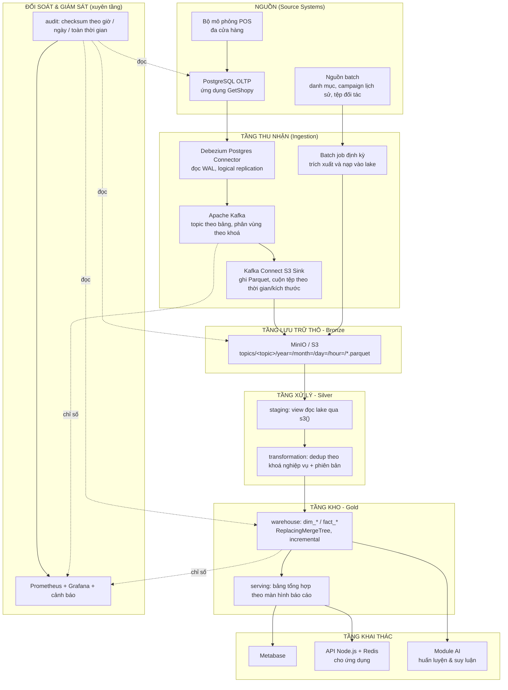
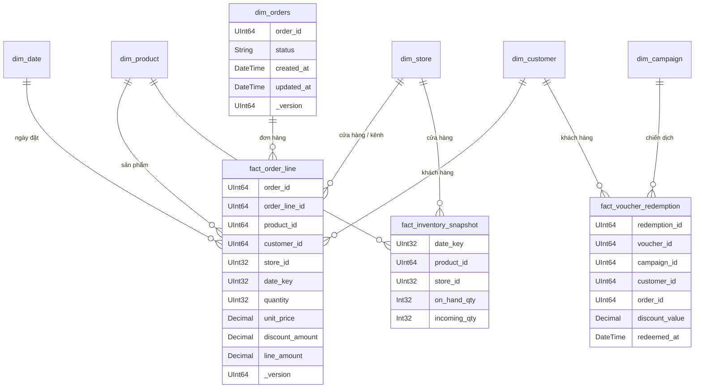
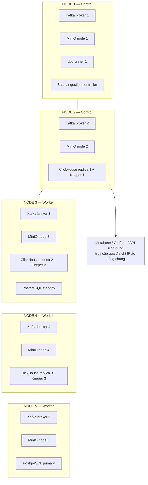

# KIẾN TRÚC NỀN TẢNG DỮ LIỆU (DATA PLATFORM)

Tài liệu này đặc tả kiến trúc nền tảng dữ liệu của đề tài ở hai cấp độ: **sandbox một máy** (môi trường nghiên cứu, đo đạc) và **cụm nhiều máy** (môi trường vận hành, tính sẵn sàng cao). Cấp sandbox là môi trường được dùng để thực nghiệm và nghiệm thu trong khoá luận.

---

## 1. Nguyên lý thiết kế

| Nguyên lý | Diễn giải |
|---|---|
| **Tách rời tác nghiệp và phân tích** | Không truy vấn phân tích trực tiếp trên CSDL tác nghiệp. Dữ liệu được sao chép ra ngoài bằng CDC đọc log, gần như không gây tải cho hệ thống bán hàng. |
| **Dữ liệu thô bất biến** | Lake chỉ ghi thêm, không sửa. Mọi sai sót ở tầng trên đều có thể tính lại từ lake mà không cần đọc lại nguồn. |
| **Hàng đợi là vùng đệm và là nhật ký phát lại** | Kafka giữ dữ liệu theo thời hạn lưu trữ (retention), cho phép phát lại khi tầng dưới lỗi hoặc khi thay đổi logic biến đổi. |
| **Biến đổi tăng trưởng** | dbt chỉ xử lý phần dữ liệu mới theo watermark; không tính lại toàn bộ. |
| **Hợp nhất bất đồng bộ thay vì cập nhật tại chỗ** | Cập nhật/xoá được biểu diễn bằng phiên bản mới; ClickHouse `ReplacingMergeTree` hợp nhất ở nền, tránh chi phí ghi lại bảng. |
| **Chất lượng dữ liệu là một thành phần của hệ thống** | Đối soát xuyên tầng chạy tự động theo lịch, phát chỉ số ra hệ giám sát, có thủ tục leo thang — không phải kiểm tra thủ công. |
| **Mọi thứ tái lập được** | Cấu hình nằm trong mã và biến môi trường; dựng lại môi trường từ máy trắng bằng một câu lệnh. |

---

## 2. Kiến trúc logic



---

## 3. Đặc tả từng tầng

### 3.1. Tầng nguồn
- **PostgreSQL 15** với `wal_level = logical`, publication cho các bảng cần theo dõi. Đây là CSDL tác nghiệp của ứng dụng GetShopy.
- **Bộ mô phỏng POS**: tiến trình Python ghi trực tiếp vào PostgreSQL với tốc độ điều khiển được, mô phỏng nhiều cửa hàng, có cả ghi mới và cập nhật trạng thái đơn hàng. Mục đích: tạo tải đủ lớn để thực nghiệm và tạo dữ liệu lịch sử có pattern cho AI.
- **Nguồn batch**: dữ liệu ít biến động hoặc chỉ có dạng tệp (danh mục sản phẩm, cấu hình campaign lịch sử, dữ liệu đối tác vận chuyển/thanh toán).

### 3.2. Tầng thu nhận

**Luồng streaming (near real-time)**
- **Debezium** đọc nhật ký ghi trước (WAL) của PostgreSQL, tạo bản ghi thay đổi có cấu trúc `before` / `after` / `op` (`c` tạo mới, `u` cập nhật, `d` xoá) / `ts_ms` / `lsn`.
- **Kafka**: mỗi bảng nguồn tương ứng một topic (`cdc_prod.public.<table>`). Khoá thông điệp là khoá chính, đảm bảo mọi thay đổi của cùng một bản ghi đi vào cùng một phân vùng và **giữ đúng thứ tự** — điều kiện tiên quyết để dedup theo phiên bản cho ra kết quả đúng.
- **S3 Sink Connector** ghi xuống MinIO ở định dạng Parquet, phân vùng theo `year/month/day/hour`, cuộn tệp theo ngưỡng số bản ghi hoặc theo thời gian.

**Điểm cần chú ý — vấn đề tệp nhỏ (small files):** micro-batch theo chu kỳ ngắn sinh nhiều tệp Parquet nhỏ, làm giảm hiệu năng đọc. Ba biện pháp: (a) tăng ngưỡng cuộn tệp và chấp nhận độ trễ cao hơn, (b) chạy job gộp tệp định kỳ, (c) dùng định dạng bảng có quản lý siêu dữ liệu như **Apache Iceberg** (hướng phát triển — xem Mục 8).

**Luồng batch**
- Job định kỳ (hằng ngày) trích xuất nguồn không phù hợp CDC, ghi Parquet vào lake theo cùng quy ước phân vùng, nhờ đó tầng trên xử lý đồng nhất bất kể nguồn gốc.

### 3.3. Tầng lưu trữ thô (Bronze)
- **MinIO** với giao diện tương thích S3; bucket `data-lake`.
- Quy ước đường dẫn: `topics/<topic>/year=YYYY/month=MM/day=DD/hour=HH/*.parquet`.
- Tính chất: **bất biến, chỉ ghi thêm**. Là nguồn chân lý (source of truth) để tính lại toàn bộ tầng trên khi cần.
- Vòng đời dữ liệu: dữ liệu nóng giữ tại chỗ; dữ liệu cũ có thể chuyển sang lớp lưu trữ rẻ hơn (định hướng).

### 3.4. Tầng xử lý (Silver) — dbt-core
Cấu trúc dự án dbt hiện tại (`local-infra-sandbox/dbt_warehouse`) và định hướng mở rộng:

| Thư mục | Vật liệu hoá | CSDL đích | Vai trò |
|---|---|---|---|
| `models/staging` | view | (mặc định) | Đọc trực tiếp Parquet trên MinIO bằng hàm bảng `s3()`, làm phẳng cấu trúc CDC (`after.*`), ép kiểu, chuẩn hoá tên cột |
| `models/transformation` | view | (mặc định) | **Dedup**: với mỗi khoá nghiệp vụ, chọn phiên bản mới nhất theo `(ts_ms, lsn)`; loại bản ghi đã xoá (`op = 'd'`) |
| `models/warehouse` | incremental | `warehouse` | Mô hình chiều: `dim_*`, `fact_*`; engine `ReplacingMergeTree`, khoá sắp xếp theo khoá nghiệp vụ, cột phiên bản để hợp nhất |
| `models/serving` | table | `serving` | Bảng tổng hợp sẵn theo từng màn hình báo cáo, tối ưu độ trễ đọc |
| `models/audit` | table | `audit` | Checksum xuyên tầng, tiền kiểm theo watermark, bản ghi sự cố |

**Chiến lược tăng trưởng (incremental):** mỗi lần chạy chỉ đọc phân vùng lake mới hơn watermark đã xử lý; watermark lưu ở lớp audit/metadata. Model tiền kiểm (`checksum_watermark_preflight`) xác nhận dữ liệu nguồn đã hạ cánh đủ trước khi tính, tránh tính trên phân vùng còn dở.

**Kiểm thử dữ liệu:** dbt tests cho tính duy nhất của khoá, ràng buộc không rỗng, quan hệ khoá giữa fact và dim, miền giá trị hợp lệ (trạng thái đơn, số tiền không âm).

### 3.5. Tầng kho (Gold) — ClickHouse

**Vì sao ClickHouse:** lưu trữ theo cột và nén cao nên chỉ đọc đúng cột cần thiết; thực thi vector hoá; đặc biệt có họ engine `*MergeTree` hợp nhất dữ liệu ở nền — phù hợp với đặc thù **lượng cập nhật lớn** của nghiệp vụ đơn hàng.

**Cơ chế xử lý cập nhật/xoá (trọng tâm kỹ thuật của đề tài):**

```sql
-- Ý tưởng mô hình bảng ở tầng warehouse
CREATE TABLE warehouse.dim_orders (
    order_id      UInt64,
    store_id      UInt32,
    customer_id   UInt64,
    status        LowCardinality(String),
    total_amount  Decimal(18, 2),
    updated_at    DateTime64(3),
    _version      UInt64,      -- suy ra từ ts_ms/lsn của CDC
    _is_deleted   UInt8
) ENGINE = ReplacingMergeTree(_version)
PARTITION BY toYYYYMM(updated_at)
ORDER BY (order_id);
```

- Một đơn hàng đổi trạng thái nhiều lần → nhiều dòng cùng `order_id` với `_version` tăng dần.
- ClickHouse hợp nhất bất đồng bộ ở nền, giữ lại dòng có `_version` lớn nhất.
- Truy vấn cần trạng thái mới nhất chắc chắn dùng `FINAL` hoặc gom nhóm với `argMax(...)`; các bảng `serving` được tính sẵn nên người dùng cuối không phải chịu chi phí này.
- Xoá được biểu diễn bằng cờ `_is_deleted` (xoá luận lý), tránh xoá vật lý tốn kém.

**So sánh với phương án thay thế** (đưa vào chương thực nghiệm TN4): ghi lại toàn bộ bảng mỗi lần chạy, hoặc dùng `ALTER TABLE ... UPDATE` (thao tác mutation nặng). Tiêu chí so sánh: thời gian chạy, I/O đĩa, mức tiêu thụ tài nguyên, và độ trễ nhìn thấy dữ liệu mới.

**Tối ưu truy vấn:** chọn khoá sắp xếp theo mẫu truy cập thực tế; phân vùng theo tháng; dùng `LowCardinality` cho cột phân loại; chỉ mục nhảy (skip index) khi cần; khung nhìn vật lý hoá (materialized view) cho các tổng hợp nóng.

### 3.6. Tầng khai thác
- **Metabase**: người dùng nghiệp vụ tự khám phá dữ liệu trên mô hình đã chuẩn hoá.
- **API Node.js + Redis**: phục vụ các màn hình của ứng dụng, cache các câu trả lời ổn định.
- **Module AI**: đọc dữ liệu đặc trưng từ `warehouse`, ghi kết quả suy luận trở lại ClickHouse để ứng dụng đọc (chi tiết ở [03-AI-INTEGRATION.md](03-AI-INTEGRATION.md)).

---

## 4. Mô hình dữ liệu kho (dimensional model)



**Các chủ đề nghiệp vụ (data domain):**

| Chủ đề | Bảng fact | Chiều liên quan | Câu hỏi nghiệp vụ phục vụ |
|---|---|---|---|
| Bán hàng | `fact_order_line` | date, product, customer, store, orders | Doanh thu theo thời gian/cửa hàng/danh mục, giá trị đơn trung bình, top sản phẩm |
| Khuyến mãi | `fact_voucher_redemption` | campaign, customer, date | Tỉ lệ sử dụng voucher, chi phí khuyến mãi, uplift theo campaign |
| Tồn kho | `fact_inventory_snapshot` | product, store, date | Nguy cơ hết hàng, vòng quay tồn kho, hàng tồn chậm |
| Khách hàng | dẫn xuất từ fact bán hàng | customer, date | RFM, giữ chân khách, giá trị vòng đời khách hàng |

`dim_date` được sinh sẵn (không lấy từ CDC), chứa cờ ngày lễ và mùa vụ — cần cho phần dự báo.

---

## 5. Đối soát dữ liệu và hợp đồng SLA

Đây là điểm nhấn kỹ thuật của đề tài: **chứng minh dữ liệu đúng – đủ – kịp thời một cách tự động**.

### 5.1. Nguyên lý
Với mỗi chủ đề, ở mỗi cửa sổ thời gian, hệ thống tính độc lập ba bộ số liệu tại ba tầng và so khớp:

```
NGUỒN (PostgreSQL)  ──┐
LAKE  (Parquet/MinIO) ─┼──►  so khớp: số bản ghi, tổng giá trị nghiệp vụ, watermark lớn nhất
KHO   (warehouse)   ──┘
```

ClickHouse có thể đọc trực tiếp cả PostgreSQL (hàm bảng `postgresql()`) và Parquet trên MinIO (hàm bảng `s3()`), nên toàn bộ phép đối soát được biểu diễn bằng SQL trong dbt — không cần thành phần ngoài.

### 5.2. Các cấp đối soát

| Model | Phạm vi | Tần suất | Mục đích |
|---|---|---|---|
| `checksum_watermark_preflight` | Kiểm tra dữ liệu đã hạ cánh đủ chưa | Trước mỗi lần chạy biến đổi | Chặn việc tính toán trên phân vùng còn dở |
| `checksum_hourly_orders` | Cửa sổ 1 giờ gần nhất | Mỗi giờ | Phát hiện lệch sớm, đúng mức chi phí |
| `checksum_all_orders` | Toàn thời gian | Hằng ngày | Bảo đảm không trôi tích luỹ theo thời gian |
| `checksum_escalation_orders` | Các bản ghi lệch quá ngưỡng thời gian | Mỗi giờ | Phân biệt "đang trên đường" và "thực sự mất" |

### 5.3. Phân loại trạng thái
`OK` · `SOURCE_READ_ERROR` · `STORAGE_MISMATCH` (nguồn ≠ lake) · `WAREHOUSE_MISMATCH` (nguồn ≠ kho) · `STORAGE_SUM_MISMATCH` · `WAREHOUSE_SUM_MISMATCH`.

Việc so khớp **cả số bản ghi và tổng giá trị nghiệp vụ** rất quan trọng: số bản ghi đúng mà tổng tiền lệch cho thấy lỗi ở tầng biến đổi (sai kiểu dữ liệu, mất độ chính xác số thập phân, dedup chọn sai phiên bản) — dạng lỗi mà việc chỉ đếm dòng không bao giờ phát hiện được.

### 5.4. Hợp đồng SLA dữ liệu

| Chiều | Chỉ số | Ngưỡng cam kết (sandbox) | Cách đo |
|---|---|---|---|
| **Đúng** (correctness) | tỉ lệ checksum ở trạng thái OK | ≥ 99,9% lần chạy | lớp `audit` |
| **Đủ** (completeness) | số bản ghi lệch giữa các tầng | = 0 sau khi hoà (settle) | lớp `audit` |
| **Kịp thời** (timeliness) | độ trễ đầu-cuối p95 | trong ngưỡng chu kỳ thu nhận | dấu thời gian nguồn vs kho |
| **Sẵn sàng** (availability) | tỉ lệ lần chạy pipeline thành công | ≥ 99% | Prometheus |
| **Tươi** (freshness) | tuổi của bản ghi mới nhất ở kho | < 2× chu kỳ thu nhận | truy vấn watermark |

### 5.5. Quy trình leo thang và phát lại
1. Checksum lệch → ghi bảng sự cố ở lớp `audit`, phát chỉ số ra Prometheus.
2. Cảnh báo phân loại theo mức: cảnh báo (có thể do dữ liệu đang trên đường) và nghiêm trọng (vượt ngưỡng chờ).
3. Phát lại: nếu lake thiếu → tua lại độ lệch (offset) của consumer group trên Kafka; nếu kho thiếu → chạy lại dbt cho phân vùng liên quan (các model là bất biến khi chạy lại nên an toàn).
4. Đối soát lại để xác nhận trở về `OK`; ghi nhận thời gian phát hiện và thời gian phục hồi làm số liệu cho TN5.

---

## 6. Giám sát và vận hành

| Nhóm chỉ số | Nội dung | Nguồn |
|---|---|---|
| Thu nhận | độ trễ tiêu thụ theo consumer group, thông lượng, trạng thái connector, số lần lỗi | Kafka JMX exporter, REST API của Kafka Connect |
| Lưu trữ | dung lượng, số tệp, phân bố kích thước tệp trên bucket | MinIO metrics |
| Kho | thời gian truy vấn, số phần chờ merge, dung lượng nén, số lần chèn | ClickHouse system tables + exporter |
| Biến đổi | thời gian chạy từng model dbt, tỉ lệ thành công, tình trạng test | log dbt → exporter |
| **SLA dữ liệu** | trạng thái checksum theo chủ đề và theo tầng, độ trễ đầu-cuối, độ tươi | lớp `audit` → exporter |
| Hạ tầng | CPU, RAM, đĩa, mạng của từng node/container | node exporter, cAdvisor |

Bốn dashboard Grafana: **Tổng quan pipeline** · **Chất lượng & SLA dữ liệu** · **Hiệu năng ClickHouse** · **Sức khoẻ hạ tầng**.

---

## 7. Triển khai cấp cụm (tính sẵn sàng cao)

Đề tài đã thông luồng ở cấp máy ảo đơn; cấp cụm được tái lập trên nhóm máy ảo beta được doanh nghiệp cấp.



**Chiến lược sẵn sàng cao theo thành phần**

| Thành phần | Cơ chế | Chịu được |
|---|---|---|
| Kafka | nhiều broker, hệ số nhân bản 3, `min.insync.replicas = 2` | hỏng 1 broker không mất dữ liệu, không ngừng ghi |
| MinIO | chế độ phân tán, mã hoá xoá (erasure coding) | hỏng đĩa/node trong giới hạn của cấu hình erasure set |
| ClickHouse | bảng nhân bản + cụm Keeper (3 node, đồng thuận) | hỏng 1 replica vẫn đọc/ghi được |
| PostgreSQL | nhân bản dòng (streaming replication), chuyển đổi dự phòng (định hướng: Patroni + Consul) | hỏng primary → chuyển sang standby |
| dbt / batch | tiến trình không lưu trạng thái, chạy lại được | lỗi giữa lúc chạy → chạy lại an toàn nhờ tính bất biến |
| Điểm truy cập | địa chỉ IP ảo (Kube-VIP/MetalLB) + định tuyến theo tên miền | hỏng node vào không mất điểm truy cập |

**Diễn tập sự cố (nội dung thực nghiệm TN5):** hạ một broker Kafka trong lúc đang có tải; hạ một replica ClickHouse trong lúc đang truy vấn; ngắt mạng giữa lake và kho; kill tiến trình dbt giữa lúc ghi. Mỗi kịch bản đo: hệ thống còn phục vụ được không, thời gian phát hiện, thời gian phục hồi, và trạng thái đối soát sau khi phục hồi.

**Ước lượng tài nguyên (capacity planning)** — với yêu cầu thiết kế hàng chục triệu bản ghi ghi mới và hàng triệu bản ghi cập nhật mỗi ngày: cần tính lượng dữ liệu thô mỗi ngày, hệ số nén của Parquet và của ClickHouse, dung lượng cần cho thời hạn lưu trữ Kafka, băng thông mạng lúc cao điểm, và phần dự trữ cho việc hợp nhất ở nền. Bảng tính chi tiết đặt ở chương phân tích yêu cầu của quyển báo cáo.

---

## 8. Hướng phát triển của nền tảng

| Hạng mục | Giá trị mang lại | Ghi chú trong đề tài |
|---|---|---|
| **Apache Iceberg** cho tầng thô | Giải quyết tệp nhỏ, cho phép cập nhật ở mức bản ghi, quay lại theo thời gian (time travel), tiến hoá lược đồ | Trình bày thiết kế và so sánh với Parquet thuần; hiện thực nếu còn thời gian |
| **Airflow / Dagster** | Điều phối có phụ thuộc, chạy lại theo mốc thời gian, hiển thị lineage khi thực thi | Sandbox dùng bộ lịch đơn giản |
| **Quản trị dữ liệu** (DataHub/OpenMetadata) | Danh mục dữ liệu, lineage, phân loại dữ liệu nhạy cảm | Định hướng |
| **Feature store** | Dùng lại đặc trưng giữa các mô hình, chống lệch giữa lúc huấn luyện và lúc phục vụ | Định hướng, hiện đang tính đặc trưng bằng dbt |
| **Xử lý dòng thực sự** (Flink/ksqlDB) | Tổng hợp theo cửa sổ ở mức giây | Hiện dùng micro-batch, đủ cho yêu cầu near real-time |
| **Bảo mật & định danh tập trung** (Keycloak) | Đăng nhập một lần, phân quyền theo vai trò cho Metabase/API/UI | Định hướng |
| **Tự động hoá hạ tầng** (Terraform/Ansible + CI/CD) | Dựng lại cụm tái lập được, triển khai tự động | Một phần thực hiện ở giai đoạn cụm VM |
