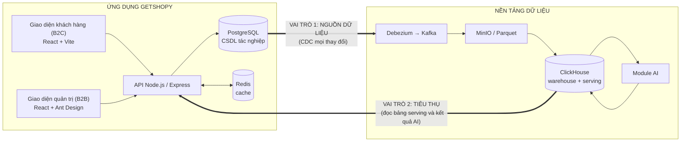
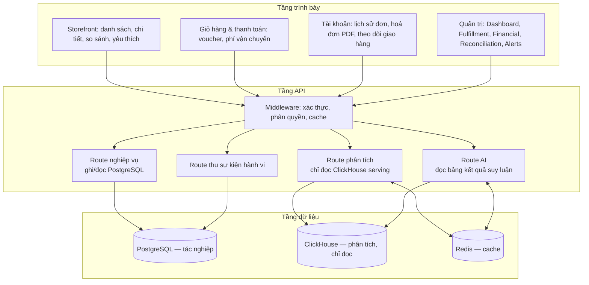
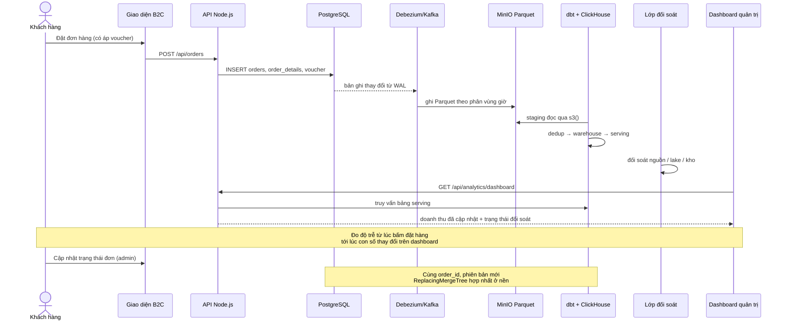

# KIẾN TRÚC ỨNG DỤNG GETSHOPY

Ứng dụng minh hoạ của đề tài. Vai trò của ứng dụng trong luận văn **không phải** là một sản phẩm thương mại điện tử độc lập, mà là **bằng chứng vận hành cho nền tảng dữ liệu**: nó vừa sinh ra dữ liệu ở đầu vào, vừa tiêu thụ kết quả phân tích ở đầu ra. Nhờ đó toàn bộ vòng đời dữ liệu — phát sinh, thu nhận, biến đổi, phân tích, phản hồi trở lại nghiệp vụ — được thể hiện trên một hệ thống chạy thật.

---

## 1. Vai trò kép trong hệ thống

### Vai trò 1 — Nguồn dữ liệu
Mọi hành vi nghiệp vụ trên ứng dụng ghi vào PostgreSQL và lập tức trở thành bản ghi thay đổi (CDC) chảy vào nền tảng:

| Hành vi trên ứng dụng | Bảng nguồn | Ý nghĩa với nền tảng |
|---|---|---|
| Đặt đơn hàng | `orders`, `order_details` | Bản ghi tạo mới — luồng chính của fact bán hàng |
| Cập nhật trạng thái đơn (chờ xác nhận → đóng gói → đang giao → đã giao) | `orders` | **Nhiều bản ghi cập nhật trên cùng khoá** — chính là tình huống kiểm chứng `ReplacingMergeTree` |
| Áp mã giảm giá | `outputvoucher_detail` | Dữ liệu đo hiệu quả khuyến mãi |
| Thêm/sửa sản phẩm, cập nhật kho | `products`, `inventory` | Dữ liệu chiều biến động chậm và ảnh chụp tồn kho |
| Đăng ký / cập nhật khách hàng | `customers` | Dữ liệu chiều khách hàng |
| Xem sản phẩm, tìm kiếm, thêm giỏ | `user_events` | Dữ liệu hành vi — đầu vào cho module gợi ý |
| Đối soát thanh toán | `payments`, `reconciliations` | Dữ liệu cho màn hình đối soát tài chính |

Bên cạnh ứng dụng, **bộ mô phỏng POS** ghi vào cùng lược đồ với tốc độ cao để tạo tải và tạo dữ liệu lịch sử. Ứng dụng cho tính *chân thực*, bộ mô phỏng cho *quy mô*; cả hai dùng chung một lược đồ nên tầng trên xử lý đồng nhất.

### Vai trò 2 — Nơi tiêu thụ kết quả
Ứng dụng đọc **hai loại dữ liệu** từ ClickHouse (không bao giờ truy vấn tổng hợp trên PostgreSQL):
1. Bảng ở tầng `serving` — số liệu báo cáo đã được dbt tính sẵn.
2. Bảng kết quả suy luận của các module AI (gợi ý, dự báo, phân khúc, đề xuất campaign).

---

## 2. Ngăn xếp công nghệ

| Thành phần | Công nghệ | Cổng (môi trường local) |
|---|---|---|
| Giao diện B2C + B2B | React 18 + Vite, Ant Design, Leaflet (bản đồ theo dõi giao hàng) | 5173 |
| API | Node.js + Express | 8080 |
| CSDL tác nghiệp | PostgreSQL 15 (bật `wal_level = logical`) | 5432 |
| Kho phân tích (chỉ đọc) | ClickHouse | 8123 / 9000 |
| Cache | Redis 7 | 6379 |
| Đóng gói | Docker Compose | |

**Thay đổi cần thực hiện so với hiện trạng:** phiên bản hiện tại dùng tệp `db.json` làm nơi lưu dữ liệu. Đây là điểm chặn đối với đề tài, vì không có nhật ký ghi trước thì không thể bắt thay đổi bằng CDC. Vì vậy hạng mục đầu tiên của Giai đoạn 2 là **chuyển tầng lưu trữ tác nghiệp sang PostgreSQL** với lược đồ khớp lược đồ nguồn đã chốt.

---

## 3. Kiến trúc ứng dụng

**Nguyên tắc tách trách nhiệm:** ghi luôn đi vào PostgreSQL; đọc dữ liệu tổng hợp luôn đi vào ClickHouse. Đây chính là hiện thân ở mức mã nguồn của luận điểm "tách rời tác nghiệp và phân tích" — và cũng là điều dễ trình bày nhất khi bảo vệ.

---

## 4. Bản đồ màn hình ↔ nguồn dữ liệu

Bảng này là cầu nối giữa ứng dụng và nền tảng; mỗi màn hình đều truy được về mô hình dbt cụ thể.

| Màn hình | Dữ liệu hiển thị | Nguồn |
|---|---|---|
| **Dashboard quản trị** | Doanh thu theo ngày/giờ, so sánh cùng kỳ, top sản phẩm, doanh thu theo cửa hàng và danh mục, giá trị đơn trung bình | `serving.daily_orders_summary`, `serving.order_details_summary` |
| **Fulfillment** | Số đơn theo trạng thái, thời gian trung bình mỗi chặng, đơn quá hạn | `serving` từ `dim_orders` + `fact_order_line` |
| **Financial** | Dòng tiền theo phương thức thanh toán, phí, lợi nhuận gộp | `serving` từ fact bán hàng + dữ liệu thanh toán |
| **Reconciliation** | So khớp đơn hàng ↔ thanh toán, các khoản lệch | mô hình đối soát ở `serving`; hiển thị cả trạng thái đối soát dữ liệu của nền tảng từ lớp `audit` |
| **Alerts** | Bất thường doanh thu/tồn kho, nguy cơ hết hàng, **cảnh báo chất lượng dữ liệu** | kết quả dự báo + `audit.checksum_*` |
| **Campaign / Marketing** | Hiệu quả các đợt voucher đã phát, phân khúc khách hàng, đề xuất campaign mới | `fact_voucher_redemption` + kết quả module AI-3 |
| **Chi tiết sản phẩm (B2C)** | "Sản phẩm liên quan", "Khách hàng cũng mua" | bảng kết quả module AI-1 |
| **Giỏ hàng (B2C)** | Gợi ý mua kèm, gợi ý voucher phù hợp | AI-1 + AI-3 |
| **Chatbot quản trị** | Hỏi đáp số liệu bằng ngôn ngữ tự nhiên | trợ lý dữ liệu, truy vấn `serving`/`warehouse` với quyền chỉ đọc |

Việc đưa **cảnh báo chất lượng dữ liệu** của nền tảng lên ngay màn hình Alerts của ứng dụng là một chi tiết đáng nhấn mạnh khi bảo vệ: nó cho thấy SLA dữ liệu không phải là chỉ số nội bộ của kỹ sư mà là thông tin nghiệp vụ ("số liệu bạn đang xem đã được đối soát tới thời điểm nào").

---

## 5. Luồng đầu-cuối dùng để demo

Kịch bản demo thứ hai (thể hiện AI): xem vài sản phẩm → module gợi ý dùng dữ liệu hành vi đã vào kho → lần truy cập sau nhận được gợi ý cá nhân hoá.

---

## 6. Đóng góp của ứng dụng vào phần thực nghiệm

| Thực nghiệm | Vai trò của ứng dụng |
|---|---|
| Độ trễ đầu-cuối (TN1) | Cung cấp điểm quan sát *có ý nghĩa nghiệp vụ*: từ hành vi người dùng tới con số trên dashboard, thay vì chỉ đo giữa các thành phần kỹ thuật |
| Xử lý cập nhật (TN4) | Luồng đổi trạng thái đơn hàng tạo ra khối lượng cập nhật thật trên cùng khoá |
| Đối chứng truy vấn (TN3) | Có sẵn cả PostgreSQL và ClickHouse với cùng dữ liệu, cùng một truy vấn báo cáo → so sánh trực tiếp |
| Đánh giá AI (TN6) | Là nơi tích hợp và thể hiện kết quả suy luận |

---

## 7. Ranh giới phạm vi của ứng dụng

**Làm:** các luồng nghiệp vụ đủ để sinh dữ liệu đại diện; các màn hình quản trị đọc dữ liệu từ kho; các điểm hiển thị kết quả AI; thu sự kiện hành vi.

**Không làm:** cổng thanh toán thật, giao vận thật, kiểm thử giao diện đầy đủ, tối ưu hiệu năng phía trình duyệt, đa ngôn ngữ, ứng dụng di động. Ứng dụng được đánh giá theo tiêu chí "có đủ luồng dữ liệu để chứng minh nền tảng", không theo tiêu chí của một sản phẩm thương mại.
