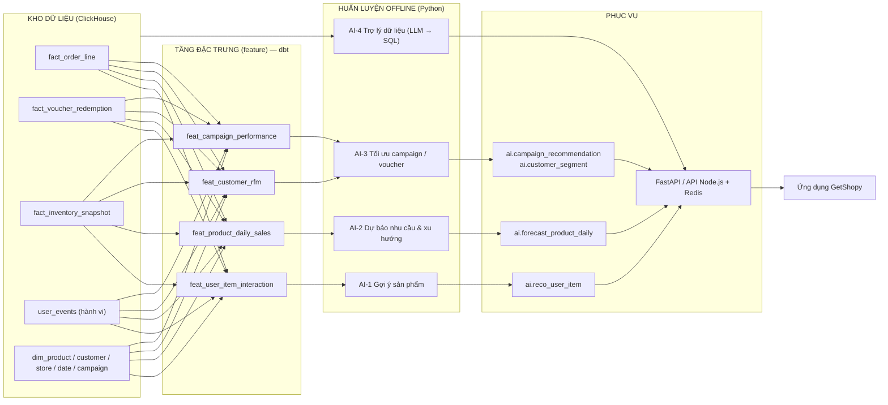

# THIẾT KẾ CÁC MODULE AI TRÊN NỀN TẢNG DỮ LIỆU

Nguyên tắc xuyên suốt: **mọi module AI đều lấy dữ liệu từ kho dữ liệu (warehouse), không truy cập trực tiếp CSDL tác nghiệp**. Nhờ đó phần AI trở thành minh chứng cho giá trị của nền tảng — có nền dữ liệu sạch, có lịch sử, có chiều đầy đủ thì mới làm được phân tích nâng cao — chứ không phải một phần rời rạc ghép thêm vào.

---

## 1. Kiến trúc tích hợp AI



**Mẫu thiết kế phục vụ (serving pattern):** tính theo lô (batch scoring) — mô hình chạy định kỳ, ghi kết quả thành bảng trong ClickHouse (cơ sở dữ liệu `ai`), ứng dụng chỉ đọc bảng. Lý do chọn: độ trễ đọc rất thấp, không phụ thuộc tình trạng dịch vụ mô hình lúc người dùng truy cập, dễ tái lập kết quả để đưa vào báo cáo. Một dịch vụ FastAPI mỏng chỉ dùng cho các trường hợp cần suy luận tại thời điểm yêu cầu (gợi ý theo phiên truy cập hiện tại, và trợ lý dữ liệu).

**Tầng đặc trưng bằng dbt:** đặc trưng được định nghĩa bằng SQL trong dbt thay vì trong mã Python. Ưu điểm: cùng một định nghĩa dùng cho cả lúc huấn luyện và lúc phục vụ (tránh lệch train/serve), có kiểm thử dữ liệu, có lineage, và người khác đọc lại hiểu được.

---

## 2. Vấn đề dữ liệu huấn luyện: bộ sinh dữ liệu có chủ đích

Dữ liệu trong đề tài là dữ liệu mô phỏng. Nếu sinh ngẫu nhiên đều thì **không mô hình nào học được gì**, và phần đánh giá sẽ vô nghĩa. Vì vậy bộ sinh dữ liệu cài đặt sẵn các quy luật, có ghi lại tham số (**ground truth**) để về sau đối chiếu với kết quả mô hình.

| Quy luật cài đặt | Cách mô phỏng | Mô hình nào phải phát hiện được |
|---|---|---|
| Mùa vụ theo tuần và theo tháng | Hệ số nhân theo thứ trong tuần, theo tháng, theo ngày lễ | AI-2 dự báo |
| Giờ cao điểm trong ngày | Phân phối theo giờ khác nhau giữa kênh cửa hàng và kênh trực tuyến | AI-2 |
| Phân khúc khách hàng | Ba nhóm: giá trị cao ít nhạy giá, nhạy giá, mua theo dịp — khác nhau về tần suất, giá trị đơn, tỉ lệ dùng voucher | AI-3 phân khúc |
| Độ co giãn theo giá | Xác suất mua tăng theo mức giảm giá, mức độ khác nhau theo phân khúc và theo danh mục | AI-3 uplift |
| Hiệu ứng của campaign | Trong khoảng thời gian campaign, doanh số nhóm hàng áp dụng tăng theo hệ số định trước, kèm hiện tượng mua dồn trước/sau | AI-2, AI-3 |
| Sản phẩm mua kèm | Các cụm sản phẩm có xác suất xuất hiện cùng nhau cao (điện thoại + ốp + sạc) | AI-1 gợi ý |
| Sở thích cá nhân | Mỗi khách có véc-tơ ưa thích danh mục ẩn, chi phối hành vi xem và mua | AI-1 |
| Xu hướng dài hạn | Tăng trưởng dần theo thời gian, một số sản phẩm vào và ra khỏi thị trường | AI-2 |
| Nhiễu | Nhiễu ngẫu nhiên và một số ngày bất thường (đột biến, sự cố) | Kiểm tra độ bền của mô hình và phần phát hiện bất thường |

Cần sinh **12–24 tháng dữ liệu lịch sử** để phần dự báo có đủ chuỗi thời gian, đồng thời sinh dòng dữ liệu trực tuyến cho luồng CDC.

Cách đánh giá nhờ đó mạnh hơn thông thường: có thể so kết quả mô hình với tham số đã cài (ví dụ mô hình uplift ước lượng hệ số nâng doanh số là 1,18 trong khi tham số cài là 1,20) — điều mà dữ liệu thật không cho phép làm.

---

## 3. AI-1 — Gợi ý sản phẩm (Recommendation)

**Bài toán:** với một khách hàng (hoặc một phiên truy cập), đưa ra K sản phẩm có khả năng quan tâm cao nhất; và với một sản phẩm, đưa ra các sản phẩm thường được mua kèm.

**Dữ liệu đặc trưng** — `feat_user_item_interaction`, tổng hợp từ `fact_order_line` và `user_events`:

| Cột | Ý nghĩa |
|---|---|
| `customer_id`, `product_id` | cặp tương tác |
| `purchase_count`, `view_count`, `cart_count` | số lần theo từng loại hành vi |
| `confidence` | điểm tin cậy có trọng số (mua > thêm giỏ > xem), có suy giảm theo thời gian |
| `last_interaction_at` | phục vụ chia tập theo thời gian |

**Các mô hình theo thứ tự tăng dần độ phức tạp**
1. **Đường cơ sở:** top sản phẩm bán chạy toàn cục và theo danh mục.
2. **Luật mua kèm:** ma trận đồng xuất hiện trong cùng đơn, dùng lift/confidence — phục vụ trực tiếp mục "Khách hàng cũng mua".
3. **Lọc cộng tác trên phản hồi ẩn (ALS):** phân rã ma trận tương tác, sinh véc-tơ ẩn cho khách và sản phẩm; xử lý được việc không có đánh giá tường minh.
4. 🔹 **Kết hợp (hybrid):** trộn ALS với độ tương đồng nội dung (danh mục, thương hiệu, khoảng giá) để giảm vấn đề khởi đầu lạnh (cold start) cho sản phẩm mới.

**Chia tập:** theo mốc thời gian (huấn luyện trên dữ liệu trước thời điểm T, đánh giá trên sau T) — không chia ngẫu nhiên, vì chia ngẫu nhiên gây rò rỉ thông tin tương lai.

**Chỉ số đánh giá:** Precision@K, Recall@K, MAP@K, độ phủ danh mục (catalog coverage) với K = 5, 10, 20; so với đường cơ sở.

**Phục vụ:** bảng `ai.reco_user_item(customer_id, product_id, score, rank, model_version, scored_at)` và `ai.reco_item_item(...)`; tính lại hằng ngày. Với khách chưa đăng nhập: dùng gợi ý theo sản phẩm đang xem.

**Điểm tích hợp trong ứng dụng:** khối "Sản phẩm liên quan" ở trang chi tiết, gợi ý mua kèm ở giỏ hàng, khối "Dành cho bạn" ở trang chủ.

---

## 4. AI-2 — Dự báo nhu cầu và xu hướng (Forecasting)

**Bài toán:** dự báo số lượng bán theo (sản phẩm, ngày) cho 7–30 ngày tới; phát hiện sản phẩm đang lên/đang xuống; cảnh báo nguy cơ hết hàng.

**Dữ liệu đặc trưng** — `feat_product_daily_sales`: chuỗi doanh số theo sản phẩm–ngày, kèm các đặc trưng trễ (lag 1/7/14/28 ngày), trung bình trượt, cờ ngày lễ và cuối tuần từ `dim_date`, cờ có khuyến mãi và mức giảm giá, giá bán, tồn kho đầu ngày, thuộc tính danh mục/thương hiệu.

**Các mô hình**
1. **Đường cơ sở:** dự báo bằng giá trị kỳ trước (naive), trung bình trượt, naive theo mùa (cùng thứ tuần trước).
2. **Prophet:** phân rã xu hướng – mùa vụ – ngày lễ; mạnh khi chuỗi có mùa vụ rõ, dễ giải thích cho người nghiệp vụ.
3. **LightGBM:** một mô hình toàn cục cho toàn bộ sản phẩm, dùng đặc trưng trễ và biến ngoại sinh; xử lý tốt trường hợp nhiều chuỗi ngắn và thưa.

**Đánh giá:** kiểm định tiến dần theo thời gian (walk-forward) qua nhiều mốc gốc dự báo; chỉ số MAPE, sMAPE (an toàn hơn khi doanh số nhỏ), RMSE, WAPE; phân tách kết quả theo nhóm sản phẩm bán nhanh / bán chậm.

**Phục vụ:** bảng `ai.forecast_product_daily(product_id, store_id, forecast_date, yhat, yhat_lower, yhat_upper, model_version, generated_at)`.

**Ứng dụng nghiệp vụ:**
- **Cảnh báo hết hàng:** so nhu cầu dự báo trong thời gian bổ hàng với tồn kho hiện tại → hiển thị ở màn hình Alerts.
- **Đề xuất nhóm hàng đưa vào khuyến mãi:** hàng dự báo giảm nhu cầu nhưng tồn kho cao → nối sang AI-3.
- **Biểu đồ xu hướng cho ban điều hành:** doanh số thực tế và dự báo trên cùng một trục thời gian.

---

## 5. AI-3 — Tối ưu chiến dịch khuyến mãi và voucher

Đây là module gắn chặt nhất với dữ liệu đặc thù mà nền tảng đã thu được: lịch sử các đợt voucher/campaign đã phát hành.

**Bài toán:** từ hiệu quả các đợt đã phát hành, đề xuất cấu hình cho đợt tiếp theo — nhắm vào phân khúc khách nào, loại và mức ưu đãi nào, áp cho danh mục nào — kèm ước lượng hiệu quả và chi phí.

### 5.1. Phân khúc khách hàng
`feat_customer_rfm`: recency (số ngày từ lần mua cuối), frequency (số đơn), monetary (tổng giá trị), kèm tỉ lệ dùng voucher, danh mục ưa thích, giá trị đơn trung bình.

Phương pháp: chấm điểm RFM theo phân vị → phân cụm K-Means (chọn số cụm bằng chỉ số silhouette) → **gán nhãn nghiệp vụ** cho từng cụm (khách trung thành giá trị cao, khách nhạy giá, khách mới, khách có nguy cơ rời bỏ, khách ngủ đông). Việc gán nhãn nghiệp vụ là điều kiện để marketing dùng được; một bảng số cụm không nhãn thì không ai dùng.

### 5.2. Đo hiệu quả campaign đã phát hành
`feat_campaign_performance` cho mỗi campaign: tỉ lệ sử dụng voucher, số đơn phát sinh, doanh thu, chi phí giảm giá, giá trị đơn trung bình so nhóm không dùng voucher, doanh thu tăng thêm ước lượng (**uplift**), tỉ suất chi phí khuyến mãi trên doanh thu tăng thêm, và tỉ lệ khách quay lại sau đợt.

Ước lượng uplift: so sánh nhóm dùng voucher với nhóm đối chứng tương đồng (khớp theo phân khúc và mức chi tiêu trước đó) — nêu rõ đây là suy luận từ dữ liệu quan sát, có nguy cơ tự chọn mẫu (self-selection), không phải thử nghiệm đối chứng ngẫu nhiên.

### 5.3. Đề xuất cấu hình campaign
Đầu vào: mục tiêu (tăng doanh thu / giải phóng tồn kho / kéo khách ngủ đông quay lại), ngân sách, khoảng thời gian.
Xử lý: mô hình ước lượng phản hồi (xác suất chuyển đổi theo phân khúc × mức giảm giá × danh mục, học từ dữ liệu lịch sử) → tìm cấu hình tối ưu trong ràng buộc ngân sách → xuất phương án kèm hiệu quả và chi phí dự kiến.
Đầu ra: bảng `ai.campaign_recommendation` gồm phân khúc mục tiêu, loại ưu đãi, mức ưu đãi, danh mục áp dụng, số lượng voucher, doanh thu tăng thêm dự kiến, chi phí dự kiến, mức độ tin cậy.

🔹 **Sinh nội dung bằng LLM:** từ cấu hình đã chọn, sinh tên chiến dịch, nội dung thông báo và email theo từng phân khúc. Đây là phần trang trí; giá trị cốt lõi nằm ở phần ước lượng định lượng phía trên.

### 5.4. Đánh giá
So với đường cơ sở "giảm giá đồng loạt cho tất cả khách": mô phỏng trên dữ liệu kiểm định để so doanh thu tăng thêm trên mỗi đồng chi phí khuyến mãi; đồng thời đối chiếu tham số uplift mà mô hình học được với tham số đã cài trong bộ sinh dữ liệu.

---

## 6. AI-4 🔹 — Trợ lý hỏi đáp dữ liệu (LLM → SQL)

**Bài toán:** người quản trị hỏi bằng tiếng Việt ("doanh thu tháng này so tháng trước theo từng cửa hàng?") → hệ thống trả về bảng số liệu và biểu đồ.

**Luồng xử lý**
```
Câu hỏi tiếng Việt
  → Ghép ngữ cảnh: lược đồ các bảng ở tầng serving/warehouse + mô tả cột lấy từ dbt docs + một số ví dụ mẫu
  → LLM sinh câu SQL cho ClickHouse
  → Lớp kiểm soát: chỉ cho phép SELECT, chỉ trên danh sách bảng cho phép, bắt buộc có LIMIT,
    kiểm tra cú pháp bằng EXPLAIN, đặt hạn mức thời gian và bộ nhớ truy vấn
  → Thực thi với tài khoản chỉ đọc
  → Định dạng kết quả + chọn dạng biểu đồ phù hợp + giải thích ngắn
```

**Điểm đáng nhấn về mặt kỹ thuật:** mô hình dữ liệu chuẩn hoá tốt và có tài liệu (dbt docs, mô tả cột, tên bảng theo quy ước) chính là yếu tố quyết định tỉ lệ sinh SQL đúng. Đây là một lập luận trực tiếp cho giá trị của nền tảng dữ liệu: chất lượng của lớp mô hình hoá quyết định chất lượng của lớp AI phía trên.

**An toàn:** tài khoản chỉ đọc, chỉ truy cập được tầng `serving` và một phần `warehouse`; chặn mọi câu lệnh thay đổi dữ liệu; ghi log toàn bộ câu hỏi và SQL sinh ra; không đưa dữ liệu bản ghi ra ngoài mà chỉ gửi lược đồ.

**Đánh giá:** bộ 30–50 câu hỏi mẫu có đáp án SQL do người viết; đo tỉ lệ chạy được, tỉ lệ đúng ngữ nghĩa (kết quả khớp đáp án), thời gian phản hồi; phân tích các trường hợp sai theo nhóm nguyên nhân.

**Phương án dự phòng nếu cắt module này:** bộ truy vấn mẫu tham số hoá (chọn chỉ số, chọn chiều, chọn khoảng thời gian) — vẫn phục vụ được nhu cầu tự khám phá số liệu mà không phụ thuộc LLM.

---

## 7. Tổng hợp chỉ số đánh giá

| Module | Đường cơ sở | Chỉ số chính | Mục tiêu |
|---|---|---|---|
| AI-1 Gợi ý | Top bán chạy | Precision@10, Recall@10, MAP@10, độ phủ danh mục | Vượt đường cơ sở rõ rệt ở cả độ chính xác và độ phủ |
| AI-2 Dự báo | Naive theo mùa | sMAPE, WAPE, RMSE theo mốc dự báo | Vượt đường cơ sở ở nhóm sản phẩm bán nhanh; nêu rõ giới hạn ở nhóm bán chậm |
| AI-3 Campaign | Giảm giá đồng loạt | Doanh thu tăng thêm trên một đồng chi phí; sai số ước lượng uplift so tham số cài | Chọn được cấu hình tốt hơn phương án đồng loạt |
| AI-4 Trợ lý | Truy vấn mẫu | Tỉ lệ chạy được, tỉ lệ đúng ngữ nghĩa | Đạt mức đủ dùng trên bộ câu hỏi mẫu, phân tích rõ các ca sai |

---

## 8. Vòng đời mô hình và điểm cần trung thực trong báo cáo

**Vòng đời:** đặc trưng tính bằng dbt theo lịch → huấn luyện lại định kỳ (gợi ý: hằng ngày; dự báo: hằng tuần) → ghi kết quả kèm `model_version` và `scored_at` → theo dõi chỉ số theo thời gian → 🔹 lưu vết thí nghiệm bằng MLflow nếu đủ thời gian.

**Cần nêu rõ trong luận văn:**
- Dữ liệu là dữ liệu mô phỏng, nên các chỉ số chứng minh **luồng end-to-end hoạt động và mô hình học được quy luật đã cài**, không phải kết luận về thị trường thực tế.
- Ước lượng uplift dựa trên dữ liệu quan sát nên có thiên lệch tự chọn mẫu; muốn kết luận nhân quả cần thử nghiệm đối chứng ngẫu nhiên trên hệ thống thật.
- Các mô hình sử dụng đều là phương pháp đã công bố; đóng góp của đề tài nằm ở **kiến trúc tích hợp AI vào nền tảng dữ liệu** (tầng đặc trưng bằng dbt, phục vụ theo lô qua ClickHouse, vòng lặp phản hồi trở lại ứng dụng), không phải ở thuật toán mới.
