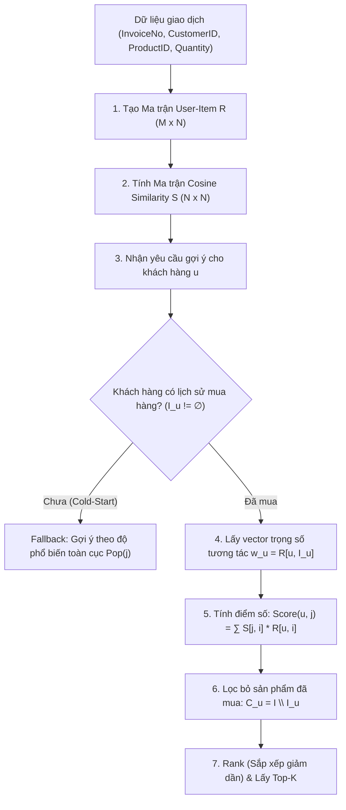

# Chi tiết Toán học & Cơ chế Hoạt động của Model Item-Based Collaborative Filtering

> **Tài liệu tham chiếu mã nguồn:** [`models/cf_recommendation.py`](../models/cf_recommendation.py)  
> **Phương pháp:** Item-Based Collaborative Filtering kết hợp Cosine Similarity và Weighted Scoring.

---

## 1. Tổng quan cơ chế hoạt động

Mô hình thuộc họ thuật toán **Item-Based Collaborative Filtering (Lọc cộng tác dựa trên sản phẩm)**. 

* **Triết lý:** Các sản phẩm thường xuyên được mua cùng nhau bởi nhiều khách hàng sẽ có độ tương đồng cao. Nếu khách hàng $u$ đã mua các sản phẩm trong tập $\mathcal{I}_u$, hệ thống sẽ tìm các sản phẩm ứng viên $j$ (chưa mua) có độ tương đồng lớn nhất với tập $\mathcal{I}_u$ để gợi ý.
* **Luồng xử lý (Workflow):**



---

## 2. Ký hiệu Toán học (Mathematical Notations)

| Ký hiệu | Ý nghĩa toán học | Tương ứng trong mã nguồn |
| :--- | :--- | :--- |
| $\mathcal{U} = \{u_1, u_2, \dots, u_M\}$ | Không gian người dùng gồm $M$ khách hàng | `self.user_item_matrix.index` |
| $\mathcal{I} = \{i_1, i_2, \dots, i_N\}$ | Không gian sản phẩm gồm $N$ sản phẩm | `self.user_item_matrix.columns` |
| $\mathbf{R} \in \mathbb{R}_{\ge 0}^{M \times N}$ | Ma trận tương tác User-Item | `self.user_item_matrix` |
| $\mathbf{r}_i \in \mathbb{R}^M$ | Vector biểu diễn sản phẩm $i$ qua tất cả khách hàng | Cột thứ $i$ của `self.user_item_matrix` |
| $\mathbf{S} \in [0, 1]^{N \times N}$ | Ma trận tương đồng Cosine giữa các sản phẩm | `self.item_similarity` |
| $\mathcal{I}_u = \{i \in \mathcal{I} \mid R_{u, i} > 0\}$ | Tập hợp sản phẩm khách hàng $u$ đã từng mua | `purchased` trong `recommend()` |
| $\mathcal{C}_u = \mathcal{I} \setminus \mathcal{I}_u$ | Tập hợp ứng viên (sản phẩm $u$ chưa từng mua) | Các index sau khi `scores.drop(...)` |
| $\hat{R}_{u, j}$ hay $\text{Score}(u, j)$ | Điểm dự đoán mức độ quan tâm của $u$ tới item $j$ | Giá trị trong Series `scores` |
| $\mathcal{R}_K(u)$ | Danh sách Top-$K$ sản phẩm được gợi ý cho $u$ | Kết quả trả về của `recommend()` |

---

## 3. Các Công thức Toán học Chi tiết

### 3.1. Xây dựng Ma trận tương tác User-Item ($\mathbf{R}$)

Mỗi phần tử $R_{u, i}$ tại hàng $u$ và cột $i$ biểu diễn tổng lượng tiêu thụ (`Quantity`) của khách hàng $u$ cho sản phẩm $i$:

$$R_{u, i} = \begin{cases} \displaystyle\sum_{t \in \mathcal{T}_{u, i}} \text{Quantity}(t), & \text{nếu } (u, i) \text{ có giao dịch hợp lệ} \\ 0, & \text{ngược lại} \end{cases}$$

với $\mathcal{T}_{u, i}$ là tập hợp các bản ghi hóa đơn có sự tham gia của cặp $(u, i)$.

* **Đoạn code:**
  ```python
  # utils/preprocessing.py (create_user_item_matrix)
  return df.pivot_table(
      index="CustomerID",
      columns="ProductID",
      values="Quantity",
      aggfunc="sum",
      fill_value=0,
  )
  ```

---

### 3.2. Tính toán Độ tương đồng Cosine (Cosine Similarity - $CS$)

Mỗi sản phẩm $i \in \mathcal{I}$ được đặc trưng bởi vector hành vi khách hàng:
$$\mathbf{r}_i = \begin{bmatrix} R_{u_1, i} \\ R_{u_2, i} \\ \vdots \\ R_{u_M, i} \end{bmatrix} \in \mathbb{R}^M$$

Độ tương đồng Cosine $S_{i, j}$ giữa hai sản phẩm $i$ và $j$ là cosin của góc hợp bởi hai vector $\mathbf{r}_i$ và $\mathbf{r}_j$:

$$S_{i, j} = \text{sim}(i, j) = \cos(\mathbf{r}_i, \mathbf{r}_j) = \frac{\mathbf{r}_i \cdot \mathbf{r}_j}{\|\mathbf{r}_i\|_2 \|\mathbf{r}_j\|_2} = \frac{\displaystyle\sum_{u \in \mathcal{U}} R_{u, i} \cdot R_{u, j}}{\sqrt{\displaystyle\sum_{u \in \mathcal{U}} R_{u, i}^2} \cdot \sqrt{\displaystyle\sum_{u \in \mathcal{U}} R_{u, j}^2}}$$

Trong đó:
* $\mathbf{r}_i \cdot \mathbf{r}_j = \sum_{u \in \mathcal{U}} R_{u, i} R_{u, j}$ là tích vô hướng (Dot Product).
* $\|\mathbf{r}_i\|_2 = \sqrt{\sum_{u \in \mathcal{U}} R_{u, i}^2}$ là chuẩn Euclid ($L_2$ norm).
* **Đặc tính:**
  * Tính đối xứng: $S_{i, j} = S_{j, i}$ ($\mathbf{S} = \mathbf{S}^T$).
  * Đường chéo chính: $S_{i, i} = 1$ với mọi sản phẩm $i$ đã có ít nhất một giao dịch ($\|\mathbf{r}_i\|_2 > 0$).
  * Do $R_{u, i} \ge 0$, ta có $S_{i, j} \in [0, 1]$.
* **Đoạn code:**
  ```python
  # models/cf_recommendation.py (Dòng 86-91)
  similarity = cosine_similarity(self.user_item_matrix.T)
  self.item_similarity = pd.DataFrame(
      similarity,
      index=self.user_item_matrix.columns,
      columns=self.user_item_matrix.columns,
  )
  ```

---

### 3.3. Tính Điểm dự đoán (Prediction Scoring)

Cho khách hàng cần gợi ý $u \in \mathcal{U}$:

#### Kịch bản A: Khách hàng đã có lịch sử ($\mathcal{I}_u \neq \emptyset$)
Điểm số dự đoán $\hat{R}_{u, j}$ cho một sản phẩm ứng viên $j \in \mathcal{I}$ là tổng có trọng số giữa độ tương đồng của sản phẩm $j$ với các sản phẩm khách hàng $u$ đã mua:

$$\hat{R}_{u, j} = \sum_{i \in \mathcal{I}_u} S_{j, i} \cdot R_{u, i}$$

**Dạng biểu diễn ma trận (Matrix Formulation):**
$$\mathbf{\hat{r}}_u = \mathbf{S}_{*, \mathcal{I}_u} \cdot \mathbf{w}_u$$

* $\mathbf{w}_u = \mathbf{R}_{u, \mathcal{I}_u}^T \in \mathbb{R}^{|\mathcal{I}_u| \times 1}$: Vector trọng số tương tác của người dùng $u$.
* $\mathbf{S}_{*, \mathcal{I}_u} \in \mathbb{R}^{N \times |\mathcal{I}_u|}$: Ma trận con gồm tất cả các dòng của $\mathbf{S}$ và chỉ lấy các cột thuộc $\mathcal{I}_u$.
* $\mathbf{\hat{r}}_u \in \mathbb{R}^N$: Vector điểm số của tất cả các sản phẩm đối với người dùng $u$.
* **Đoạn code:**
  ```python
  # models/cf_recommendation.py (Dòng 152-153)
  weights = self.user_item_matrix.loc[customer_id, purchased]
  scores = self.item_similarity.loc[:, purchased].mul(weights, axis=1).sum(axis=1)
  ```

#### Kịch bản B: Khách hàng mới / Chưa có lịch sử ($\mathcal{I}_u = \emptyset$ - Cold-Start)
Nếu khách hàng hoàn toàn mới, hệ thống dự báo điểm số dựa trên **Độ phổ biến toàn cục (Global Popularity)**:

$$\text{Pop}(j) = \sum_{v \in \mathcal{U}} R_{v, j} = \|\mathbf{r}_j\|_1$$

* **Đoạn code:**
  ```python
  # models/cf_recommendation.py (Dòng 96 & Dòng 145-149)
  self.popular_items = self.user_item_matrix.sum(axis=0).sort_values(ascending=False)
  if not purchased:
      return [(item, float(score)) for item, score in self.popular_items.head(top_k).items()]
  ```

---

### 3.4. Lọc Sản phẩm & Xếp hạng (Filtering & Ranking)

#### 1. Loại bỏ sản phẩm đã mua (Candidate Filtering)
Tập các sản phẩm chưa mua:
$$\mathcal{C}_u = \mathcal{I} \setminus \mathcal{I}_u = \{ j \in \mathcal{I} \mid R_{u, j} = 0 \}$$
* **Đoạn code:**
  ```python
  # models/cf_recommendation.py (Dòng 156)
  scores = scores.drop(labels=purchased, errors="ignore")
  ```

#### 2. Hàm Xếp hạng (Rank Function)
Thứ hạng của sản phẩm $j \in \mathcal{C}_u$ được xác định dựa trên số lượng sản phẩm ứng viên khác có điểm số cao hơn:

$$\operatorname{Rank}(j) = 1 + \sum_{k \in \mathcal{C}_u \setminus \{j\}} \mathbb{I}\left( \hat{R}_{u, k} > \hat{R}_{u, j} \right)$$

*(với $\mathbb{I}(\cdot)$ là indicator function; trường hợp điểm bằng nhau sẽ giữ nguyên thứ tự xuất hiện ban đầu - stable sort)*.

#### 3. Trích xuất Top-$K$ Gợi ý
Danh sách $K$ sản phẩm được đề xuất cuối cùng:

$$\mathcal{R}_K(u) = \operatorname*{arg\,top\text{-}K}_{j \in \mathcal{C}_u} \left( \hat{R}_{u, j} \right) = \left\{ j \in \mathcal{C}_u \mid \operatorname{Rank}(j) \le K \right\}$$

* **Đoạn code:**
  ```python
  # models/cf_recommendation.py (Dòng 159-160)
  scores = scores.sort_values(ascending=False, kind="stable").head(top_k)
  return [(item, float(score)) for item, score in scores.items()]
  ```

---

## 4. Bảng Ánh Xạ Giữa Toán Học & Code

| Khái niệm Toán học | Ký hiệu | Biến / Đoạn Code trong `models/cf_recommendation.py` |
| :--- | :---: | :--- |
| User-Item Matrix | $\mathbf{R}$ | `self.user_item_matrix` (Dòng 81) |
| Item Similarity Matrix | $\mathbf{S}$ | `self.item_similarity = pd.DataFrame(cosine_similarity(...))` (Dòng 87) |
| Lịch sử mua hàng | $\mathcal{I}_u$ | `purchased = self.get_purchased_products(customer_id)` (Dòng 142) |
| Trọng số tương tác | $\mathbf{w}_u$ | `weights = self.user_item_matrix.loc[customer_id, purchased]` (Dòng 152) |
| Dự đoán điểm số | $\hat{R}_{u, j}$ | `scores = self.item_similarity.loc[:, purchased].mul(weights, axis=1).sum(axis=1)` (Dòng 153) |
| Lọc sản phẩm cũ | $\mathcal{C}_u$ | `scores = scores.drop(labels=purchased, errors="ignore")` (Dòng 156) |
| Xếp hạng & Cắt Top-$K$ | $\mathcal{R}_K(u)$ | `scores.sort_values(ascending=False, kind="stable").head(top_k)` (Dòng 159) |
| Điểm phổ biến (Cold-Start) | $\text{Pop}(j)$ | `self.popular_items = self.user_item_matrix.sum(axis=0)...` (Dòng 96) |

---

## 5. Ví Dụ Tính Toán Minh Họa Bằng Số

Giả sử hệ thống có 3 khách hàng $\mathcal{U} = \{u_1, u_2, u_3\}$ và 4 sản phẩm $\mathcal{I} = \{P_1, P_2, P_3, P_4\}$.

### Bước 1: Ma trận User-Item $\mathbf{R}$

$$\mathbf{R} = \begin{bmatrix}
 & P_1 & P_2 & P_3 & P_4 \\
u_1 & 2 & 1 & 0 & 0 \\
u_2 & 1 & 3 & 2 & 0 \\
u_3 & 0 & 0 & 4 & 5
\end{bmatrix}$$

Vector của từng sản phẩm:
- $\mathbf{r}_1 = [2, 1, 0]^T \implies \|\mathbf{r}_1\|_2 = \sqrt{2^2 + 1^2 + 0^2} = \sqrt{5} \approx 2.236$
- $\mathbf{r}_2 = [1, 3, 0]^T \implies \|\mathbf{r}_2\|_2 = \sqrt{1^2 + 3^2 + 0^2} = \sqrt{10} \approx 3.162$
- $\mathbf{r}_3 = [0, 2, 4]^T \implies \|\mathbf{r}_3\|_2 = \sqrt{0^2 + 2^2 + 4^2} = \sqrt{20} \approx 4.472$
- $\mathbf{r}_4 = [0, 0, 5]^T \implies \|\mathbf{r}_4\|_2 = \sqrt{0^2 + 0^2 + 5^2} = \sqrt{25} = 5.000$

---

### Bước 2: Ma trận Cosine Similarity $\mathbf{S}$

Tính độ tương đồng giữa các cặp sản phẩm:
- $S_{1, 2} = \frac{(2 \times 1) + (1 \times 3) + (0 \times 0)}{\sqrt{5} \times \sqrt{10}} = \frac{5}{\sqrt{50}} \approx 0.707$
- $S_{1, 3} = \frac{(2 \times 0) + (1 \times 2) + (0 \times 4)}{\sqrt{5} \times \sqrt{20}} = \frac{2}{\sqrt{100}} = 0.200$
- $S_{2, 3} = \frac{(1 \times 0) + (3 \times 2) + (0 \times 4)}{\sqrt{10} \times \sqrt{20}} = \frac{6}{\sqrt{200}} \approx 0.424$
- $S_{3, 4} = \frac{(0 \times 0) + (2 \times 0) + (4 \times 5)}{\sqrt{20} \times 5} = \frac{20}{5\sqrt{20}} = \frac{4}{\sqrt{20}} \approx 0.894$
- Các cặp khác không có khách hàng mua chung thì có tích vô hướng $= 0 \implies S = 0$.

Ma trận $\mathbf{S}$ thu được:

$$\mathbf{S} \approx \begin{bmatrix}
 & P_1 & P_2 & P_3 & P_4 \\
P_1 & 1.000 & 0.707 & 0.200 & 0.000 \\
P_2 & 0.707 & 1.000 & 0.424 & 0.000 \\
P_3 & 0.200 & 0.424 & 1.000 & 0.894 \\
P_4 & 0.000 & 0.000 & 0.894 & 1.000
\end{bmatrix}$$

---

### Bước 3: Gợi ý cho khách hàng $u_1$

1. **Kiểm tra lịch sử:** $\mathcal{I}_{u_1} = \{P_1, P_2\}$. Trọng số tương ứng: $R_{u_1, P_1} = 2$, $R_{u_1, P_2} = 1$.
2. **Tính điểm $\hat{R}_{u_1, j}$ cho tất cả sản phẩm:**
   $$\hat{R}_{u_1, j} = S_{j, P_1} \times 2 + S_{j, P_2} \times 1$$
   - Với $P_1$: $1.000 \times 2 + 0.707 \times 1 = 2.707$
   - Với $P_2$: $0.707 \times 2 + 1.000 \times 1 = 2.414$
   - Với $P_3$: $0.200 \times 2 + 0.424 \times 1 = \mathbf{0.824}$
   - Với $P_4$: $0.000 \times 2 + 0.000 \times 1 = \mathbf{0.000}$
3. **Lọc sản phẩm đã mua:**
   - Loại bỏ $P_1$ và $P_2$.
   - Tập ứng viên còn lại: $\mathcal{C}_{u_1} = \{P_3, P_4\}$.
4. **Ranking & Top-$K$ ($K=1$):**
   - $\hat{R}_{u_1, P_3} = 0.824 \implies \operatorname{Rank}(P_3) = 1$.
   - $\hat{R}_{u_1, P_4} = 0.000 \implies \operatorname{Rank}(P_4) = 2$.
   - **Kết quả gợi ý:** $\mathcal{R}_1(u_1) = [(P_3, 0.824)]$.
