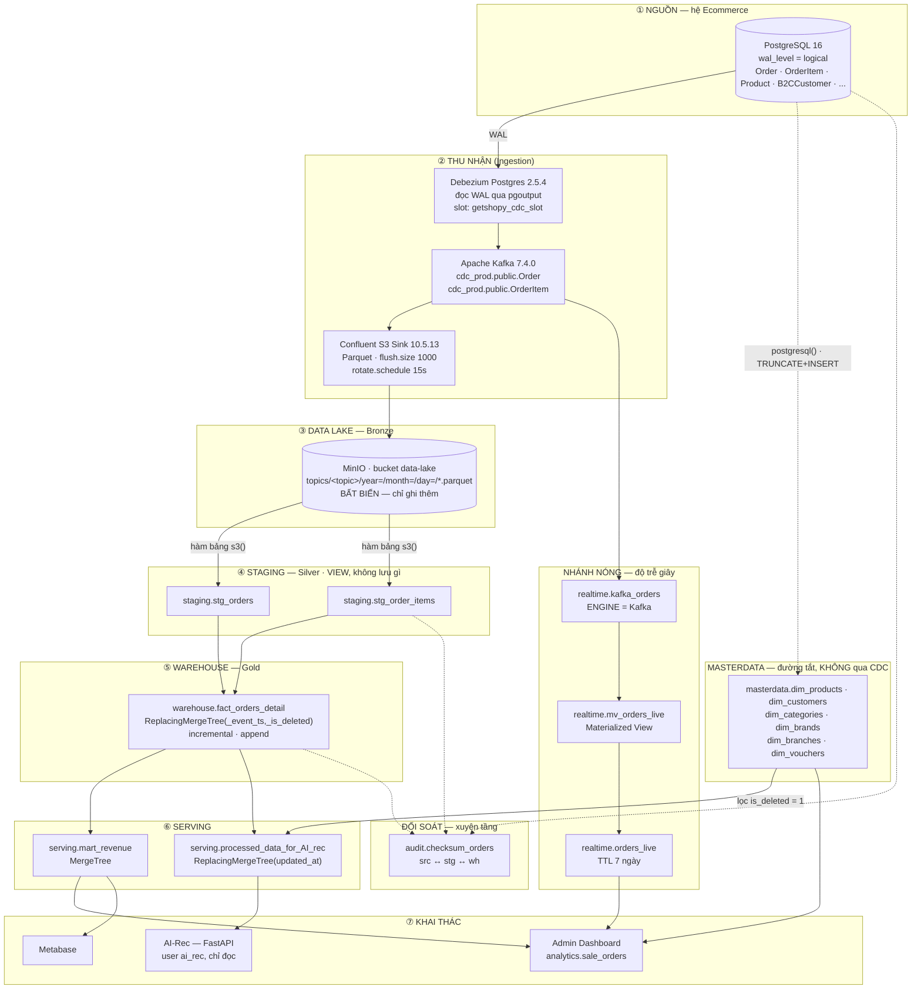
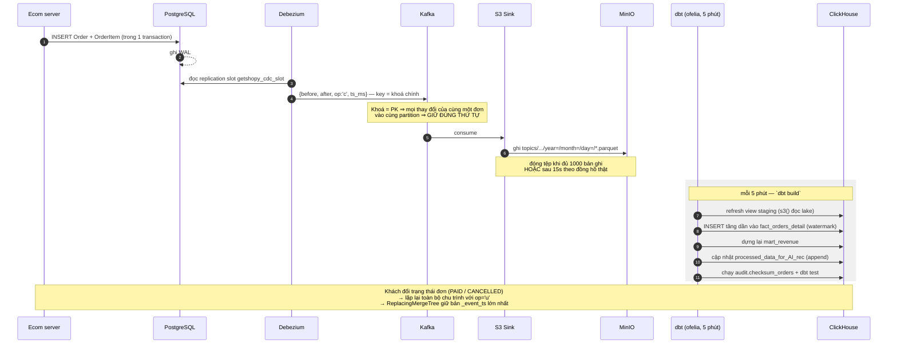
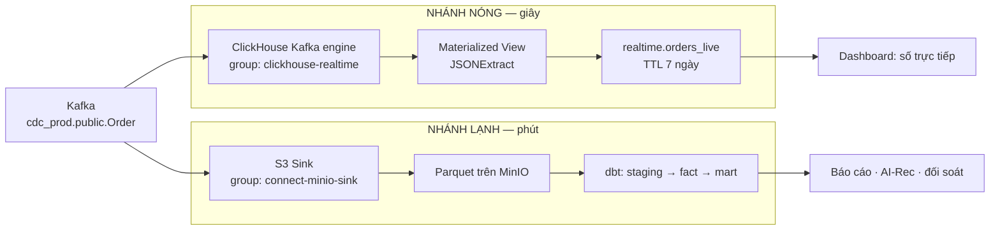
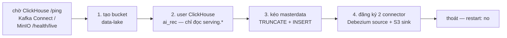
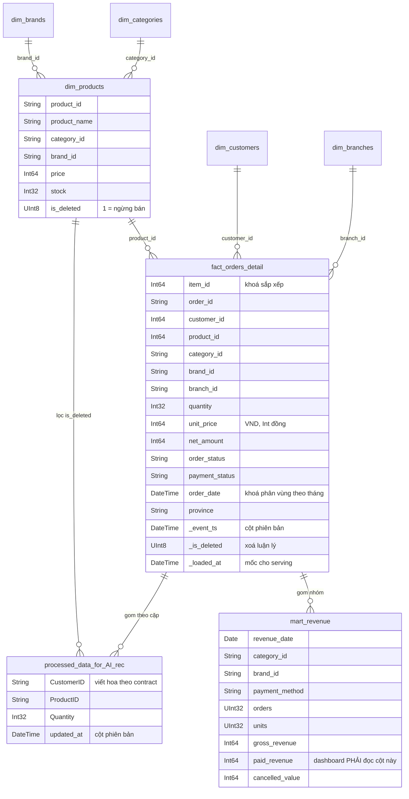

# KIẾN TRÚC HỆ BIGDATA — `local-infra-sandbox`

> Cập nhật: 16/09/2026
> Phạm vi: **chỉ hệ BigData**. Hệ Ecommerce (`ktln-Getshopy`) chỉ xuất hiện ở
> hai vai: **nguồn dữ liệu** và **nơi tiêu thụ kết quả**. Kiến trúc tổng của cả
> đề tài nằm ở [`docs/01-ARCH-DATA-PLATFORM.md`](../../docs/01-ARCH-DATA-PLATFORM.md);
> tài liệu này mô tả **cái đang chạy trong repo**, không phải cái dự định.
> Hợp đồng dữ liệu với bên tiêu thụ: [`data-contract-warehouse.md`](../../docs/implement-phase/implement-plan/data-contract-warehouse.md).

---

## Mục lục

1. [Vấn đề](#1-vấn-đề)
2. [Các quyết định kiến trúc](#2-các-quyết-định-kiến-trúc)
3. [Kiến trúc logic](#3-kiến-trúc-logic)
4. [Sơ đồ luồng](#4-sơ-đồ-luồng)
5. [Mô hình dữ liệu](#5-mô-hình-dữ-liệu)
6. [Đặc tả từng tầng](#6-đặc-tả-từng-tầng)
7. [Ba bài toán khó và cách hệ giải](#7-ba-bài-toán-khó-và-cách-hệ-giải)
8. [Ranh giới với hai hệ tiêu thụ](#8-ranh-giới-với-hai-hệ-tiêu-thụ)
9. [Vấn đề đã gặp khi hiện thực](#9-vấn-đề-đã-gặp-khi-hiện-thực)
10. [Hạn chế đã biết và nợ kỹ thuật](#10-hạn-chế-đã-biết-và-nợ-kỹ-thuật)
11. [Hướng phát triển](#11-hướng-phát-triển)
12. [Tham chiếu](#12-tham-chiếu)

---

## 1. Vấn đề

### 1.1. Vì sao không truy vấn phân tích thẳng trên Postgres

CSDL tác nghiệp của Ecommerce phục vụ đường đi của **một đơn hàng**: đọc/ghi vài
dòng, có chỉ mục, phải trả lời trong vài chục mili-giây. Báo cáo thì ngược lại —
quét hàng triệu dòng, gom nhóm theo ngày/danh mục/chi nhánh.

Đặt hai loại tải này lên cùng một máy gây ba hậu quả cụ thể:

| Hậu quả | Diễn giải |
|---|---|
| Tranh chấp tài nguyên | Một câu `GROUP BY` toàn bảng `OrderItem` chiếm buffer pool và I/O; checkout của khách xếp hàng sau nó. |
| Khoá và bloat | Truy vấn phân tích chạy lâu giữ snapshot cũ, cản `VACUUM`, bảng phình dần. |
| Sai mô hình lưu trữ | Postgres lưu theo **dòng**. Báo cáo chỉ cần 3/40 cột nhưng vẫn phải đọc cả dòng từ đĩa. |

Yêu cầu thiết kế của đề tài là hàng chục triệu bản ghi mới và hàng triệu bản ghi
cập nhật mỗi ngày — ở quy mô đó đây không còn là vấn đề hiệu năng mà là vấn đề
**khả dụng của hệ bán hàng**.

### 1.2. Vì sao không ghi thẳng ClickHouse trong luồng checkout (dual-write)

Bản đầu của hệ Ecommerce ghi song song: mỗi đơn vừa `INSERT` vào Postgres vừa
`INSERT` vào ClickHouse ngay trong request. Cách này đã bị gỡ bỏ, vì:

- **Checkout gánh thêm việc không thuộc về nó.** Một lần ghi analytics chậm là
  khách chờ thêm.
- **Không có giao dịch chung.** Ghi Postgres xong, ghi ClickHouse lỗi → hai bên
  lệch nhau vĩnh viễn, và không có chỗ nào phát hiện ra.
- **Bỏ sót cập nhật.** Đơn đổi trạng thái `PENDING_PAYMENT → PAID → CANCELLED`
  ở nhiều nơi trong code. Mỗi chỗ phải nhớ ghi lại analytics; quên một chỗ là
  doanh thu sai.
- **Không phát lại được.** Sửa logic biến đổi thì không có nguồn nào để tính lại.

CDC đọc **nhật ký ghi trước (WAL)** giải quyết cả bốn: nó ở ngoài đường đi của
request, bắt *mọi* thay đổi kể cả những chỗ code quên, và Kafka giữ lại lịch sử
để phát lại.

### 1.3. Ba bên tiêu thụ, ba yêu cầu khác nhau

| Bên tiêu thụ | Cần gì | Độ trễ chấp nhận được | Đọc bảng nào |
|---|---|---|---|
| **Admin Dashboard** | Doanh thu theo ngày × danh mục × thương hiệu × phương thức TT | Vài phút | `serving.mart_revenue` (qua view `analytics.sale_orders`) |
| **AI-Rec** | Đúng ba cột `CustomerID · ProductID · Quantity`, đã làm sạch theo nghiệp vụ | Chu kỳ train của họ | `serving.processed_data_for_AI_rec` |
| **Số liệu trực tiếp** | Đơn vừa đặt xong phải thấy ngay | **Giây** | `realtime.orders_live` |

Ba yêu cầu này không thể phục vụ bằng cùng một cơ chế: đường lakehouse không thể
xuống dưới chu kỳ phút, còn đường realtime không giữ được lịch sử và không làm
được phép đối soát. Đó là lý do có **kiến trúc hai nhánh** (§2, §4.3).

### 1.4. Bốn khó khăn kỹ thuật của bài toán

**(a) Dữ liệu đơn hàng là dữ liệu *cập nhật nhiều lần*, không phải chỉ ghi thêm.**
Một đơn đi qua `PENDING → PENDING_PAYMENT → PAID → SHIPPING → DELIVERED`, có thể
rẽ sang `CANCELLED`/`REFUNDED`. CDC sinh **một bản ghi cho mỗi lần đổi**. Kho
theo cột (ClickHouse) lại không hợp với `UPDATE` tại chỗ — mutation phải ghi lại
cả phần dữ liệu (part). Cần một cách biểu diễn cập nhật mà không phải cập nhật.

**(b) Lược đồ tiến hoá (schema evolution).** Thêm một cột vào Postgres **không**
tự chảy hết đường ống: Parquet có lược đồ cố định tại thời điểm ghi, nên file cũ
và file mới lệch cột. Đây không phải giả thuyết — sự cố `province` (§9, mục 1)
là minh chứng đã xảy ra trong dự án này.

**(c) Vấn đề tệp nhỏ (small files).** Sink xoay tệp mỗi 15 giây để dữ liệu tươi
→ mỗi ngày sinh hàng nghìn tệp Parquet nhỏ. Càng nhiều tệp, mỗi lần đọc lake
càng tốn thời gian mở tệp và đọc metadata hơn là đọc dữ liệu.

**(d) Phải *chứng minh* được dữ liệu đúng — đủ — kịp thời.** Loại lỗi nguy hiểm
nhất của pipeline không phải lỗi làm hệ chết, mà lỗi **im lặng**: connector vẫn
"RUNNING", offset vẫn tiến, dbt vẫn báo thành công, chỉ là thiếu vài nghìn bản
ghi hoặc một cột toàn rỗng. Không có đối soát tự động thì không ai biết.

### 1.5. Ràng buộc của môi trường

| Ràng buộc | Hệ quả lên thiết kế |
|---|---|
| Một máy, Docker Compose | Mọi thành phần chạy hệ số nhân bản 1. Không chứng minh được HA ở cấp này — phần đó thuộc giai đoạn cụm nhiều máy. |
| Không có tài khoản cloud | MinIO đóng vai S3. API tương thích nên mã không đổi khi lên cloud thật. |
| Là khoá luận, không phải sản phẩm | Ưu tiên **giải thích được** hơn là tối ưu tuyệt đối. `dbt + ofelia` thay cho Airflow; Parquet thuần thay cho Iceberg. |
| Dùng chung `.env` và network với hệ Ecommerce | Nguồn CDC là **DB thật của Ecommerce**, không phải DB mô phỏng. |

---

## 2. Các quyết định kiến trúc

| # | Quyết định | Phương án đã loại | Lý do chọn |
|---|---|---|---|
| 1 | **CDC log-based** (Debezium đọc WAL) | Query theo `updated_at` mỗi N phút | Query theo mốc thời gian **bỏ sót bản ghi xoá** và bỏ sót thay đổi xảy ra giữa hai lần quét; lại còn tạo tải trên bảng nghiệp vụ. |
| 2 | **Lakehouse**: đổ Parquet xuống lake rồi mới vào kho | Kafka → thẳng ClickHouse | Lake là **nguồn chân lý bất biến**: sửa logic dbt thì tính lại từ lake, không phải đọc lại Postgres hay tua Kafka. |
| 3 | **Hai nhánh nóng/lạnh** từ cùng một topic Kafka | Một nhánh duy nhất | Một nhánh không thể vừa đạt độ trễ giây vừa giữ lịch sử và đối soát được. Hai nhánh **độc lập**, hỏng một bên không kéo bên kia. |
| 4 | `ReplacingMergeTree(_event_ts, _is_deleted)` | `ALTER TABLE ... UPDATE`, hoặc dựng lại bảng mỗi lượt | Mutation trong ClickHouse ghi lại cả part — quá đắt với hàng triệu cập nhật/ngày. ReplacingMergeTree biến cập nhật thành **ghi thêm một phiên bản**, hợp nhất ở nền. |
| 5 | **Masterdata đi đường tắt**, không qua CDC | Cho dimension qua CDC như fact | Dimension đổi rất ít, không cần lịch sử, lớn nhất 26k dòng. Dựng cả đường CDC cho chúng là thừa. ClickHouse đọc thẳng Postgres bằng hàm bảng `postgresql()`. |
| 6 | **dbt-core + ofelia** (cron trong Docker) | Airflow / Dagster | Quy mô này chưa cần DAG động, retry policy, backfill theo mốc. Airflow thêm 3–4 container và một CSDL metadata — chi phí không đổi lấy giá trị gì ở đây. |
| 7 | **Parquet thuần** trên MinIO | Apache Iceberg | Iceberg giải quyết small files và cập nhật mức bản ghi, nhưng thêm catalog + engine. Ghi nhận là **hướng phát triển**, không hiện thực trong phạm vi khoá luận. |
| 8 | **Đối soát là một tầng của hệ** (`models/audit`) | Kiểm tra thủ công khi nghi ngờ | Lỗi im lặng (§1.4d) không bao giờ tự lộ ra. Đối soát chạy mỗi lượt `dbt build`. |
| 9 | Nhánh nóng ghi **bảng riêng** `realtime.orders_live` | Ghi chung `fact_orders_detail` | Hai nguồn ghi cùng một bảng thì lệch lúc nào không biết, và không giải thích được trong báo cáo. |
| 10 | Bảng cho AI-Rec là **append-only** | `materialized='table'` (drop + create mỗi lượt) | Drop/create để lại khoảng bảng rỗng; AI-Rec fetch đúng lúc đó sẽ train trên bảng trống và **xoá sạch model đang tốt**. |

---

## 3. Kiến trúc logic



**Bảng tra cứu nhanh từng tầng**

| # | Tầng | Công nghệ | Vật thể tạo ra | Vòng đời | Ai đọc |
|---|---|---|---|---|---|
| ① | Nguồn | PostgreSQL 16 | WAL | — | Debezium, masterdata, audit |
| ② | Thu nhận | Debezium + Kafka + S3 Sink | Message CDC (JSON) | Theo retention Kafka | Sink, nhánh nóng |
| ③ | Lake | MinIO (S3 API) | Tệp Parquet | Vĩnh viễn (bất biến) | Staging, audit |
| ④ | Staging | ClickHouse `s3()` | **View** | Không lưu | Warehouse, audit |
| ⑤ | Warehouse | ClickHouse ReplacingMergeTree | Bảng fact | Vĩnh viễn | Serving, audit, view tương thích |
| ⑥ | Serving | ClickHouse MergeTree / ReplacingMergeTree | Bảng tổng hợp | Vĩnh viễn | Dashboard, AI-Rec, Metabase |
| — | Masterdata | ClickHouse `postgresql()` | Bảng chiều | Ghi đè mỗi lượt sync | Serving, dashboard |
| — | Nhánh nóng | ClickHouse Kafka engine + MV | Bảng sự kiện | **TTL 7 ngày** | Dashboard số trực tiếp |
| — | Đối soát | dbt model | Bảng lịch sử checksum | Vĩnh viễn | Người vận hành, scheduler |

---

## 4. Sơ đồ luồng

### 4.1. Luồng end-to-end của một đơn hàng (nhánh lạnh)



### 4.2. Vòng đời một bản ghi bị cập nhật nhiều lần

```
Postgres        t0 INSERT (PENDING)    t1 UPDATE (PAID)    t2 UPDATE (CANCELLED)
                     │                      │                    │
Kafka            op=c,ts=t0            op=u,ts=t1           op=u,ts=t2
                     │                      │                    │
MinIO           parquet A              parquet A/B          parquet B
                     └──────────────┬───────┴────────────────────┘
staging (view)      3 DÒNG cho cùng một order_id
                                    │
        dedup trong lô (row_number OVER PARTITION BY ... ORDER BY event_ts DESC)
                                    │
warehouse           ghi 1 dòng/lượt chạy, nhiều lượt ⇒ nhiều phiên bản cùng khoá
                                    │
        ReplacingMergeTree hợp nhất Ở NỀN, KHÔNG hứa thời điểm
                                    │
đọc ra              PHẢI dùng `FINAL` + `WHERE _is_deleted = 0`
```

> **Điểm phải nhớ:** thiếu `FINAL` thì truy vấn trả về *cả* phiên bản cũ lẫn mới.
> Không có lỗi nào báo ra — chỉ là doanh thu bị đếm nhiều lần.

### 4.3. Hai nhánh, cùng một nguồn Kafka



| | Nhánh nóng | Nhánh lạnh |
|---|---|---|
| Độ trễ | ~1 giây | 5–7 phút |
| Lịch sử | 7 ngày (TTL) | Vĩnh viễn |
| Tính lại được? | Không | **Có** — từ lake |
| Đối soát? | Không | **Có** |
| Đọc trực tiếp JSON? | Có (nên nhận được cột mới ngay) | Không (Parquet lược đồ cố định) |
| Dùng cho | Số liệu trực tiếp trên dashboard | Báo cáo, AI-Rec, kiểm toán |

> **Consumer group phải TÁCH RIÊNG.** Dùng chung group thì Kafka chia partition
> cho hai bên và **mỗi bên chỉ thấy một nửa dữ liệu** — lỗi im lặng điển hình.

### 4.4. Luồng khởi tạo (`scripts/bootstrap-bigdata.sh`)



Bốn bước **bắt buộc đúng thứ tự** và đều **idempotent**. Lý do gom vào script
thay vì để chạy tay: chạy bước 4 trước khi Postgres có `wal_level=logical` thì
connector lỗi **lúc đăng ký**, còn quên bước 2 thì AI-Rec không đọc được — cả
hai đều không hiện ra ngay, chỉ là dữ liệu không bao giờ chảy.

### 4.5. Ngân sách độ trễ (nhánh lạnh)

| Chặng | Độ trễ điển hình | Cái gì quyết định |
|---|---|---|
| Postgres → Kafka | < 1 s | Tốc độ đọc WAL của Debezium |
| Kafka → Parquet trên MinIO | ≤ 15 s | `rotate.schedule.interval.ms = 15000` (đồng hồ thật) hoặc đủ `flush.size = 1000` |
| Parquet → warehouse | ≤ 5 phút | Chu kỳ `ofelia` gọi `dbt build` (`DBT_SCHEDULE`) |
| warehouse → serving | Cùng lượt dbt | Nằm trong cùng một `dbt build` |
| **Tổng** | **≈ 5–6 phút** | Chu kỳ dbt chiếm phần lớn |

Muốn nhanh hơn thì hạ `DBT_SCHEDULE`, nhưng đổi lại nhiều tệp Parquet nhỏ hơn và
`OPTIMIZE` phải chạy dày hơn. Cần số liệu trong vài giây thì **dùng nhánh nóng**,
không phải siết chu kỳ nhánh lạnh.

---

## 5. Mô hình dữ liệu



**Đặc tả bảng**

| Bảng | Grain | Engine | ORDER BY | PARTITION BY | Chiến lược nạp |
|---|---|---|---|---|---|
| `warehouse.fact_orders_detail` | 1 dòng / 1 `OrderItem` | `ReplacingMergeTree(_event_ts, _is_deleted)` | `(item_id)` | `toYYYYMM(order_date)` | incremental · append theo watermark |
| `serving.mart_revenue` | ngày × danh mục × thương hiệu × PTTT | `MergeTree()` | `(revenue_date, category_id, brand_id, payment_method)` | — | dựng lại toàn bộ mỗi lượt |
| `serving.processed_data_for_AI_rec` | 1 dòng / cặp (khách, sản phẩm) | `ReplacingMergeTree(updated_at)` | `(CustomerID, ProductID)` | — | incremental · append, chỉ tính lại cặp bị đụng |
| `masterdata.dim_*` | 1 dòng / thực thể | `MergeTree()` | khoá chính | — | TRUNCATE + INSERT |
| `realtime.orders_live` | 1 dòng / đơn | `ReplacingMergeTree(_event_ts, _is_deleted)` | `(order_id)` | `toYYYYMM(order_date)` | Materialized View, TTL 7 ngày |
| `audit.checksum_orders` | 1 dòng / lần chạy | `MergeTree()` | `checked_at` | — | dựng lại mỗi lượt |

**Hai quy ước không được vi phạm**

1. **Tiền là `Int64`, đơn vị đồng** — khớp Postgres. Không dùng `Float`: so sánh
   lệch và lệch kiểu khi đối soát giữa hai hệ.
2. **`fact_orders_detail` KHÔNG join `dim_products` để lấy tên/giá.** `OrderItem`
   đã chụp sẵn giá tại thời điểm mua. Join bảng hiện tại làm **doanh thu lịch sử
   đổi theo giá hôm nay**.

---

## 6. Đặc tả từng tầng

### 6.1. Nguồn — PostgreSQL

```
wal_level = logical · max_replication_slots = 4 · max_wal_senders = 4
```

`wal_level = logical` là **điều kiện bắt buộc**; thiếu thì Debezium báo lỗi lúc
*đăng ký connector*, không phải lúc chạy.

Bảng theo dõi: `public.Order`, `public.OrderItem`. Prisma tạo bảng **PascalCase
có nháy kép** — viết sai hoa/thường trong `table.include.list` là Debezium không
bắt được bảng nào và cũng không báo lỗi.

### 6.2. Thu nhận — Debezium + Kafka + S3 Sink

| Cấu hình | Giá trị | Vì sao |
|---|---|---|
| `plugin.name` | `pgoutput` | Plugin logical decoding có sẵn trong Postgres, không phải cài thêm |
| `topic.prefix` | `cdc_prod` | Sinh ra `cdc_prod.public.Order` — dbt đọc qua biến `CDC_TOPIC_PREFIX` |
| `slot.name` / `publication.name` | `getshopy_cdc_slot` / `getshopy_cdc_pub` | Đặt tên tường minh để xoá/tạo lại được khi cần |
| `decimal.handling.mode` | `double` | Tiền đã là `Int` (đồng) nên không cần xử lý Decimal |
| Key của message | Khoá chính | **Quan trọng nhất**: cùng khoá ⇒ cùng partition ⇒ đúng thứ tự ⇒ dedup theo phiên bản mới cho kết quả đúng |
| `flush.size` | `1000` | Ngưỡng số bản ghi để đóng tệp |
| `rotate.schedule.interval.ms` | `15000` | Theo **đồng hồ thật**. `rotate.interval.ms` theo timestamp của *record*, nên lúc ít đơn thì bản ghi cuối **nằm mãi trong buffer** |
| `schema.compatibility` | `BACKWARD` | `NONE` khiến sink dùng lược đồ của record **đầu tiên** cho cả tệp và **không mở tệp mới khi lược đồ đổi** — cột mới bị bỏ im lặng |
| `path.format` | `'year='YYYY/'month='MM/'day='dd` | Phân vùng tới **ngày**, không có `hour=` — đường dẫn trong staging phải khớp |

Plugin được **build vào image** (`kafka-connect/Dockerfile`, ghim
`S3_SINK_VERSION` và `DEBEZIUM_VERSION`) thay vì commit ~50MB JAR vào git.

### 6.3. Data lake — MinIO

```
data-lake/topics/<topic>/year=YYYY/month=MM/day=DD/<topic>+<partition>+<offset>.parquet
```

Tính chất: **bất biến, chỉ ghi thêm**. Đây là nguồn chân lý để tính lại toàn bộ
tầng trên khi logic biến đổi thay đổi.

### 6.4. Staging — view `s3()`

`staging.stg_orders`, `staging.stg_order_items` là **view**, không lưu gì. Chúng
làm phẳng envelope Debezium:

```sql
ifNull(tupleElement(after,'id'), tupleElement(before,'id')) AS order_id
```

Ba chi tiết quyết định tính đúng:

1. **`ifNull(after, before)`** — bản ghi xoá (`op = 'd'`) chỉ có `before`.
2. **Truy cập trường theo TÊN, không theo vị trí.** Bản cũ dùng
   `tupleElement(after, 1)`; thêm/bớt/đổi thứ tự một cột trong Postgres là mọi
   model lệch hết mà **không có lỗi nào báo ra**, chỉ là số sai.
3. **Tham số thứ ba làm giá trị mặc định** — `tupleElement(after,'province','')`
   cho phép **một view đọc được cả hai thế hệ tệp Parquet** (tệp sinh trước khi
   thêm cột không có trường này; thiếu mặc định thì ClickHouse ném
   `NOT_FOUND_COLUMN_IN_BLOCK`).

### 6.5. Warehouse — `fact_orders_detail`

Là **bảng**, không phải view. Lý do: view `s3()` phải quét lại **toàn bộ** Parquet
trên MinIO mỗi lần truy vấn — vài nghìn đơn thì không thấy gì, nhưng dữ liệu lớn
dần là mỗi lần mở dashboard đọc lại cả data lake; view cũng không phân vùng,
không chỉ mục.

Ba ràng buộc kỹ thuật của `MergeTree` mà mọi cột CDC đều vi phạm nếu không xử lý:

| Ràng buộc | Vì sao vi phạm | Cách xử lý |
|---|---|---|
| `ORDER BY` / `PARTITION BY` **không nhận `Nullable`** | Mọi cột đọc từ CDC đều `Nullable`; `toInt64(Nullable)` vẫn `Nullable` | `ifNull(...)` tường minh trước khi ép kiểu |
| Cột **version** và cột **is_deleted** của `ReplacingMergeTree` bắt buộc NOT NULL | `greatest()` giữ `Nullable` nếu đầu vào `Nullable` | `assumeNotNull()` bọc **ngoài cùng**, sau khi đã `ifNull` bên trong |
| Hợp nhất chạy **ở nền, không hứa thời điểm** | — | Mọi truy vấn đọc bảng này **phải** `FINAL` + `WHERE _is_deleted = 0` |

Cột `_event_ts` lấy **mốc muộn hơn** giữa đơn và dòng hàng, để đơn đổi trạng thái
cũng kéo dòng hàng cập nhật theo.

### 6.6. Serving

**`mart_revenue`** tách `gross_revenue` và `paid_revenue`: đơn `PENDING_PAYMENT`
và `CANCELLED` **chưa phải tiền thật**, gộp vào là báo cáo thổi phồng. Dashboard
phải đọc `paid_revenue`.

**`processed_data_for_AI_rec`** — bảng quan trọng nhất về mặt hợp đồng:

- Tên cột viết hoa `CustomerID · ProductID · Quantity`, **không được đổi** — code
  AI-Rec đọc thẳng tên này.
- **Append-only**: mỗi lần một cặp đổi số lượng thì ghi thêm dòng mới với
  `updated_at` mới. Không bao giờ có khoảng bảng rỗng (§2, quyết định 10).
- **Tính lại trên TOÀN BỘ lịch sử của cặp bị đụng**, không cộng dồn phần mới —
  một dòng fact bị sửa (đơn chuyển huỷ, số lượng thay đổi) sẽ bị cộng hai lần.
- **`LEFT JOIN` chứ không `INNER`**: một cặp vừa thay đổi có thể **không còn thoả
  điều kiện** nữa (đơn `CANCELLED`, sản phẩm ngừng bán). Ghi `Quantity = 0` làm
  **bia mộ mềm** — đúng quy ước "không có thông tin số lượng ⇒ 0" trong contract,
  và `fit()` bên AI-Rec lọc `Quantity > 0` nên dòng đó tự bị loại khỏi tập train.
  Bỏ qua thì dòng cũ nằm lại vĩnh viễn và model vẫn học một tương tác đã huỷ.

### 6.7. Masterdata — đường tắt

`CREATE IF NOT EXISTS → TRUNCATE → INSERT SELECT → đối chiếu số dòng`.

`TRUNCATE` chứ không `DROP + CREATE AS SELECT`:

- Lược đồ giữ nguyên, không phụ thuộc kiểu mà `SELECT` suy ra. Nguồn đổi kiểu
  một cột là bảng đích **im lặng đổi theo**, mọi thứ phía sau lệch.
- `DROP` làm gãy mọi view / dbt model đang trỏ vào bảng.
- `TRUNCATE` vẫn xoá sạch dữ liệu cũ — bản ghi không còn ở nguồn sẽ biến mất
  khỏi đích thay vì nằm lại làm bẩn báo cáo.

Có **hai đường** làm cùng việc này: dbt models `models/masterdata/*.sql` và script
`scripts/sync-masterdata.sh` / `bootstrap-bigdata.sh`. Xem §10.

### 6.8. Đối soát — `audit.checksum_orders`

Đếm và tổng tiền tại **ba điểm** trên đường đi, trong **một câu SQL duy nhất**:

```
src : postgresql('...','OrderItem',...)        ← nguồn nghiệp vụ, sự thật gốc
stg : view s3() đọc Parquet, ĐÃ dedup          ← lake
wh  : fact_orders_detail FINAL, _is_deleted=0  ← kho
```

ClickHouse đọc được cả Postgres (`postgresql()`) lẫn Parquet (`s3()`), nên toàn
bộ phép đối soát nằm trong dbt — **không cần thành phần ngoài**.

So khớp **cả số bản ghi và tổng tiền**: số bản ghi đúng mà tổng tiền lệch cho
thấy lỗi ở tầng biến đổi (sai kiểu, mất độ chính xác, dedup chọn sai phiên bản)
— dạng lỗi mà chỉ đếm dòng **không bao giờ** phát hiện được.

Lệch **tạm thời** là bình thường (dữ liệu còn trong buffer của sink); lệch **kéo
dài** nghĩa là mất bản ghi.

### 6.9. Điều phối và vận hành

| Thành phần | Vai trò | Chu kỳ |
|---|---|---|
| `bootstrap` (chạy 1 lần) | 4 bước khởi tạo, idempotent | Khi `compose up` |
| `dbt-scheduler` (ofelia) | `dbt build` = run + test ⇒ checksum chạy **mỗi lượt** | `DBT_SCHEDULE`, mặc định 5 phút |
| Nhãn `ofelia.job-exec` trên ClickHouse | `OPTIMIZE TABLE serving.processed_data_for_AI_rec FINAL` | `CH_OPTIMIZE_SCHEDULE`, mặc định 1 giờ |
| `dbt` (profile `dbt`) | Chạy tay khi cần | — |

> `dbt **build**` chứ không `dbt run`: `build` = `run` + `test`. Chạy `run` là mất
> dữ liệu giữa đường mà không ai biết cho tới khi chạy test tay.

> `OPTIMIZE FINAL` **không** đặt vào `post_hook` của dbt: dbt chạy mỗi 5 phút,
> mà `OPTIMIZE FINAL` đọc và ghi lại **toàn bộ** bảng. Chạy mỗi 5 phút là dành
> phần lớn thời gian của máy để sắp xếp lại dữ liệu vừa mới sắp xong.

**Lệnh thường dùng** (chạy ở thư mục gốc `src/`):

```bash
docker compose --profile bigdata up -d           # dựng toàn bộ hệ BigData
docker compose --profile dbt run --rm dbt build  # chạy pipeline một lượt
docker compose --profile dbt run --rm dbt test --select tag:audit
docker compose logs -f bootstrap                 # xem 4 bước khởi tạo
curl -s localhost:8083/connectors/postgres-source-connector/status | jq
```

### 6.10. Khai thác

- **Admin Dashboard** đọc qua view tương thích `analytics.sale_orders` — ánh xạ
  từ `fact_orders_detail` để 16 câu query cũ không phải sửa. Cột `status` cố ý
  map từ `payment_status` chứ **không** phải `order_status`: đơn COD vừa đặt cũng
  mang `order_status = 'CONFIRMED'` trong khi chưa thu đồng nào.
- **AI-Rec** dùng user ClickHouse riêng `ai_rec`, **chỉ đọc** `serving.*`, kèm
  settings profile giới hạn `max_execution_time = 60s`, `max_memory_usage = 2GB`,
  `readonly = 1`. Không dùng chung tài khoản admin: hệ khác chỉ được đọc đúng
  bảng nó cần và không được chạy truy vấn nặng làm nghẽn dashboard.
- **Metabase** cho người dùng nghiệp vụ tự khám phá.

---

## 7. Ba bài toán khó và cách hệ giải

### 7.1. Cập nhật và xoá — hai lớp khử trùng

```
lớp 1 — TRONG LÔ:  row_number() OVER (PARTITION BY khoá ORDER BY event_ts DESC) = 1
        giải quyết: một đơn đổi trạng thái NHIỀU LẦN giữa hai lượt dbt

lớp 2 — GIỮA CÁC LÔ:  ReplacingMergeTree(_event_ts, _is_deleted)
        giải quyết: cùng một khoá xuất hiện ở NHIỀU lượt chạy khác nhau
```

Xoá được biểu diễn bằng **cờ `_is_deleted`** (xoá luận lý), không xoá vật lý.

**Chi phí phải trả:** mọi truy vấn đọc bảng đều cần `FINAL`, tốn hơn đọc thường.
Đổi lại: ghi rất rẻ (chỉ là `INSERT`), không có mutation, không khoá.

### 7.2. Nạp tăng dần và watermark

```sql
WHERE event_ts >= (SELECT ifNull(max(_event_ts), toDateTime64('1970-01-01 00:00:00',3,'UTC')) FROM {{ this }})
```

Dùng **`>=` chứ không `>`**: thà nạp thừa vài dòng ở mốc giao rồi để
`ReplacingMergeTree` khử, còn hơn **bỏ sót** bản ghi cùng mili-giây. Bảng rỗng
thì `max()` trả mốc 0 ⇒ lần đầu nạp toàn bộ.

Dòng hàng mà đơn chưa tới (Parquet `Order` flush sau `OrderItem`) thì **bỏ qua
lượt này**; lần chạy sau bắt được vì watermark chưa vượt qua nó.

### 7.3. Chứng minh dữ liệu đúng — đủ — kịp

| Chiều | Đo bằng gì | Ở đâu |
|---|---|---|
| **Đúng** | `src_amount` vs `wh_amount` | `audit.checksum_orders` |
| **Đủ** | `src_rows` − `stg_rows` − `wh_rows` | `audit.checksum_orders` |
| **Kịp** | Chênh lệch mốc thời gian lớn nhất giữa các tầng | `audit.checksum_orders` |
| **Hợp lệ** | `unique`, `not_null`, `relationships`, `unique_combination_of_columns` | `dbt test` |

Chạy tự động mỗi lượt `dbt build`, ghi lịch sử vào bảng để theo dõi **xu hướng**
— lệch một lúc rồi về `KHỚP` là bình thường; lệch tăng dần là mất dữ liệu.

---

## 8. Ranh giới với hai hệ tiêu thụ

| Việc | Ai làm | Vì sao đặt ở đó |
|---|---|---|
| Loại đơn `CANCELLED`, đơn chưa `PAID` | **Warehouse** | Quy tắc **nghiệp vụ** — chỉ warehouse biết |
| Loại sản phẩm `is_deleted = 1` | **Warehouse** | Gợi ý hàng ngừng bán là lỗi khách nhìn thấy được. Cần `masterdata.dim_products` |
| Gộp theo cặp (khách, sản phẩm), cộng `Quantity` | **Warehouse** | Định nghĩa grain của contract |
| Ép `String` cho hai id | **Warehouse** | Tránh pandas đọc thành số rồi mất số 0 đầu |
| Encode id → chỉ số ma trận | **AI-Rec** | Chỉ số phụ thuộc tập dữ liệu **tại thời điểm train** |
| Dựng sparse CSR, L2-normalize, cosine similarity | **AI-Rec** | Chính là thuật toán |
| Ngưỡng lọc cold-start | **AI-Rec** | Là **siêu tham số** — cứng hoá ở warehouse thì mỗi lần đổi ngưỡng phải chạy lại cả pipeline |
| Loại sản phẩm khách đã mua khỏi kết quả | **AI-Rec** | Logic lúc **suy luận**, không phải lúc chuẩn bị dữ liệu |

Client B2C **không đọc thẳng** warehouse — nó gọi API của AI-Rec và của server
Ecom. Warehouse chỉ nói chuyện với hai hệ.

---

## 9. Vấn đề đã gặp khi hiện thực

Điểm chung của phần lớn các mục dưới đây: **không có lỗi nào báo ra**. Mọi khâu
đều "thành công", chỉ là kết quả không xảy ra.

| # | Triệu chứng | Nguyên nhân | Xử lý | Trạng thái |
|---|---|---|---|---|
| 1 | Thêm cột `Order.province`; Kafka có đủ 16 cột nhưng Parquet chỉ 15, staging đọc ra rỗng | Parquet có **lược đồ cố định tại thời điểm ghi**; S3 Sink với `schema.compatibility = NONE` dùng lược đồ của record đầu tiên và không mở tệp mới khi lược đồ đổi | Đổi sang `BACKWARD` (sink tự xoay tệp khi phát hiện lược đồ tiến hoá) + `tupleElement(after,'province','')` để một view đọc được cả hai thế hệ tệp | ⚠️ Chưa thông hẳn — xem §10 |
| 2 | Đổi thứ tự cột trong Postgres làm mọi con số sai, không có lỗi | Staging truy cập trường **theo vị trí**: `tupleElement(after, 1)` | Chuyển sang truy cập **theo tên** ở toàn bộ staging | ✅ |
| 3 | ClickHouse từ chối tạo bảng: `ORDER BY` chứa cột `Nullable` | Mọi cột đọc từ CDC đều `Nullable`; `toInt64(Nullable)` vẫn `Nullable` | `ifNull()` tường minh trước khi ép kiểu | ✅ |
| 4 | `ReplacingMergeTree` từ chối cột version | `greatest()` giữ `Nullable` nếu đầu vào `Nullable` | `assumeNotNull()` bọc **ngoài cùng** | ✅ |
| 5 | Doanh thu bị đếm nhiều lần | Đọc `ReplacingMergeTree` mà quên `FINAL` — hợp nhất chạy ở nền, không hứa thời điểm | Bắt buộc `FINAL` + `WHERE _is_deleted = 0` ở mọi model đọc fact; ghi rõ trong mô tả model | ✅ |
| 6 | Lúc ít đơn, bản ghi cuối không bao giờ xuống MinIO | `rotate.interval.ms` tính theo **timestamp của record**, nên chỉ đóng tệp khi có record mới đến | Dùng `rotate.schedule.interval.ms` (theo **đồng hồ thật**) | ✅ |
| 7 | AI-Rec thỉnh thoảng train trên bảng trống rồi **xoá sạch model đang tốt** | `materialized='table'` ⇒ mỗi lượt dbt `DROP` rồi `CREATE` lại; chu kỳ 5 phút nên luôn có khoảng bảng không tồn tại | Chuyển sang **append-only** + `ReplacingMergeTree(updated_at)` | ✅ |
| 8 | Truy vấn `FINAL` chậm dần theo thời gian | Bảng append-only tích luỹ phần thừa; ClickHouse hợp nhất ở nền nhưng không hứa lúc nào | `OPTIMIZE ... FINAL` theo lịch **1 giờ** qua nhãn `ofelia.job-exec` — **không** đặt vào `post_hook` | ✅ |
| 9 | Nhánh nóng: consumer chạy, offset tiến, bảng đích **trống** | `JsonConverter` bật `schemas.enable` ⇒ message có dạng `{"schema":…,"payload":{before,after,…}}`; dữ liệu thật ở **tầng hai** | `JSONExtractRaw(payload,'payload')` rồi mới lấy `after`/`before` | ✅ |
| 10 | Mỗi nhánh chỉ thấy **một nửa** dữ liệu | S3 Sink và ClickHouse Kafka engine dùng **chung** consumer group ⇒ Kafka chia partition cho hai bên | Tách group: `clickhouse-realtime` riêng | ✅ |
| 11 | dbt tạo bảng ở `default_warehouse` thay vì `warehouse` | Mặc định dbt ghép `target.schema + '_' + schema`; với ClickHouse thì `schema` **chính là database** | Ghi đè macro `generate_schema_name` | ✅ |
| 12 | Debezium không bắt được bảng nào, không báo lỗi | Prisma tạo bảng **PascalCase có nháy kép**; `table.include.list` viết sai hoa/thường | Khai đúng `public.Order,public.OrderItem` | ✅ |
| 13 | `docker pull minio/minio` trả `pull access denied` | MinIO đã gỡ image khỏi Docker Hub công khai | Dùng registry chính thức `quay.io/minio/minio` | ✅ |
| 14 | Connector đăng ký lỗi ngay từ đầu | Postgres chưa bật `wal_level = logical` | Đặt vào `command` của service `postgres`; bootstrap chờ health rồi mới đăng ký | ✅ |
| 15 | Báo cáo doanh thu thổi phồng | Dashboard lọc `order_status = 'CONFIRMED'`, nhưng đơn COD vừa đặt cũng mang trạng thái này trong khi chưa thu đồng nào | View `analytics.sale_orders` map `status` từ `payment_status`; `mart_revenue` tách `paid_revenue` khỏi `gross_revenue` | ✅ |
| 16 | Masterdata: nguồn đổi kiểu một cột là bảng đích im lặng đổi theo | `DROP + CREATE AS SELECT` để `SELECT` suy ra kiểu | `CREATE IF NOT EXISTS` với lược đồ **tường minh** + `TRUNCATE` | ✅ |

---

## 10. Hạn chế đã biết và nợ kỹ thuật

### 10.1. 🔴 Bí mật đang nằm trong repo

`local-infra-sandbox/.env` chứa mật khẩu thật và **thư mục chưa có `.gitignore`**
(cả ở đây lẫn ở thư mục gốc `src/`). Việc cần làm trước khi đẩy code đi bất cứ
đâu:

1. Thêm `.gitignore` chặn `.env` ở cả hai nơi.
2. **Xoay (rotate) toàn bộ** mật khẩu đã từng nằm trong file: `POSTGRES_PASSWORD`,
   `MINIO_ACCESS_KEY` / `MINIO_SECRET_KEY`, `CLICKHOUSE_PASSWORD`,
   `AI_REC_CH_PASSWORD`.
3. Nếu đã commit: xoá khỏi **lịch sử** git, không chỉ khỏi bản hiện tại.

`.env.example` đã đúng quy ước (để trống giá trị) — giữ nguyên cách đó.

### 10.2. `province` chưa tới nhánh lạnh

| Tầng | Có `province`? |
|---|---|
| Postgres | ✅ |
| Kafka message | ✅ (đủ 16 cột) |
| **Parquet trên MinIO** | ❌ (15 cột) |
| ClickHouse staging | ❌ (đọc ra rỗng) |
| `realtime.orders_live` (nhánh nóng) | ✅ (đọc thẳng JSON) |

Đã thử và **đều không được**: restart/tạo lại source connector, đổi
`schema.compatibility` từ `NONE` sang `BACKWARD`, restart sink task,
`schema_inference_mode = 'union'` phía ClickHouse, `SYSTEM DROP SCHEMA CACHE`,
xoá + tạo lại sink kèm xoá consumer group.

**Hướng chưa thử:** chuyển `JsonConverter` → **Avro + Schema Registry**, cách
chuẩn để xử lý schema evolution trong CDC (đổi lại thêm một service).

**Ảnh hưởng:** báo cáo theo vùng ở nhánh lạnh chưa dùng được. Nhánh nóng có đủ,
hoặc join `masterdata.dim_customers`. Không chặn luồng nào khác.

### 10.3. Nợ kỹ thuật khác

| # | Nợ | Ảnh hưởng | Đề xuất |
|---|---|---|---|
| 1 | `config-clickhouse/s3.xml` **là một thư mục rỗng** — Docker tạo ra vì tệp nguồn không tồn tại. Cấu hình S3 mà nó định cung cấp chưa bao giờ được nạp | Hiện **không gãy gì**, vì các model `s3()` truyền access key / secret trực tiếp làm tham số | Hoặc tạo tệp thật, hoặc **gỡ bind-mount** ở cả hai compose để khỏi hiểu nhầm |
| 2 | `local-infra-sandbox/docker-compose.yml` vẫn khai `postgres-mock-source`, `clickhouse-local` 23.8, mount thư mục `connectors/` | Lệch với compose gốc (quyết định 13/09: **một** Postgres, **một** ClickHouse 24.8, plugin build vào image) | Đánh dấu rõ là compose **kế thừa/độc lập**, hoặc gỡ bỏ |
| 3 | Masterdata có **hai đường** làm cùng việc: dbt `models/masterdata/*.sql` và script `sync-masterdata.sh` / `bootstrap-bigdata.sh` | Hai nơi định nghĩa lược đồ ⇒ sửa một chỗ quên chỗ kia | Chọn **một** đường làm chuẩn; đường còn lại gọi lại nó hoặc bỏ |
| 4 | `scripts/trigger_pipeline.ps1` truy vấn bảng `audit_checksum_orders_compare` — bảng này nằm ở `backup audit/`, **không** có trong `models/` | Script luôn báo "Không đọc được status" | Hoặc đưa 4 model trong `backup audit/` trở lại `models/audit/`, hoặc sửa script đọc `audit.checksum_orders` |
| 5 | `.env.example` khai `CDC_PREFIX="topics"` và `CDC_TOPICS=...` nhưng **không thành phần nào đọc** (dbt đọc `CDC_TOPIC_PREFIX`; danh sách topic hardcode trong JSON connector) | Gây hiểu nhầm khi cấu hình | Xoá hoặc đổi tên cho khớp |
| 6 | `connectors/` chứa ~50MB JAR đã tải tay, trong khi image đã tự cài plugin qua `confluent-hub` | Phình repo, không biết bản nào đang chạy | Xoá thư mục, giữ `connectors/README.md` |
| 7 | Không có **Prometheus/Grafana**; giám sát hiện dựa vào bảng audit và log | Không đo được độ trễ consumer, thông lượng, thời gian merge | Thêm Kafka JMX exporter + ClickHouse exporter (giai đoạn sau) |
| 8 | **Vấn đề tệp nhỏ** chưa xử lý — xoay tệp 15s ⇒ hàng nghìn tệp Parquet/ngày | Staging chậm dần khi lake lớn | Job gộp tệp định kỳ, hoặc chuyển sang Iceberg |
| 9 | Hệ số nhân bản 1 ở mọi thành phần | Hỏng một container là mất khả dụng | Thuộc giai đoạn cụm nhiều máy, ngoài phạm vi sandbox |
| 10 | `stg_orders`/`stg_order_items` không lọc theo phân vùng ngày | View quét toàn bộ lake mỗi lần dbt chạy | Thêm điều kiện `_path` theo watermark ngày khi lake lớn |

---

## 11. Hướng phát triển

| Hạng mục | Giải quyết vấn đề nào | Chi phí thêm vào |
|---|---|---|
| **Avro + Schema Registry** | §10.2 — schema evolution đứt ở sink | Một service, và mọi consumer phải đổi converter |
| **Apache Iceberg** cho tầng Bronze | Tệp nhỏ, cập nhật mức bản ghi, time travel, tiến hoá lược đồ | Catalog + engine đọc/ghi |
| **Prometheus + Grafana** | Không đo được độ trễ, thông lượng, sức khoẻ merge | 2 container + exporter |
| **Airflow / Dagster** | Phụ thuộc giữa job, backfill theo mốc, lineage khi thực thi | 3–4 container + CSDL metadata |
| **Cụm nhiều máy** (Kafka RF=3, MinIO erasure coding, ClickHouse replica + Keeper) | Tính sẵn sàng cao, diễn tập sự cố | Nhiều VM, độ phức tạp vận hành |
| **Keycloak** | Đăng nhập một lần, phân quyền theo vai trò cho Metabase/API | Một service + tích hợp |

---

## 12. Tham chiếu

### Trong repo

| Vai trò | Tệp |
|---|---|
| Compose toàn hệ (bản đang chạy) | [`../../docker-compose.yml`](../../docker-compose.yml) |
| Compose sandbox (kế thừa) | [`../docker-compose.yml`](../docker-compose.yml) |
| Khởi tạo 4 bước | [`../../scripts/bootstrap-bigdata.sh`](../../scripts/bootstrap-bigdata.sh) |
| Image Kafka Connect (ghim phiên bản plugin) | [`../kafka-connect/Dockerfile`](../kafka-connect/Dockerfile) |
| Cấu hình connector | [`../config-json/pg-source-connector.json`](../config-json/pg-source-connector.json) · [`../config-json/minio-sink-connector.json`](../config-json/minio-sink-connector.json) |
| Dự án dbt | [`../dbt_warehouse/dbt_project.yml`](../dbt_warehouse/dbt_project.yml) |
| Staging | [`../dbt_warehouse/models/staging/`](../dbt_warehouse/models/staging/) |
| Warehouse | [`../dbt_warehouse/models/warehouse/fact_orders_detail.sql`](../dbt_warehouse/models/warehouse/fact_orders_detail.sql) |
| Serving | [`../dbt_warehouse/models/serving/`](../dbt_warehouse/models/serving/) |
| Masterdata | [`../dbt_warehouse/models/masterdata/`](../dbt_warehouse/models/masterdata/) · [`../scripts/sync-masterdata.sh`](../scripts/sync-masterdata.sh) |
| Đối soát | [`../dbt_warehouse/models/audit/checksum_orders.sql`](../dbt_warehouse/models/audit/checksum_orders.sql) |
| Nhánh nóng | [`../../scripts/etl/realtime-layer.sql`](../../scripts/etl/realtime-layer.sql) |
| View tương thích dashboard | [`../../scripts/etl/compat-sale-orders.sql`](../../scripts/etl/compat-sale-orders.sql) |
| Quyền AI-Rec | [`../sql/init/02_ai_rec_user.sql`](../sql/init/02_ai_rec_user.sql) |
| Hợp đồng dữ liệu | [`../../docs/implement-phase/implement-plan/data-contract-warehouse.md`](../../docs/implement-phase/implement-plan/data-contract-warehouse.md) |
| Nhật ký sự cố | [`../../docs/implement-phase/results/results.md`](../../docs/implement-phase/results/results.md) |

### Ngoài repo

- Debezium — PostgreSQL Connector: https://debezium.io/documentation/reference/stable/connectors/postgresql.html
- Confluent — Amazon S3 Sink Connector: https://docs.confluent.io/kafka-connectors/s3-sink/current/overview.html
- ClickHouse — `ReplacingMergeTree`: https://clickhouse.com/docs/en/engines/table-engines/mergetree-family/replacingmergetree
- ClickHouse — Kafka engine: https://clickhouse.com/docs/en/engines/table-engines/integrations/kafka
- ClickHouse — hàm bảng `s3()` và `postgresql()`: https://clickhouse.com/docs/en/sql-reference/table-functions/s3
- dbt — Incremental models: https://docs.getdbt.com/docs/build/incremental-models
- Apache Parquet — Schema evolution: https://parquet.apache.org/docs/
- Kleppmann, M. — *Designing Data-Intensive Applications*, O'Reilly, 2017 (ch. 11: Stream Processing)
- Kimball, R. & Ross, M. — *The Data Warehouse Toolkit*, 3rd ed., Wiley, 2013
