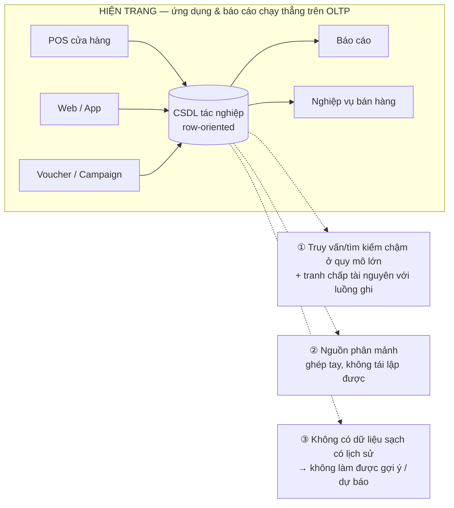
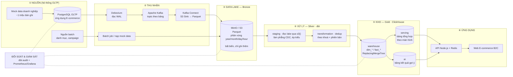
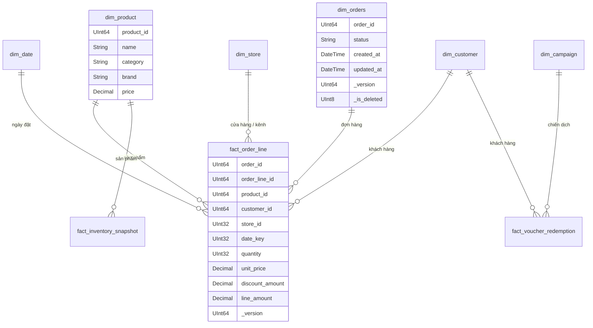
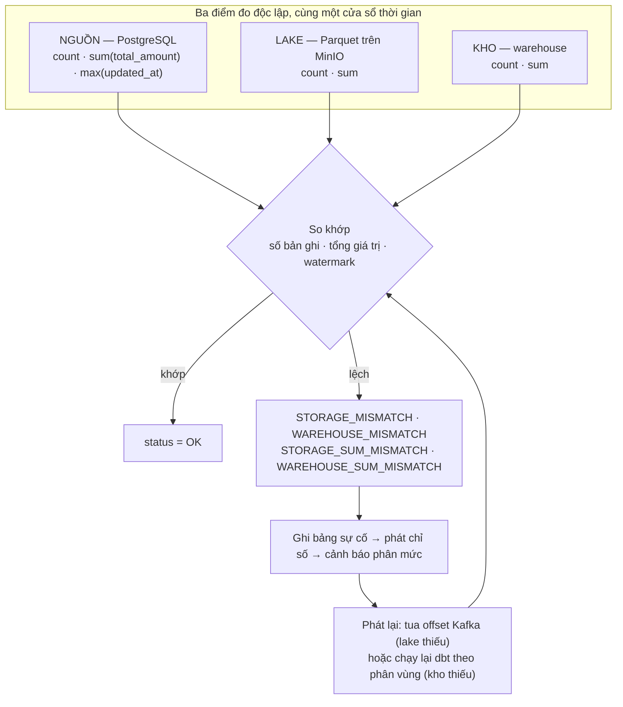
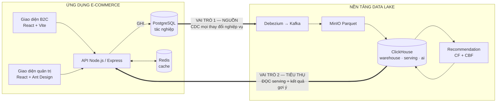
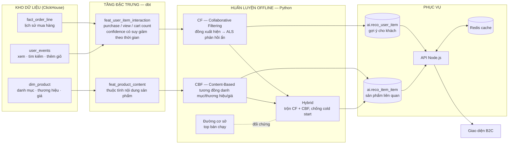

# MÔ TẢ ĐỀ TÀI

**Dự án:** Phát triển hệ thống Thương mại điện tử tích hợp xử lý dữ liệu lớn và AI Recommendation trên nền tảng Data Lake doanh nghiệp

| | |
|---|---|
| GVHD | Võ Văn Thành |
| Thời gian thực hiện | 08/2026 – 12/2026 · bảo vệ dự kiến 01/2027 |
| Quy mô dữ liệu mục tiêu | **~1 triệu bản ghi** sản phẩm/giao dịch |
| Sản phẩm | Ứng dụng E-commerce B2C + Recommendation System + (tuỳ chọn) Analytics/Dashboard, chạy trên nền tảng Data Lake đã có |

> **Nguồn phạm vi:** tài liệu này lấy [docs/Project_Brief_Ecommerce_DataLake.md](docs/Project_Brief_Ecommerce_DataLake.md) — bản brief chốt từ buổi báo cáo gần nhất — làm **mốc phạm vi và quy mô chính thức**. Các tài liệu kiến trúc trước đó ([docs/00](docs/00-DE-CUONG-VA-KIEN-TRUC.md) → [docs/05](docs/05-CAN-CHOT-VOI-GVHD.md)) được dùng làm **mô tả nền tảng dữ liệu hiện có** — tức phần "giải pháp kiến trúc hiện tại" mà ứng dụng sẽ khai thác. Chỗ nào brief và đề cương cũ khác nhau, tài liệu này **theo brief** và ghi chú rõ (§2.4).

Bốn nội dung: **vấn đề** (§1) · **phạm vi** (§2) · **giải pháp kiến trúc hiện tại** (§3) · **ứng dụng thể hiện hiệu quả của kiến trúc** (§4).

---

## 0. Tóm tắt

Doanh nghiệp đã có một **nền tảng dữ liệu tập trung (Data Lake / Lakehouse)** gom dữ liệu từ nhiều hệ thống OLTP: dữ liệu thô lưu trên MinIO dạng Parquet, được chuẩn hoá qua dbt và nạp vào kho phân tích ClickHouse theo mô hình chiều. Nền tảng này **đã thông luồng đầu-cuối** ở môi trường sandbox và máy ảo đơn.

Đề tài phát triển một **ứng dụng thương mại điện tử B2C** kết nối trực tiếp vào nền tảng đó, với ba mục tiêu:

1. **Chứng minh hiệu năng ở quy mô ~1 triệu bản ghi** — duyệt, tìm kiếm, lọc, phân loại sản phẩm phải chạy mượt. *Đây là yêu cầu quan trọng nhất từ GVHD.*
2. **Hệ thống gợi ý thông minh (Recommendation)** — Collaborative Filtering + Content-Based Filtering, huấn luyện trên dữ liệu hành vi và lịch sử mua hàng lấy từ Data Lake, trả kết quả về giao diện ở mức realtime/near-realtime.
3. **Phân tích dữ liệu & báo cáo (tuỳ chọn)** — dashboard doanh thu, bán lẻ, hiệu quả chiến dịch.

Luận điểm xuyên suốt: **ứng dụng là bằng chứng vận hành cho kiến trúc Data Lake.** Nó chạy nhanh ở quy mô triệu bản ghi *vì* dữ liệu đã được tách khỏi OLTP, chuẩn hoá và mô hình hoá sẵn; nó gợi ý được sản phẩm cá nhân hoá *vì* nền tảng có sẵn dữ liệu hành vi và lịch sử có chiều đầy đủ. Không có nền tảng thì cả hai đều không làm được ở mức này.

---

## 1. Vấn đề

### 1.1. Bối cảnh

Doanh nghiệp bán lẻ có chuỗi cửa hàng và kênh thương mại điện tử sinh dữ liệu liên tục trên nhiều nguồn phân tán: POS tại cửa hàng, website/app bán hàng, hệ thống khuyến mãi – voucher, kho, thanh toán. Cách làm phổ biến — cắm ứng dụng và báo cáo trực tiếp vào CSDL tác nghiệp (OLTP) — bộc lộ ba hạn chế:



| # | Hạn chế | Hệ quả với ứng dụng E-commerce |
|---|---|---|
| **V1** | **Hiệu năng và tranh chấp tài nguyên** — truy vấn duyệt/lọc/tổng hợp trên hàng triệu dòng của CSDL dạng dòng rất chậm | Trang danh sách sản phẩm, tìm kiếm, lọc theo nhiều tiêu chí bị thắt cổ chai; tệ hơn, tải đọc của ứng dụng tranh chấp với luồng ghi nghiệp vụ |
| **V2** | **Phân mảnh nguồn dữ liệu** — dữ liệu sản phẩm, đơn hàng, khuyến mãi, tồn kho nằm ở nhiều hệ thống OLTP khác nhau | Ứng dụng phải tự ghép nhiều nguồn, mỗi màn hình là một lần làm lại; không tái lập, không kiểm chứng được |
| **V3** | **Không có nền dữ liệu sạch có lịch sử** — dữ liệu tác nghiệp không lưu vết theo dạng phân tích | Không đủ chất lượng để huấn luyện mô hình gợi ý (cần ma trận tương tác người dùng–sản phẩm có lịch sử) hay phân tích xu hướng |

### 1.2. Bài toán trọng tâm — hiệu năng ở quy mô 1 triệu bản ghi

Đây là **yêu cầu quan trọng nhất từ GVHD**, và cũng là câu hỏi mà toàn bộ thiết kế phải trả lời:

> **Làm thế nào để ứng dụng chạy mượt mà — truy vấn, tìm kiếm, lọc nhanh chóng — khi cơ sở dữ liệu có 1 triệu bản ghi?**

Bài toán này chia thành ba nhánh kỹ thuật:

| Nhánh | Nội dung |
|---|---|
| **Performance tuning** | Tối ưu truy vấn ở tầng ứng dụng: phân trang, tránh N+1, cache, giới hạn dữ liệu trả về, đo p50/p95/p99 cho từng loại truy vấn |
| **Database design** | Tối ưu cấu trúc dữ liệu: chọn engine phù hợp, đánh index / skip index, chọn khoá sắp xếp và chiến lược phân vùng, bảng tổng hợp sẵn — tránh thắt cổ chai |
| **AI pipeline** | Xây luồng dữ liệu để mô hình đọc được tập dữ liệu lớn, huấn luyện, và trả kết quả gợi ý về giao diện ở mức realtime / near-realtime |

### 1.3. Ba câu hỏi nghiên cứu – kỹ thuật

| | Câu hỏi | Trả lời bằng |
|---|---|---|
| **RQ1**<br/>*Hiệu năng* | Ở quy mô ~1 triệu bản ghi, kiến trúc dữ liệu nào cho phép ứng dụng duyệt/tìm kiếm/lọc trong ngưỡng chấp nhận được, mà không gây tải cho hệ tác nghiệp? | Tách đọc–ghi; kho cột ClickHouse + bảng `serving` tính sẵn + cache Redis (§3.5) — đối chứng đo đạc với truy vấn thẳng trên OLTP (§4.2) |
| **RQ2**<br/>*Chất lượng dữ liệu* | Dữ liệu ứng dụng đọc từ Data Lake có **đúng, đủ, kịp thời** so với hệ nguồn không — và chứng minh thế nào một cách tự động? | Cơ chế đối soát checksum xuyên tầng, hiện thực bằng SQL trong dbt (§3.6) |
| **RQ3**<br/>*AI trên dữ liệu lớn* | Làm sao xây luồng để mô hình gợi ý huấn luyện được trên tập dữ liệu lớn và phục vụ kết quả ở mức near-realtime cho giao diện? | Tầng đặc trưng bằng dbt → huấn luyện offline (CF + CBF) → phục vụ theo lô qua bảng kết quả trong ClickHouse + Redis (§4.3) |

---

## 2. Phạm vi

### 2.1. Nguồn dữ liệu và quy mô

| Hạng mục | Nội dung |
|---|---|
| **Nguồn dữ liệu gốc** | Hệ thống Data Lake tập trung của doanh nghiệp — gom dữ liệu từ nhiều hệ thống OLTP; dữ liệu thô lưu trên **MinIO dạng Parquet** |
| **Dữ liệu dùng cho đề tài** | **Bản sao mock data** được trích xuất và cung cấp bởi doanh nghiệp, lưu và quản lý trên **Development Database Server riêng của nhóm** |
| **Quy mô thiết kế** | **~1 triệu bản ghi** sản phẩm/giao dịch — hệ thống phải chịu tải và xử lý được ở mức này |
| **Kiến trúc tích hợp** | Ứng dụng Web E-commerce (đã có sẵn nền tảng mã nguồn) **kết nối trực tiếp** với Data Server chứa 1 triệu bản ghi để truy vấn, tìm kiếm và phân tích |

**Lưu ý về liêm chính học thuật:** dữ liệu dùng trong luận văn là **bản sao mock** do doanh nghiệp cung cấp / bộ sinh mô phỏng, không dùng dữ liệu thật của khách hàng; lược đồ **tham khảo có tinh giản** từ mô hình nghiệp vụ thực tế, không sao chép nguyên trạng. Hệ thống production của doanh nghiệp chỉ nêu như bối cảnh và cơ sở đối chiếu thiết kế, **không nằm trong phạm vi nghiệm thu**.

### 2.2. Yêu cầu chức năng

**(A) Chức năng E-commerce cốt lõi** — *bắt buộc*

- Hiển thị, duyệt danh sách sản phẩm ở quy mô lớn.
- Cơ chế **tìm kiếm, lọc (filtering) và phân loại sản phẩm tốc độ cao** — đây là nơi bài toán hiệu năng thể hiện rõ nhất.
- Xử lý các quy trình mua hàng cơ bản (giỏ hàng, đặt đơn, theo dõi trạng thái).

**(B) Hệ thống gợi ý thông minh (Recommendation System)** — *bắt buộc, trọng tâm AI*

- Thu thập và phân tích **dữ liệu hành vi và lịch sử mua hàng** của người dùng.
- Áp dụng mô hình học máy đưa ra đề xuất sản phẩm **cá nhân hoá**.
- Thuật toán dự kiến: **Collaborative Filtering (CF)** và **Content-Based Filtering (CBF)**.

**(C) Phân tích dữ liệu & báo cáo** — *tuỳ chọn*

- Phân tích dữ liệu bán lẻ, doanh thu, hiệu quả chiến dịch bán hàng.
- Tổng hợp thành báo cáo/dashboard hỗ trợ quyết định kinh doanh.

### 2.3. Ranh giới phạm vi

| Trong phạm vi — **làm thật, có kiểm chứng** | Ngoài phạm vi — **chỉ thiết kế / định hướng** |
|---|---|
| Ứng dụng E-commerce B2C kết nối Data Server ~1 triệu bản ghi | Vận hành hệ thống production của doanh nghiệp |
| **Tối ưu hiệu năng**: thiết kế CSDL, index, phân vùng, bảng tổng hợp, cache, phân trang | Xây lại Data Lake từ đầu (nền tảng đã có — đề tài khai thác và đo đạc trên nó) |
| **Đo đạc có đối chứng** hiệu năng truy vấn ở nhiều mức quy mô | Cổng thanh toán / giao vận thật, app di động, đa ngôn ngữ |
| Recommendation System: CF + CBF, có đánh giá offline | Nghiên cứu thuật toán ML mới |
| AI pipeline: đặc trưng bằng dbt → huấn luyện → phục vụ near-realtime | Kubernetes, Keycloak SSO, Patroni HA, Apache Iceberg (trình bày ở mức thiết kế) |
| Dashboard/analytics ở mức tuỳ chọn | Real-time streaming ở mức giây (micro-batch đã đủ) |

### 2.4. Điều chỉnh so với đề cương trước đó

Brief từ buổi báo cáo gần nhất **thu hẹp và dịch chuyển trọng tâm**. Bảng dưới đây ghi rõ để tránh nhầm lẫn khi đọc lại bộ tài liệu cũ:

| Nội dung | Đề cương trước ([docs/00](docs/00-DE-CUONG-VA-KIEN-TRUC.md)) | **Theo brief mới** |
|---|---|---|
| Trọng tâm chấm điểm | Nền tảng 60% – AI 25% – Ứng dụng 15% | **Ứng dụng + hiệu năng là trọng tâm**; nền tảng đóng vai trò *hạ tầng đã có* mà ứng dụng khai thác |
| Bài toán số một | Đối soát & SLA dữ liệu (RQ3 cũ) | **Performance tuning ở 1 triệu bản ghi** — "yêu cầu quan trọng nhất từ GVHD" |
| Quy mô thực nghiệm | 1M / 10M / 50M dòng; 100 → 5.000 giao dịch/phút | **~1 triệu bản ghi** là quy mô thiết kế chính thức |
| Số module AI | 3 module + 1 tuỳ chọn (gợi ý, dự báo, campaign, trợ lý LLM) | **Recommendation (CF + CBF) là bắt buộc**; dự báo / campaign / trợ lý → hướng mở rộng |
| Analytics / Dashboard | Bắt buộc (MT3, MT4) | **Tuỳ chọn** |
| Nguồn dữ liệu | Bộ sinh mô phỏng POS tự viết | **Mock data do doanh nghiệp trích xuất và cung cấp**, lưu trên Data Server của nhóm |

Các hạng mục bị hạ xuống "tuỳ chọn" hoặc "mở rộng" **không bị xoá** — chúng vẫn có thiết kế sẵn trong bộ tài liệu và trở thành nội dung chương *hướng phát triển*.

### 2.5. Mốc ngắn hạn — MVP trong 2 tuần

| Việc | Tiêu chí hoàn thành |
|---|---|
| Hoàn thiện kết nối giữa Web App E-commerce hiện tại và CSDL chứa 1 triệu bản ghi | Ứng dụng đọc được dữ liệu thật từ Data Server, không còn dùng `db.json` |
| Chứng minh hệ thống cơ bản vận hành ở quy mô này | Trang danh sách / tìm kiếm / lọc hiển thị đúng và trong ngưỡng thời gian chấp nhận được, có số đo kèm theo |
| Nghiên cứu kỹ thuật | Phương pháp xử lý dữ liệu lớn, tối ưu truy vấn, kiến trúc phân tán (nếu cần) |
| Cập nhật hồ sơ | Đề cương chi tiết + kế hoạch thực hiện + phương án thiết kế, đưa lên cổng quản lý dự án của trường |

**Điểm chặn cần xử lý đầu tiên:** phiên bản GetShopy hiện tại dùng tệp `db.json` làm nơi lưu dữ liệu. Đây là rào cản kép — vừa không chịu được quy mô 1 triệu bản ghi, vừa không có nhật ký ghi trước (WAL) nên không bắt được thay đổi bằng CDC. Việc đầu tiên là **chuyển tầng lưu trữ tác nghiệp sang PostgreSQL** và **đấu nối tầng đọc phân tích vào ClickHouse**.

---

## 3. Giải pháp kiến trúc hiện tại

Phần này mô tả **nền tảng dữ liệu đã có** — thứ mà ứng dụng ở §4 sẽ khai thác và chứng minh hiệu quả. Nền tảng đã thông luồng đầu-cuối ở sandbox một máy và máy ảo đơn.

### 3.1. Nguyên lý thiết kế

| Nguyên lý | Diễn giải | Giải quyết |
|---|---|---|
| **Tách rời tác nghiệp và phân tích** | Không truy vấn phân tích trực tiếp trên OLTP. Dữ liệu sao chép ra ngoài bằng CDC đọc log — gần như không gây tải cho hệ thống bán hàng | V1, RQ1 |
| **Dữ liệu thô bất biến** | Lake chỉ ghi thêm, không sửa. Mọi sai sót ở tầng trên đều tính lại được từ lake mà không cần đọc lại nguồn | V2, RQ2 |
| **Hàng đợi là vùng đệm và nhật ký phát lại** | Kafka giữ dữ liệu theo retention, cho phép phát lại khi tầng dưới lỗi hoặc khi đổi logic biến đổi | V2 |
| **Biến đổi tăng trưởng** | dbt chỉ xử lý phần dữ liệu mới theo watermark, không tính lại toàn bộ | RQ1 |
| **Hợp nhất bất đồng bộ thay vì cập nhật tại chỗ** | Cập nhật/xoá biểu diễn bằng phiên bản mới; `ReplacingMergeTree` hợp nhất ở nền | RQ1 |
| **Chất lượng dữ liệu là một thành phần của hệ thống** | Đối soát xuyên tầng chạy tự động theo lịch, phát chỉ số ra hệ giám sát | **RQ2** |
| **Mọi thứ tái lập được** | Cấu hình nằm trong mã và biến môi trường; dựng lại môi trường bằng một câu lệnh | V2 |

### 3.2. Kiến trúc tổng thể — từ nguồn tới ứng dụng



### 3.3. Đặc tả từng tầng

| Tầng | Thành phần | Trách nhiệm | Ghi chú kỹ thuật |
|---|---|---|---|
| Nguồn | PostgreSQL 15 | CSDL tác nghiệp của ứng dụng | `wal_level = logical` + publication cho bảng cần theo dõi |
| Thu nhận streaming | Debezium → Kafka → S3 Sink | Bắt thay đổi, đệm, hạ cánh Parquet | **Khoá thông điệp = khoá chính** ⇒ mọi thay đổi của một bản ghi vào cùng phân vùng và **giữ đúng thứ tự** — điều kiện tiên quyết để dedup đúng |
| Thu nhận batch | Job định kỳ / nạp mock data | Nguồn không phù hợp CDC; nạp bộ dữ liệu 1 triệu bản ghi | Ghi theo **cùng quy ước phân vùng** ⇒ tầng trên xử lý đồng nhất |
| Data Lake (Bronze) | MinIO + Parquet | Nguồn chân lý bất biến | `topics/<topic>/year=/month=/day=/hour=/*.parquet`; vấn đề tệp nhỏ: tăng ngưỡng cuộn tệp / job gộp tệp / (định hướng) Iceberg |
| Silver | dbt `staging` + `transformation` | Làm phẳng CDC, ép kiểu, hợp nhất phiên bản | Chọn phiên bản mới nhất theo `(ts_ms, lsn)`; loại `op = 'd'` |
| Gold | dbt `warehouse` + `serving` trên ClickHouse | Mô hình chiều + **bảng tổng hợp tính sẵn** | Incremental theo watermark; đây là tầng ứng dụng đọc trực tiếp |
| AI | database `ai` trong ClickHouse | Bảng kết quả gợi ý | `ai.reco_user_item`, `ai.reco_item_item` |
| Chất lượng | dbt `audit` + tests | Đối soát và kiểm thử | ClickHouse đọc được cả PostgreSQL (`postgresql()`) và Parquet (`s3()`) ⇒ đối soát biểu diễn **trọn vẹn bằng SQL** |
| Vận hành | Prometheus/Grafana, bộ lịch | Quan sát và điều phối | Dashboard: pipeline · SLA dữ liệu · hiệu năng ClickHouse · hạ tầng |

**Ngăn xếp công nghệ:** PostgreSQL 15 (nguồn) · Debezium, Kafka Connect, Apache Kafka (thu nhận) · MinIO + Apache Parquet (Data Lake) · dbt-core adapter ClickHouse (xử lý) · **ClickHouse** (kho phân tích) · **Redis** (cache) · **Node.js/Express** (API) · **React + Vite, Ant Design** (giao diện) · pandas, scikit-learn, implicit/ALS (AI) · Prometheus, Grafana (giám sát) · Docker Compose (triển khai).

### 3.4. Mô hình dữ liệu kho



| Chủ đề | Bảng fact | Phục vụ chức năng nào của ứng dụng |
|---|---|---|
| Bán hàng | `fact_order_line` | Doanh thu, top sản phẩm, ma trận tương tác cho CF |
| Khuyến mãi | `fact_voucher_redemption` | Hiệu quả chiến dịch (analytics tuỳ chọn) |
| Tồn kho | `fact_inventory_snapshot` | Trạng thái còn hàng trên trang sản phẩm |
| Khách hàng | dẫn xuất từ fact bán hàng | Phân khúc, đặc trưng cho gợi ý |

### 3.5. Trọng tâm 1 — Kiến trúc phục vụ hiệu năng ở quy mô 1 triệu bản ghi (RQ1)

Đây là chỗ kiến trúc trả lời trực tiếp câu hỏi trọng tâm của GVHD. Bốn cơ chế xếp chồng:

| # | Cơ chế | Vì sao nhanh |
|---|---|---|
| **1** | **Kho cột (ClickHouse) thay vì kho dòng** | Chỉ đọc đúng cột cần thiết, nén cao, thực thi vector hoá — truy vấn duyệt/lọc/tổng hợp trên triệu dòng nhanh hơn nhiều bậc so với CSDL dạng dòng |
| **2** | **Bảng `serving` tính sẵn bằng dbt** | Các tổng hợp nặng (doanh thu theo ngày, top sản phẩm, bộ lọc theo danh mục) được tính trước theo lịch; lúc người dùng truy cập chỉ là đọc bảng đã có sẵn |
| **3** | **Thiết kế bảng theo mẫu truy cập thực tế** | Khoá sắp xếp `ORDER BY` chọn theo cách ứng dụng lọc; phân vùng theo tháng; `LowCardinality` cho cột phân loại; skip index cho cột lọc thưa; materialized view cho tổng hợp nóng |
| **4** | **Cache Redis ở tầng API** | Các câu trả lời ổn định (danh mục, bộ lọc, top sản phẩm, gợi ý theo sản phẩm) được cache — cắt hẳn round-trip xuống kho |

**Xử lý cập nhật/xoá — vì sao không dùng `UPDATE`:** kho cột tối ưu cho ghi thêm; cập nhật tại chỗ (`ALTER TABLE ... UPDATE`) là mutation rất nặng. Giải pháp là biểu diễn cập nhật bằng phiên bản:

```sql
CREATE TABLE warehouse.dim_orders (
    order_id      UInt64,
    store_id      UInt32,
    customer_id   UInt64,
    status        LowCardinality(String),
    total_amount  Decimal(18, 2),
    updated_at    DateTime64(3),
    _version      UInt64,   -- suy ra từ ts_ms / lsn của CDC
    _is_deleted   UInt8     -- xoá luận lý, tránh xoá vật lý tốn kém
) ENGINE = ReplacingMergeTree(_version)
PARTITION BY toYYYYMM(updated_at)
ORDER BY (order_id);
```

Một đơn hàng đổi trạng thái nhiều lần → nhiều dòng cùng `order_id` với `_version` tăng dần; ClickHouse hợp nhất ở nền, giữ dòng `_version` lớn nhất. **Chi phí hợp nhất trải đều theo thời gian** thay vì dồn vào lúc ghi. Truy vấn trạng thái mới nhất dùng `FINAL` hoặc `argMax()`; tầng `serving` tính sẵn nên **người dùng cuối không chịu chi phí này**.

### 3.6. Trọng tâm 2 — Đối soát xuyên tầng và SLA dữ liệu (RQ2)

Ứng dụng đọc số liệu từ kho chứ không từ nguồn, nên phải trả lời được: *"số liệu này có đúng với hệ thống nguồn không?"*



> **Vì sao phải so cả tổng giá trị, không chỉ đếm dòng:** số bản ghi đúng mà tổng tiền lệch cho thấy lỗi ở tầng biến đổi — sai kiểu dữ liệu, mất độ chính xác số thập phân, dedup chọn sai phiên bản. Loại lỗi mà việc chỉ đếm dòng **không bao giờ** phát hiện được.

| Chiều SLA | Chỉ số | Ngưỡng | Nguồn đo |
|---|---|---|---|
| **Đúng** | Tỉ lệ checksum trạng thái OK | ≥ 99,9% lần chạy | lớp `audit` |
| **Đủ** | Số bản ghi lệch giữa các tầng | = 0 sau khi hoà | lớp `audit` |
| **Kịp thời** | Độ trễ đầu-cuối p95 | Trong ngưỡng chu kỳ thu nhận | dấu thời gian nguồn vs kho |
| **Sẵn sàng** | Tỉ lệ lần chạy pipeline thành công | ≥ 99% | Prometheus |
| **Tươi** | Tuổi bản ghi mới nhất ở kho | < 2× chu kỳ thu nhận | truy vấn watermark |

Bốn cấp đối soát: `checksum_watermark_preflight` (chặn tính trên phân vùng còn dở) · `checksum_hourly_orders` (mỗi giờ) · `checksum_all_orders` (hằng ngày, chống trôi tích luỹ) · `checksum_escalation_orders` (phân biệt "đang trên đường" và "thực sự mất").

### 3.7. Môi trường triển khai

| | Sandbox một máy | Data Server của nhóm | Cụm VM beta |
|---|---|---|---|
| Vai trò | Phát triển, đo đạc, nghiệm thu | **Chứa mock data ~1 triệu bản ghi**, ứng dụng kết nối trực tiếp | Chứng minh khả năng vận hành và chịu lỗi |
| Đóng gói | Docker Compose | Cài đặt trực tiếp | IaC có tham số |
| Trạng thái | ✅ Đã thông luồng | Hạng mục MVP 2 tuần | Mở rộng, nếu còn thời gian |

Ở cấp cụm, chiến lược sẵn sàng cao theo thành phần: Kafka (replication factor 3, `min.insync.replicas = 2`) · MinIO (phân tán + erasure coding) · ClickHouse (bảng nhân bản + Keeper 3 node) · PostgreSQL (streaming replication) · dbt (không lưu trạng thái, chạy lại an toàn nhờ tính bất biến).

---

## 4. Ứng dụng thể hiện hiệu quả của kiến trúc

Ứng dụng E-commerce là **bằng chứng vận hành** cho kiến trúc ở §3. Ba nhóm chức năng, mỗi nhóm chứng minh một luận điểm kiến trúc khác nhau.

### 4.1. Vai trò kép của ứng dụng: nguồn ↔ tiêu thụ



> **Nguyên tắc tách trách nhiệm ở mức mã nguồn:** **ghi luôn đi vào PostgreSQL; đọc dữ liệu tổng hợp và tìm kiếm luôn đi vào ClickHouse.** Đây là hiện thân trực tiếp của luận điểm "tách rời tác nghiệp và phân tích" (giải quyết V1) — và là điều dễ trình bày nhất khi bảo vệ.

**Vai trò 1 — nguồn dữ liệu.** Mọi hành vi nghiệp vụ ghi vào PostgreSQL và trở thành bản ghi CDC chảy vào nền tảng:

| Hành vi trên ứng dụng | Bảng nguồn | Ý nghĩa |
|---|---|---|
| Đặt đơn hàng | `orders`, `order_details` | Luồng chính của fact bán hàng — dữ liệu huấn luyện CF |
| **Xem sản phẩm, tìm kiếm, thêm giỏ** | `user_events` | **Dữ liệu hành vi — đầu vào chính của Recommendation** |
| Cập nhật trạng thái đơn | `orders` | Nhiều bản ghi cập nhật trên cùng khoá — tình huống kiểm chứng `ReplacingMergeTree` |
| Áp mã giảm giá | `outputvoucher_detail` | Dữ liệu đo hiệu quả khuyến mãi (analytics) |
| Thêm/sửa sản phẩm, cập nhật kho | `products`, `inventory` | Chiều sản phẩm — đầu vào của CBF |
| Đăng ký / cập nhật khách hàng | `customers` | Chiều khách hàng |

**Vai trò 2 — tiêu thụ.** Ứng dụng đọc hai loại dữ liệu từ ClickHouse và **không bao giờ truy vấn tổng hợp trên PostgreSQL**: (1) bảng `serving` do dbt tính sẵn, (2) bảng kết quả gợi ý ở database `ai`.

### 4.2. Chức năng A — E-commerce cốt lõi & bài toán hiệu năng

Đây là nơi kiến trúc chứng minh giá trị rõ nhất. Với ~1 triệu bản ghi, các màn hình sau đều là bài toán hiệu năng thật:

| Màn hình / chức năng | Truy vấn phải chạy | Cơ chế kiến trúc phục vụ |
|---|---|---|
| **Danh sách sản phẩm** (phân trang) | Duyệt + sắp xếp trên toàn bộ danh mục | Kho cột + `ORDER BY` chọn theo mẫu truy cập + phân trang theo con trỏ (cursor) thay vì `OFFSET` lớn |
| **Tìm kiếm sản phẩm** | Khớp chuỗi trên tên/mô tả | Skip index / index đảo (`ngrambf_v1`, `tokenbf_v1`) trên cột văn bản |
| **Lọc đa tiêu chí** (danh mục, thương hiệu, khoảng giá, còn hàng) | Nhiều điều kiện kết hợp | `LowCardinality` cho cột phân loại, phân vùng, skip index cho cột lọc thưa |
| **Phân loại / bộ đếm theo facet** | Đếm số sản phẩm theo từng nhóm | Bảng `serving` tính sẵn + cache Redis |
| **Trang chi tiết sản phẩm** | Thông tin sản phẩm + tồn kho + gợi ý liên quan | Đọc điểm (point lookup) + bảng `ai.reco_item_item` |
| **Giỏ hàng, đặt đơn, theo dõi đơn** | Ghi và đọc theo bản ghi | Đi thẳng vào PostgreSQL (tác nghiệp) |

**Thực nghiệm hiệu năng — đây là phần đo đạc trọng tâm của luận văn:**

| # | Thực nghiệm | Cách đo | Chứng minh |
|---|---|---|---|
| **TN1** | **Truy vấn có đối chứng** | Bộ 8–10 truy vấn tiêu biểu (duyệt, tìm kiếm, lọc đa tiêu chí, tổng hợp), chạy trên **ClickHouse vs PostgreSQL** cùng dữ liệu | Tỉ lệ tăng tốc — **định lượng trực tiếp cho V1 và RQ1** |
| **TN2** | **Biến thiên theo quy mô** | Cùng bộ truy vấn ở **100K / 500K / 1M** bản ghi | Cách hiệu năng suy giảm theo quy mô; xác định điểm nghẽn |
| **TN3** | **Hiệu quả của từng cơ chế tối ưu** | Bật/tắt lần lượt: index, phân vùng, bảng `serving`, cache Redis; đo p50/p95/p99 | **Tách bạch đóng góp của từng quyết định thiết kế** — tránh kết luận chung chung "nhanh hơn vì dùng ClickHouse" |
| **TN4** | Độ trễ end-to-end của ứng dụng | Đo từ request HTTP tới lúc render, không chỉ thời gian truy vấn CSDL | Số liệu có ý nghĩa với người dùng thật |
| **TN5** | Chi phí xử lý cập nhật | `ReplacingMergeTree` + incremental **vs** ghi lại toàn bảng: thời gian, I/O, tài nguyên | Chứng minh lựa chọn kiến trúc ở §3.5 |
| **TN6** | Đối soát & SLA + tiêm lỗi | Checksum xuyên tầng; đồng thời hạ Kafka/ClickHouse, ngắt mạng, kill dbt giữa lúc ghi | Sau phục hồi checksum trở về OK, không mất/không nhân bản — **RQ2** |

> **TN3 là thực nghiệm quan trọng nhất về mặt học thuật.** Nó biến "tôi đã tối ưu" thành "mỗi cơ chế đóng góp bao nhiêu phần trăm" — đúng câu hỏi GVHD đặt ra về performance tuning.

### 4.3. Chức năng B — Recommendation System (CF + CBF)

Nguyên tắc: **mô hình lấy dữ liệu từ warehouse, không truy cập trực tiếp CSDL tác nghiệp.** Nhờ đó phần AI trở thành minh chứng cho V3 — *có nền dữ liệu sạch, có lịch sử thì mới huấn luyện được mô hình gợi ý*.



**Bốn mức mô hình, tăng dần độ phức tạp:**

| Mức | Mô hình | Nội dung |
|---|---|---|
| 0 | **Đường cơ sở** | Top sản phẩm bán chạy toàn cục và theo danh mục — mốc để so sánh |
| 1 | **Luật mua kèm** | Ma trận đồng xuất hiện trong cùng đơn, dùng lift/confidence — phục vụ trực tiếp "Khách hàng cũng mua" |
| 2 | **CF — Collaborative Filtering** | Phân rã ma trận tương tác trên phản hồi ẩn (ALS): sinh véc-tơ ẩn cho khách và sản phẩm; xử lý được việc không có đánh giá tường minh |
| 3 | **CBF — Content-Based Filtering** | Độ tương đồng theo thuộc tính nội dung (danh mục, thương hiệu, khoảng giá, mô tả) |
| 4 | **Hybrid** | Trộn CF + CBF — giải quyết **cold start** cho sản phẩm mới và khách mới, vấn đề mà CF thuần không xử lý được |

**Đặc trưng `feat_user_item_interaction`** (định nghĩa bằng dbt, không bằng Python):

| Cột | Ý nghĩa |
|---|---|
| `customer_id`, `product_id` | Cặp tương tác |
| `purchase_count`, `view_count`, `cart_count` | Số lần theo từng loại hành vi |
| `confidence` | Điểm tin cậy có trọng số (mua > thêm giỏ > xem), có suy giảm theo thời gian |
| `last_interaction_at` | Phục vụ chia tập theo thời gian |

**Hai quyết định thiết kế của AI pipeline:**

- **Đặc trưng định nghĩa bằng dbt, không bằng Python** — cùng một định nghĩa dùng cho cả huấn luyện và phục vụ (tránh lệch train/serve), có kiểm thử dữ liệu, có lineage.
- **Phục vụ theo lô (batch scoring) + cache** — mô hình chạy định kỳ, ghi kết quả thành bảng trong ClickHouse (`ai.reco_*`); API đọc bảng và cache ở Redis. **Đây chính là cách đạt "near-realtime" ở quy mô lớn**: độ trễ đọc gần như bằng không, không phụ thuộc tình trạng dịch vụ mô hình lúc người dùng truy cập, và dễ tái lập kết quả để đưa vào báo cáo. Suy luận tại thời điểm yêu cầu chỉ dùng cho gợi ý theo phiên truy cập hiện tại (khách chưa đăng nhập → gợi ý theo sản phẩm đang xem).

**Đánh giá:**

| Hạng mục | Nội dung |
|---|---|
| Chia tập | **Theo mốc thời gian** (huấn luyện trước T, đánh giá sau T) — không chia ngẫu nhiên, vì chia ngẫu nhiên gây rò rỉ thông tin tương lai |
| Chỉ số | Precision@K, Recall@K, MAP@K, **độ phủ danh mục (catalog coverage)** với K = 5, 10, 20 |
| Đối chứng | So với đường cơ sở "top bán chạy"; so CF vs CBF vs Hybrid |
| Yêu cầu | Vượt đường cơ sở rõ rệt ở **cả độ chính xác và độ phủ** — chỉ chính xác mà độ phủ thấp thì hệ gợi ý chỉ đẩy đúng vài sản phẩm hot, không có giá trị nghiệp vụ |

**Điểm tích hợp trong ứng dụng:** khối "Sản phẩm liên quan" và "Khách hàng cũng mua" ở trang chi tiết · gợi ý mua kèm ở giỏ hàng · khối "Dành cho bạn" ở trang chủ.

**Về dữ liệu huấn luyện:** nếu dữ liệu mock sinh ngẫu nhiên đều thì **không mô hình nào học được gì**. Vì vậy bộ dữ liệu cần có quy luật cài sẵn và **ghi lại tham số**: cụm sản phẩm mua kèm (điện thoại + ốp + sạc), véc-tơ sở thích cá nhân ẩn của mỗi khách, phân khúc khách hàng, mùa vụ. Nhờ đó có "đáp án" để đối chiếu với kết quả mô hình — điều dữ liệu thật không cho phép. Cần nêu trung thực đây vừa là điểm mạnh phương pháp vừa là hạn chế (mô hình học lại quy luật do chính mình cài), để không bị coi là chứng minh vòng tròn.

### 4.4. Chức năng C — Analytics & báo cáo (tuỳ chọn)

Nếu tiến độ cho phép, phần analytics tận dụng đúng dữ liệu và mô hình đã có, chi phí biên thấp:

| Màn hình | Dữ liệu hiển thị | Nguồn |
|---|---|---|
| **Dashboard doanh thu** | Doanh thu theo ngày/giờ, so sánh cùng kỳ, top sản phẩm, doanh thu theo danh mục, giá trị đơn trung bình | `serving.daily_orders_summary`, `serving.order_details_summary` |
| **Hiệu quả chiến dịch** | Tỉ lệ dùng voucher, chi phí khuyến mãi, doanh thu tăng thêm theo campaign | `fact_voucher_redemption` |
| **Fulfillment** | Số đơn theo trạng thái, thời gian trung bình mỗi chặng, đơn quá hạn | `serving` từ `dim_orders` + `fact_order_line` |
| **Trạng thái dữ liệu** ⭐ | *"Số liệu bạn đang xem đã được đối soát tới 14:00, khớp 100% với hệ thống nguồn"* | `audit.checksum_*` |

> Màn hình cuối cùng có **chi phí gần bằng không** (dữ liệu đã có sẵn ở lớp `audit`) nhưng trả lời được câu hỏi khó nhất mà hội đồng thường đặt ra: *"làm sao bạn biết số liệu này đúng?"* — nên làm nếu có thời gian.

### 4.5. Bản đồ tổng hợp: vấn đề → giải pháp → bằng chứng

| Vấn đề | Giải pháp kiến trúc | Bằng chứng trong ứng dụng |
|---|---|---|
| **V1** Truy vấn chậm ở quy mô lớn, tranh chấp tài nguyên | Tách đọc–ghi bằng CDC; kho cột ClickHouse; bảng `serving` tính sẵn; index + phân vùng; cache Redis | TN1–TN4: đối chứng ClickHouse vs PostgreSQL, biến thiên theo quy mô, đóng góp của từng cơ chế tối ưu |
| **V2** Phân mảnh nguồn dữ liệu | Nhiều nguồn đổ về cùng quy ước phân vùng trên lake; chuẩn hoá bằng dbt về mô hình chiều dùng chung | Mỗi màn hình truy được về một mô hình dbt cụ thể; thêm màn hình mới chỉ cần thêm model + bảng kết quả |
| **V3** Không có nền dữ liệu sạch cho AI | Warehouse có lịch sử hành vi và mua hàng, có chiều sản phẩm đầy đủ; tầng đặc trưng bằng dbt | Recommendation CF + CBF chạy hoàn toàn trên warehouse; đánh giá P@K / R@K / MAP@K vượt đường cơ sở |
| **RQ1** Hiệu năng ở 1 triệu bản ghi | Bốn cơ chế xếp chồng ở §3.5 | TN1, TN2, **TN3** (tách bạch đóng góp từng cơ chế), TN4 |
| **RQ2** Dữ liệu đúng – đủ – kịp thời | Đối soát xuyên tầng bằng SQL trong dbt + SLA 5 chiều + leo thang & phát lại | TN6 (tiêm lỗi và phục hồi); màn hình trạng thái dữ liệu |
| **RQ3** AI trên dữ liệu lớn, phục vụ near-realtime | Đặc trưng bằng dbt → huấn luyện offline → **batch scoring vào bảng `ai.*` + cache Redis** | Độ trễ trả gợi ý đo được ở tầng API; kết quả đánh giá offline |

### 4.6. Vì sao đây là *nền tảng* chứ không phải *đường ống báo cáo*

[docs/04-DE-XUAT-UNG-DUNG.md](docs/04-DE-XUAT-UNG-DUNG.md) liệt kê **14 ứng dụng** có thể xây trên nền tảng này — phát hiện bất thường doanh thu, cảnh báo hết hàng, dự báo churn, định giá động, phân tích giỏ hàng, phát hiện gian lận voucher, phân tích phễu chuyển đổi, trung tâm quan sát SLA dữ liệu, tìm kiếm ngữ nghĩa…

> **Tất cả dùng chung một đường ống dữ liệu duy nhất.** Không ứng dụng nào cần thu nhận lại từ nguồn; không ứng dụng nào truy vấn trực tiếp hệ tác nghiệp. **Ứng dụng mới chỉ cần thêm một mô hình dbt và một bảng kết quả.**
>
> Đó là khác biệt giữa một *nền tảng* (platform) và một *đường ống báo cáo* (reporting pipeline) — và là lý do đề tài đặt ứng dụng E-commerce lên trên một nền tảng có sẵn, thay vì cho ứng dụng tự xử lý dữ liệu.

---

## 5. Lộ trình và sản phẩm giao

### 5.1. Lộ trình

| Giai đoạn | Nội dung | Kết quả |
|---|---|---|
| **GĐ0 — MVP (2 tuần)** | Đấu nối Web App ↔ Data Server 1 triệu bản ghi; chuyển `db.json` → PostgreSQL + ClickHouse | Hệ thống hiển thị dữ liệu thành công ở quy mô 1M, có số đo ban đầu |
| **GĐ1 — Hiệu năng** | Thiết kế lại CSDL, index, phân vùng, bảng `serving`, cache; đo TN1–TN4 | Bộ số liệu hiệu năng có đối chứng, tách bạch đóng góp từng cơ chế |
| **GĐ2 — Chức năng E-commerce** | Duyệt, tìm kiếm, lọc, phân loại, quy trình mua hàng hoàn chỉnh | Ứng dụng chạy đủ luồng ở quy mô mục tiêu |
| **GĐ3 — Recommendation** | Đặc trưng dbt → CF → CBF → Hybrid; tích hợp vào giao diện | Mô hình có đánh giá offline vượt đường cơ sở, đã hiển thị trên app |
| **GĐ4 — Chất lượng dữ liệu** | Đối soát checksum, giám sát, tiêm lỗi (TN6) | SLA dữ liệu đo được, có bằng chứng phục hồi sau sự cố |
| **GĐ5 — Analytics (tuỳ chọn)** | Dashboard doanh thu, chiến dịch, trạng thái dữ liệu | Bổ sung nếu tiến độ cho phép |
| **GĐ6 — Viết quyển & bảo vệ** | Báo cáo, slide, video demo | Quyển hoàn chỉnh |

### 5.2. Sản phẩm giao

1. Quyển báo cáo khoá luận + slide bảo vệ.
2. **Mã nguồn:** ứng dụng E-commerce (React + Node/Express), dự án dbt, module Recommendation, script nạp và sinh dữ liệu.
3. **Bộ tài liệu kỹ thuật:** kiến trúc hệ thống, thiết kế cơ sở dữ liệu và phương án tối ưu, thiết kế AI pipeline, hướng dẫn dựng lại môi trường.
4. **Bộ số liệu thực nghiệm:** bảng và biểu đồ hiệu năng TN1–TN6, kết quả đánh giá mô hình gợi ý.
5. **Dashboard:** Grafana (hiệu năng hệ thống, SLA dữ liệu) + Metabase/dashboard trong app (báo cáo nghiệp vụ, nếu làm phần tuỳ chọn).
6. **Video demo:** duyệt/tìm kiếm ở quy mô 1 triệu bản ghi · đặt đơn → dữ liệu chảy qua pipeline → gợi ý cá nhân hoá cập nhật.

---

## 6. Đóng góp của đề tài

1. **Về hiệu năng** — một lời giải có cấu trúc cho bài toán "ứng dụng chạy nhanh ở quy mô triệu bản ghi", với **bốn cơ chế xếp chồng** (kho cột, bảng tính sẵn, thiết kế bảng theo mẫu truy cập, cache) và thực nghiệm **tách bạch đóng góp của từng cơ chế** — không dừng ở kết luận chung "dùng ClickHouse thì nhanh hơn".
2. **Về kiến trúc dữ liệu** — chứng minh rằng việc tách tầng phân tích khỏi tầng tác nghiệp không chỉ là nguyên tắc lý thuyết mà cho ra **số đo cụ thể** ở cả hiệu năng lẫn khả năng làm AI.
3. **Về chất lượng dữ liệu** — cơ chế đối soát xuyên tầng biểu diễn hoàn toàn bằng SQL trong dbt (nhờ ClickHouse đọc trực tiếp được cả PostgreSQL và Parquet), biến SLA dữ liệu thành chỉ số đo được và **đưa được lên tận màn hình nghiệp vụ**.
4. **Về tích hợp AI** — mẫu thiết kế "đặc trưng bằng dbt → huấn luyện offline CF/CBF → batch scoring vào ClickHouse + cache → giao diện", cho thấy cách đạt gợi ý near-realtime ở quy mô lớn mà không cần suy luận trực tuyến.

**Cần nêu rõ và trung thực trong báo cáo:** dữ liệu là bản sao mock / mô phỏng nên chỉ số của mô hình gợi ý chứng minh **luồng end-to-end hoạt động và mô hình học được quy luật đã cài**, không phải kết luận về hành vi thị trường thực; các thuật toán sử dụng đều là phương pháp đã công bố (ALS, content-based similarity) — **đóng góp nằm ở kiến trúc tích hợp và bài toán hiệu năng, không phải thuật toán mới**.
