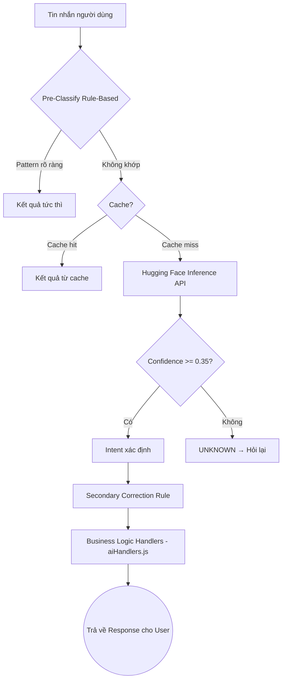

# Kiến trúc Trí tuệ Nhân tạo (AI) - Getshopy Chatbot

Tài liệu này mô tả kiến trúc AI Chatbot của Getshopy sau khi tích hợp **Hugging Face Inference API**.
Hệ thống được thiết kế theo mô hình **Pipeline đa tầng (Multi-layer)** kết hợp giữa Rule-based Pre-classifier, Hugging Face Cloud Model và Business Logic Handler.

> [!TIP]
> Việc chuyển sang Hugging Face cho phép sử dụng model AI mạnh hơn, đã được pre-train trên hàng tỷ câu văn và hỗ trợ tiếng Việt. Model có thể được fine-tune thêm với dữ liệu đặc thù của Getshopy.

---

## 1. Kiến trúc Pipeline Xử Lý (mới)

Dòng chảy dữ liệu (Data flow) của một tin nhắn khách hàng đi qua các bước sau:



---

## 2. Module NLP Duy Nhất: `src/ai/huggingface.js`

Toàn bộ thư mục AI tự code cũ (NaiveBayes, LogisticRegression, LinearSVM, EnsembleClassifier, DecisionTree, FSM, NER, SpellCorrector, CosineSimilarity, CollaborativeFilter, v.v.) đã được thay thế bởi **một file duy nhất**.

### 2.1. Cấu hình

| Biến môi trường | Mô tả | Mặc định |
|:---|:---|:---|
| `HF_API_KEY` | API Key từ huggingface.co | *(bắt buộc)* |
| `HF_MODEL` | Tên model trên Hugging Face Hub | `MoritzLaurer/mDeBERTa-v3-base-mnli-xnli` |
| `HF_CONFIDENCE_THRESHOLD` | Ngưỡng độ tin cậy tối thiểu | `0.35` |

### 2.2. Model hiện tại

- **Tên:** `MoritzLaurer/mDeBERTa-v3-base-mnli-xnli`
- **Loại:** Zero-shot Classification (Multilingual)
- **Ngôn ngữ hỗ trợ:** 100+ ngôn ngữ, bao gồm tiếng Việt
- **Cách hoạt động:** Nhận tin nhắn + danh sách 48 Intent labels → Trả về label phù hợp nhất kèm điểm confidence

### 2.3. Kế hoạch Fine-tuning (Option B — Đã chọn)

Bộ dữ liệu training cũ (`trainingData.js`) đã được backup tại `src/AI (Not used)/`. Quy trình fine-tune:

```text
1. Export trainingData.js → CSV format (message, intent)
2. Upload lên Hugging Face Hub (private dataset)
3. Fine-tune PhoBERT hoặc mDeBERTa trên Google Colab (miễn phí GPU)
4. Upload model fine-tuned lên Hugging Face Hub
5. Cập nhật HF_MODEL trong .env → model mới có data Getshopy
```

**Lợi ích:** Model fine-tuned sẽ chính xác hơn đáng kể với ngôn ngữ và domain cụ thể của Getshopy.

---

## 3. Intent Labels (48 Intents)

| Nhóm | Intents |
|:---|:---|
| **Chào hỏi / Chung** | GREETING, HELP, CONTACT, SMALLTALK, FEEDBACK_POSITIVE |
| **Tìm kiếm sản phẩm** | SEARCH_PRODUCT, SEARCH_CATEGORY, ASK_PRICE, ASK_SPECS, ASK_ACCESSORIES |
| **Tư vấn mua hàng** | ASK_RECOMMEND, ASK_BEST_SELLER, ASK_NEW_ARRIVAL, ASK_PREORDER |
| **Câu hỏi kỹ thuật** | ASK_CAMERA, ASK_BATTERY, ASK_DISPLAY, ASK_STORAGE, ASK_CONNECTIVITY, ASK_GAMING, ASK_WATERPROOF, ASK_OS, ASK_DESIGN, ASK_COMPATIBILITY |
| **Chính sách** | ASK_PROMO, ASK_DELIVERY, ASK_RETURN, ASK_PAYMENT, ASK_REVIEW, ASK_INVOICE |
| **Dịch vụ bổ sung** | ASK_GIFT, ASK_GIFT_WRAP, ASK_LOYALTY, ASK_SECOND_HAND, ASK_AUTHENTIC, ASK_TRADE_IN, ASK_REPAIR |
| **So sánh** | COMPARE_PRODUCT, COMPARE_SPECS, COMPARE_ACCESSORIES |
| **Quản lý đơn hàng** | CHECK_STOCK, TRACK_ORDER, CANCEL_ORDER, CHANGE_PRODUCT |
| **Xử lý phàn nàn** | PRICE_COMPLAINT, COMPLAINT |
| **Thương mại** | BULK_ORDER, URGENT_NEED |
| **Fallback** | UNKNOWN |

---

## 4. Pre-Classifier (Rule-Based — Không tốn API)

Một số pattern đơn giản được xử lý **trước khi gọi Hugging Face API** để tiết kiệm quota và giảm latency:

| Pattern | Intent |
|:---|:---|
| Câu chào ngắn (`xin chào`, `hi`, `hello`) | GREETING |
| `đơn hàng của tôi` + `kiểm tra/tra` | TRACK_ORDER |
| `hủy đơn` | CANCEL_ORDER |
| `giao hàng`, `ship`, `phí ship` | ASK_DELIVERY |
| `thanh toán`, `MoMo`, `VNPAY`, `trả góp` | ASK_PAYMENT |
| `bảo hành`, `đổi trả` | ASK_RETURN |

---

## 5. Cache Layer

Module tự động cache kết quả phân loại trong bộ nhớ RAM:
- **Dung lượng tối đa:** 200 entries
- **TTL (Time-to-live):** 10 phút
- **Eviction:** LRU (xóa entry cũ nhất khi đầy)

Cùng một câu hỏi gửi lần 2 sẽ được trả về từ cache trong **< 1ms** thay vì gọi API.

---

## 6. Business Logic Handler — `aiHandlers.js`

File `aiHandlers.js` (~2400 dòng) **không thay đổi** và **không chứa thuật toán AI**.  
Nó chứa:
- `ConversationQueue` — Lưu lịch sử hội thoại 10 tin gần nhất/session
- Bộ câu trả lời phong phú (5-8 biến thể/intent) → Tránh lặp lại
- Helper functions: `removeDiacritics`, `extractProductFromHistory`, `extractBudget`
- Hàm `handleExpandedIntent()` — Xử lý các intent đặc biệt (thương lượng, camera, pin, v.v.)

---

## 7. So Sánh Kiến Trúc Cũ vs Mới

| Tiêu chí | AI tự code (cũ) | Hugging Face API (mới) |
|:---|:---|:---|
| **Số file AI** | 17 files (~200KB code + 4MB weights) | 1 file (`huggingface.js`) |
| **Model** | NaiveBayes + LR + SVM Ensemble | mDeBERTa-v3 (500M+ params) |
| **Ngôn ngữ** | Tiếng Việt + Tiếng Anh (2 engine) | Đa ngôn ngữ (1 model) |
| **Training** | Tự train từ đầu (JavaScript) | Fine-tune model có sẵn (Python/Colab) |
| **Khả năng mở rộng** | Phải code thêm thuật toán | Swap model URL là xong |
| **Chi phí** | 0 (local) | Free tier 30k calls/tháng |
| **Bảo trì** | Cao (code phức tạp) | Thấp (chỉ 1 file) |

> [!NOTE]
> **Backup:** Toàn bộ code AI cũ được giữ nguyên tại `src/AI (Not used)/` — Hoạt động như "thùng chứa dữ liệu không có dây điện". Không có import nào trỏ vào thư mục này.
