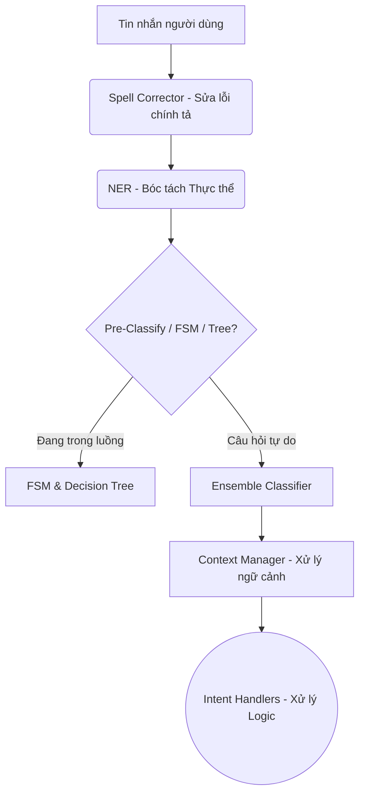

# Kiến trúc Trí tuệ Nhân tạo (AI) - Getshopy Chatbot

Tài liệu này tóm tắt toàn bộ các thuật toán và cơ chế học máy (Machine Learning) đang được vận hành bên trong hệ thống Chatbot của Getshopy. Hệ thống được thiết kế theo mô hình **Pipeline đa tầng (Multi-layer)** kết hợp giữa AI thống kê, Học máy truyền thống và Logic định tuyến.

> [!TIP]
> Sự kết hợp giữa nhiều thuật toán độc lập giúp Chatbot xử lý ngôn ngữ tự nhiên Tiếng Việt một cách trơn tru, bao dung với lỗi chính tả, và phản hồi có ngữ cảnh.

---

## 1. Pipeline Xử Lý Ngôn Ngữ Tự Nhiên (NLP)

Dòng chảy dữ liệu (Data flow) của một tin nhắn khách hàng đi qua các bước sau:

---

## 2. Chi tiết 8 Thuật Toán và Cơ Chế

### 2.1. Sửa Lỗi Chính Tả (Spell Corrector)
- **Thuật toán:** **Khoảng cách Levenshtein (Levenshtein Distance)**
- **Vai trò:** Đo lường số bước tối thiểu (thêm, sửa, xóa ký tự) để biến một từ sai thành từ đúng trong từ điển sản phẩm.
- **Ví dụ:** Khách gõ `"macbok"` -> Khoảng cách đến `"macbook"` là 1 -> Tự động sửa thành `"macbook"`.

### 2.2. Nhận Dạng Thực Thể (NER - Named Entity Recognition)
- **Thuật toán:** **Pattern Matching & Regular Expressions (Lấy cảm hứng từ CRF)**
- **Vai trò:** Quét toàn bộ câu để "nhặt" ra các thông số cụ thể: *Tên Model (productName)*, *Dung lượng (storage)*, *Màu sắc (color)*, *Ngân sách (budget)*.
- **Ví dụ:** `"có cái ip 15 pro max nào 256gb màu đen tầm 25 củ không"` -> `{ productName: "iPhone 15 Pro Max", storage: "256GB", color: "đen", budget: 25000000 }`.

### 2.3. Phân Loại Ý Định (Intent Classification) bằng Ensemble
Thay vì dùng 1 mô hình duy nhất, hệ thống kết hợp (Voting) 4 phương pháp khác nhau để đưa ra phán đoán chính xác nhất.

| Thuật toán | Vai trò / Ưu điểm | Trọng số |
| :--- | :--- | :--- |
| **Naive Bayes** | Mô hình xác suất dựa trên định lý Bayes. Hoạt động cực tốt với lượng text ngắn và từ vựng khổng lồ (triệu mẫu). | `40% - 100%` |
| **Logistic Regression** | Học theo SGD và Softmax Loss. Có khả năng trả về điểm tự tin (Confidence Score) chính xác để quyết định có Fallback (xin lỗi vì không hiểu) hay không. | `40%` |
| **Linear SVM** | Support Vector Machine (One-vs-Rest). Giúp vạch ra "đường ranh giới" sắc bén giữa các ý định (Intent) gần giống nhau. | `20%` |
| **Rule-Based** | Phân loại theo Regex cứng. Dành cho các Intent mang tính hệ thống (xin chào, kiểm tra đơn...). | `Bonus +15%` |

> [!NOTE] 
> **Dynamic Weights (Trọng số động):** Nếu Logistic Regression và SVM chưa được huấn luyện (chưa có model weights), hệ thống tự động dồn 100% trọng số biểu quyết cho Naive Bayes để đảm bảo Chatbot không bao giờ bị gián đoạn.

### 2.4. Tìm Kiếm Sản Phẩm Tương Tự (Similar Products)
- **Thuật toán:** **TF-IDF (Term Frequency-Inverse Document Frequency) kết hợp Cosine Similarity**
- **Vai trò:** Khi khách hàng yêu cầu `"còn sản phẩm nào khác không?"` hoặc `"có cái nào na ná không?"`. Thuật toán sẽ mã hóa tên/mô tả của các sản phẩm thành Vector toán học, sau đó tính Góc Cosine giữa chúng. Góc càng nhỏ (Cosine -> 1), hai sản phẩm càng giống nhau.

### 2.5. Gợi Ý Bán Chéo (Cross-Selling / Recommendation)
- **Thuật toán:** **Lọc Cộng Tác (Collaborative Filtering - Item-based Co-occurrence Matrix)**
- **Vai trò:** Khai thác lịch sử hóa đơn trong Database. Đếm số lần 2 sản phẩm được mua cùng nhau (A mua kèm B). 
- **Ví dụ:** Khi khách cho iPhone 15 vào giỏ, AI gợi ý Ốp lưng và Củ sạc vì ma trận cho thấy xác suất mua kèm rất cao.

### 2.6. Quản Lý Luồng Đặt Hàng (Order Flow)
- **Cơ chế:** **Máy Trạng Thái Hữu Hạn (FSM - Finite State Machine)**
- **Vai trò:** Ép người dùng đi theo 1 luồng cố định khi đặt hàng, không cho phép "nhảy cóc" trạng thái: `Thu thập Sản phẩm` -> `Hỏi Địa chỉ` -> `Hỏi SĐT` -> `Xác nhận Đơn`. Bất kỳ tin nhắn nào lạc đề đều được lưu lại và nhắc người dùng quay lại trạng thái hiện tại.

### 2.7. Trợ Lý Tư Vấn Tuyến Tính (Guided Advice)
- **Cơ chế:** **Cây Quyết Định (Decision Tree)**
- **Vai trò:** Xử lý câu hỏi mở: *"Tư vấn giúp tôi"*. AI đóng vai trò người bán hàng, liên tục phân nhánh đặt câu hỏi (Ngân sách bao nhiêu? -> Dùng để chơi game hay làm việc? -> Màn hình lớn hay nhỏ?). Mỗi câu trả lời cắt tỉa bớt tập sản phẩm cho đến khi ra được 1-2 sự lựa chọn tối ưu nhất.

### 2.8. Quản Lý Ngữ Cảnh Nối Tiếp (Context Management)
- **Cơ chế:** **Short-term Memory Retrieval**
- **Vai trò:** Khắc phục nhược điểm "não cá vàng" của Bot vô trạng thái (Stateless). Nếu AI phát hiện câu hỏi (Hỏi giá, Cấu hình) nhưng **NER module không tìm thấy tên sản phẩm**, nó sẽ lục lại lịch sử chat, trích xuất thực thể từ câu trả lời trước đó của chính nó để điền vào chỗ trống.
- **Ví dụ:** `Bot: "Đây là Dell XPS"` -> `User: "Bản 32GB giá bao nhiêu?"` (Tự động tra giá Dell XPS bản 32GB).
